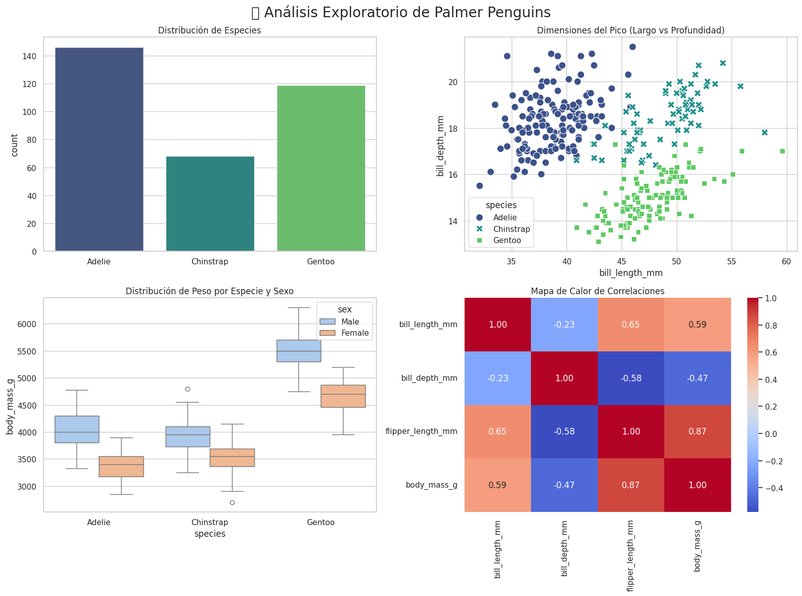
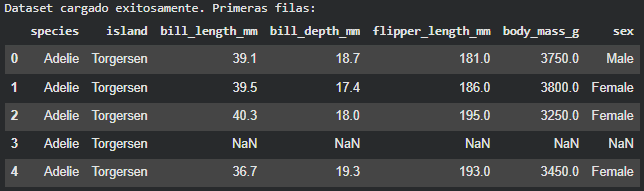
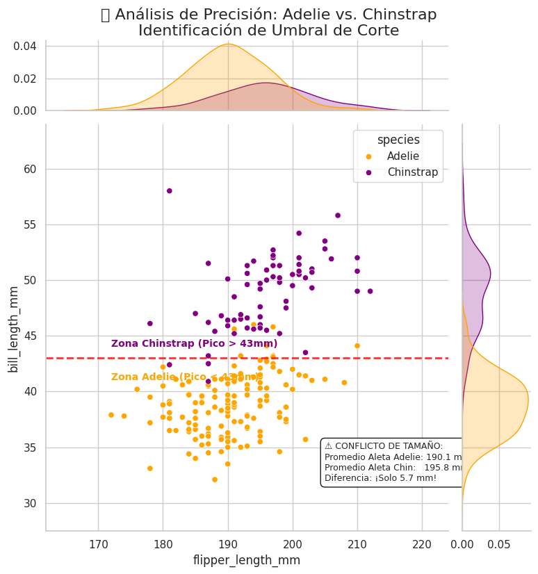
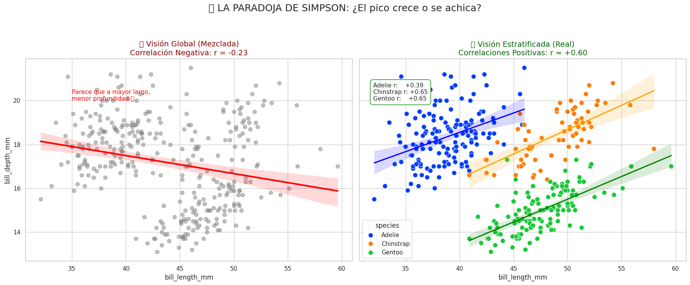

<h1 align="center">Clasificación de Especies: Palmer Penguins 🐧</h1>


<p align="center">
  <em>Identificando patrones biométricos y resolviendo conflictos estadísticos</em>
</p>

---

## 🏷️ **Etiquetas**

`#EDA` `#Clasificación` `#Biometría` `#ParadojaDeSimpson` `#Seaborn`

## 🚀 **Accesos Directos Importantes**

> *Haz clic en los botones para abrir el notebook y explorar el análisis completo.*

<div align="center">

<a href="https://colab.research.google.com/drive/1ZuVnenkQQSdC7IwdEdzx4Iwx07pI3yin?usp=sharing">
  
</a>
&nbsp;
<a href="https://drive.google.com/drive/folders/1l45vQfTOo_G0MuRvZgB7YfZKW-2a5CaG?usp=sharing">
  
</a>

</div>

---

## 📝 **Resumen Ejecutivo**

**🎯 Objetivo Principal**
Realizar un análisis exploratorio detallado (EDA) para identificar las características físicas (**biométricas**) que permiten distinguir de forma precisa las tres especies de pingüinos del Archipiélago Palmer.

**📌 Hallazgos Clave**
> * "El **Largo del Pico** es el factor más potente, resolviendo ambigüedades donde el peso falla."

* **📐 Solución al Conflicto:** Identificamos un umbral de corte de **43mm** en el pico para separar *Adelie* de *Chinstrap*.
* **⚖️ Correlación Inversa:** Se **desmintió** la falsa correlación negativa entre el largo y la profundidad del pico (Paradoja de Simpson).
* **💪 Dimorfismo Sexual:** Los machos son consistentemente más pesados que las hembras en las tres especies.

**📦 Ficha Técnica del Dataset**
* **Fuente:** Colección de datos de la Dra. Kristen Gorman, Estación Palmer, Antártida.
* **Dimensiones (Limpia):** 333 Observaciones · 7 Variables

---

## 📊 **Gestión del Proyecto**

### ✅ Checklist de Objetivos

| Tarea | Estado |
| :--- | :---: |
| 📥 Carga y Setup | ☑️ |
| 🔍 Limpieza de datos (Nulls/Outliers) | ☑️ |
| 📈 Visualizaciones (EDA Dashboard) | ☑️ |
| 🧩 Resolución de Problemas Avanzados | ☑️ |

### ⏰ Cronograma: Palmer Penguins (Predicción)

| Actividad | ⏱️ Estimado | ⏰ Real | 📝 Notas |
| :--- | :---: | :---: | :--- |
| **Configuración** | 10 m | **12 m** | Setup + Carga desde Seaborn |
| **Limpieza y Nulos** | 15 m | **18 m** | Drop de 11 filas defectuosas |
| **Visualización** | 30 m | **35 m** | Dashboard y análisis de correlación |
| **Análisis Avanzado** | 30 m | **45 m** | JointPlot, Umbral y Paradoja de Simpson |
| **Conclusiones** | 15 m | **16 m** | Redacción del Resumen Ejecutivo |
| **TOTAL** | **1h 40m** | **2h 06m** | 🔼 **+26%** (Desviación por complejidad conceptual) |

---
## 📚 **Diccionario de Datos Clave**

| Variable | Tipo | Unidad | Descripción |
| :--- | :--- | :--- | :--- |
| `species` | Categórica | — | Especie de pingüino (Adelie, Chinstrap, Gentoo) |
| `island` | Categórica | — | Isla de la colonia (Torgersen, Biscoe, Dream) |
| `bill_length_mm` | Numérica | mm | Largo del pico (Culmen) |
| `bill_depth_mm` | Numérica | mm | Profundidad del pico |
| `flipper_length_mm` | Numérica | mm | Largo de la aleta |
| `body_mass_g` | Numérica | gramos | Masa corporal (Peso) |
| `sex` | Categórica | — | Género (Male, Female) |

---
## 🔍 **Análisis Detallado de Resultados**

### 1. Variables Discriminantes (Clasificación)
* **Factor n.º 1:** `bill_length_mm` (Largo del Pico) es el predictor más fuerte.
* **Factor n.º 2:** `flipper_length_mm` y `body_mass_g` distinguen claramente a los Gentoo.

### 2. Detección de Conflictos (Análisis Avanzado)
* **El Solapamiento (Adelie/Chinstrap):** Se encontró que `flipper_length_mm` es inútil para la clasificación cruzada debido a que los promedios están a solo **5 mm** de distancia.
* **Paradoja de Simpson:** La correlación global entre `bill_length` y `bill_depth` es **negativa** (r ≈ -0.24), pero la correlación real **por especie es positiva** (r ≈ +0.60), probando que la segmentación es vital.

---

## 📸 **Visualizacion Clave**

Este análisis explora el dataset de los pingüinos de Palmer, proporcionando una visión integral sobre las distribuciones de las especies y variables clave relacionadas con sus características físicas. A continuación se presenta un resumen de las visualizaciones y análisis realizados.



* **🦩 Distribución de Especies:** La distribución de las especies de pingüinos se muestra mediante un gráfico de barras. Se observa que **Adelie** es la especie más abundante, seguida de **Gentoo** y **Chinstrap**, lo que nos da una idea clara de la distribución de las muestras por especie.

* **📏 Dimensiones del Pico (Largo vs Profundidad):** Este gráfico de dispersión muestra la relación entre el largo y la profundidad del pico de los pingüinos. Los puntos representan a cada individuo clasificado por especie, lo que nos ayuda a visualizar cómo varían estas dimensiones según la especie.

* **🐧 Distribución de Peso por Especie y Sexo:** Se visualiza la distribución de peso de los pingüinos divididos por especie y sexo mediante diagramas de caja. Es interesante notar las diferencias de peso entre machos y hembras para cada especie, destacando variaciones notables.

* **📊 Mapa de Calor de Correlaciones:** El mapa de calor muestra las correlaciones entre las variables numéricas del dataset, como el largo y la profundidad del pico, la longitud de las aletas y el peso corporal. Se destaca la fuerte correlación entre la longitud de las aletas y el peso corporal, lo que sugiere que estos atributos están estrechamente relacionados.

---

## 🔄 **DESAFIOS DIRECTOS CON EL DATASET**

Instalación rápida:

```bash
pip install -q pandas matplotlib seaborn scikit-learn
```

```python
import pandas as pd
import seaborn as sns
import matplotlib.pyplot as plt

# Cargar datos limpios
df_clean = sns.load_dataset('penguins').dropna()

# --- 3. VERIFICACIÓN ---
print("Dataset cargado exitosamente. Primeras filas:")
display(df.head())
```



---
# **El Dilema de los "Gemelos"**

### **⚠️ Situación Detectada:**
Durante el análisis general, noté algo preocupante: mientras que los pingüinos **Gentoo** son gigantes y fáciles de identificar, las especies **Adelie** y **Chinstrap** parecen tener dimensiones corporales casi idénticas (peso y aletas muy similares).  
Esto representa un problema grave de **"Solapamiento de Clases"**. Si intentamos clasificarlos solo por su tamaño, nuestro modelo fallará estrepitosamente porque se confunden entre sí.

### **🎯 Objetivo de esta sección:**
Quiero demostrar gráficamente que el tamaño corporal es inútil para distinguir estas dos especies, y encontrar la **"variable oculta"** que nos permita separarlos quirúrgicamente.

### **Cálculo Previo: Cuantificando el Solapamiento** 📏

> Este fragmento de código realiza la **preparación esencial** para resolver el Dilema de los Gemelos.
> 1.  **Filtra** el dataset, enfocándose solo en las especies Adelie y Chinstrap.
> 2.  **Calcula los promedios** de la **Longitud de la Aleta** (`flipper_length_mm`) para cuantificar la similitud entre ambas.
> 3.  **Establece** el umbral clave de **$43 \text{ mm}$** (largo del pico) que se usará en el siguiente gráfico como la línea de decisión.

```python hl_lines="5 9 10 14" linenums="1"
# --- 1. PREPARACIÓN Y CÁLCULOS CLAVE ---

# 1.1. Filtramos para enfocarnos en las especies conflictivas (Adelie y Chinstrap)
# Excluimos a Gentoo ya que su gran tamaño hace que su clasificación sea trivial.
df_dificil = df_clean[df_clean['species'] != 'Gentoo']

# 1.2. Calculamos promedios de Aleta (prueban el conflicto de solapamiento)
# Buscamos la media de la longitud de la aleta para ambas especies para cuantificar su similitud.
mean_adelie_flip = df_dificil[df_dificil['species']=='Adelie']['flipper_length_mm'].mean()
mean_chin_flip = df_dificil[df_dificil['species']=='Chinstrap']['flipper_length_mm'].mean()

# La variable 'umbral_corte' se define aquí para ser usada en el siguiente bloque
# Este es el valor clave (43mm de longitud de pico) encontrado en el análisis visual (EDA).
umbral_corte = 43

# Mostramos los resultados del cálculo para demostrar la hipótesis de solapamiento
print(f"Conflicto de Solapamiento Detectado:")
print(f"  Promedio Aleta Adelie: {mean_adelie_flip:.1f} mm")
print(f"  Promedio Aleta Chinstrap: {mean_chin_flip:.1f} mm")
print(f"  Diferencia: ¡Solo {abs(mean_adelie_flip - mean_chin_flip):.1f} mm!")
```

### 🖼️ **Visualización Final: La Solución de los $43 \text{ mm}$** 🔪

> Este bloque es el "Gran Final" del análisis. Transforma los números en una **decisión visual indiscutible**.
> 1.  **Genera el Gráfico:** Cruza la variable conflictiva (Aleta) vs. la variable solucinadora (Pico).
> 2.  **Traza el Umbral:** Dibuja la línea roja en **$y=43$** que corta el gráfico y separa las especies.
> 3.  **Etiqueta las Zonas:** Define visualmente que "Arriba de la línea = Chinstrap" y "Abajo = Adelie".

```python
# --- BLOQUE 2: VISUALIZACIÓN BASE Y CAPA NUMÉRICA ---

# 2.1. Crea el JointPlot (Muestra Flipper Length vs. Bill Length)
g = sns.jointplot(
    data=df_dificil,
    x="flipper_length_mm",
    y="bill_length_mm",
    hue="species",
    palette={"Adelie": "orange", "Chinstrap": "purple"},
    height=8,
    kind="scatter",
    marginal_ticks=True
)

# 2.2. Agrega la Línea de Separación (Umbral de 43mm)
ax = g.ax_joint
ax.axhline(y=umbral_corte, color='red', linestyle='--', linewidth=2, alpha=0.8)

# 2.3. Agrega Etiquetas de Zona y Caja de Estadísticas (Prueba y Solución)
ax.text(x=172, y=umbral_corte + 1, s=f'Zona Chinstrap (Pico > {umbral_corte}mm)', 
        color='purple', fontweight='bold', fontsize=10)
ax.text(x=172, y=umbral_corte - 2, s=f'Zona Adelie (Pico < {umbral_corte}mm)', 
        color='orange', fontweight='bold', fontsize=10)

texto_stats = (
    f"⚠️ CONFLICTO DE TAMAÑO:\n"
    f"Promedio Aleta Adelie: {mean_adelie_flip:.1f} mm\n"
    f"Promedio Aleta Chin: {mean_chin_flip:.1f} mm\n"
    f"Diferencia: ¡Solo {abs(mean_adelie_flip - mean_chin_flip):.1f} mm!"
)
ax.text(x=205, y=32, s=texto_stats, fontsize=9,
        bbox=dict(boxstyle="round,pad=0.5", fc="white", ec="black", alpha=0.9))

# 2.4. Título final
g.fig.suptitle('🧩 Análisis de Precisión: Adelie vs. Chinstrap\nIdentificación de Umbral de Corte', y=1.03, fontsize=16)
plt.show()
```
**✨ Resultado:**
Un gráfico donde la **Línea Roja** pone orden al caos, demostrando que el pico es la clave para la clasificación perfecta.



* **📉 Visión Global (La Ilusión):** En el gráfico izquierdo, al analizar todos los datos juntos (línea roja), observamos una **correlación negativa** ($r = -0.24$). Esto sugiere erróneamente que los pingüinos con picos más largos tienen picos menos profundos, lo cual contradice la lógica biológica de crecimiento.

* **✅ Visión Estratificada (La Realidad):** En el gráfico derecho, al separar los datos por especie, la tendencia se invierte completamente. Las tres especies muestran **correlaciones positivas** fuertes (líneas ascendentes). Esto revela que, dentro de su grupo, un pingüino más grande tiene un pico más grande en todas sus dimensiones.

* **🧬 Explicación Biológica:** La contradicción ocurre porque estamos mezclando grupos muy distintos: los **Gentoo** tienen picos largos pero finos, mientras que los **Adelie** tienen picos cortos pero gruesos. Al unirlos, sus diferencias de forma crean una diagonal falsa que no representa el crecimiento real de un individuo.

* **🧠 Lección Estadística (Paradoja de Simpson):** Este fenómeno confirma la existencia de la **Paradoja de Simpson**, enseñándonos que ignorar la variable de agrupación (en este caso, la *Especie*) puede llevarnos a conclusiones opuestas a la realidad y a tomar decisiones incorrectas en el modelado.

---

# **La paradoja de Simpson"**

### **⚠️ Situación Detectada:**
Al intentar analizar la geometría del pico de forma general (sin distinguir especies), encontré una contradicción biológica.  
* **Visión Global:** Los datos sugieren que los picos largos son más delgados (Relación Negativa).  
* **Sentido Común:** Un animal más grande debería tener un pico más grande en todas sus dimensiones.

### **🎯 Objetivo de esta sección:**
Voy a demostrar cómo mezclar poblaciones diferentes (Adelie, Chinstrap, Gentoo) crea una **ilusión estadística** que invierte la realidad.  
* Voy a contrastar la **Tendencia Global** (incorrecta) vs. la **Tendencia por Especie** (correcta).

### **El Gran Truco Estadístico** 📉📈

>  Este bloque de código es el **experimento final** y más avanzado del análisis. Aquí vamos a demostrar matemáticamente y visualmente cómo una **ilusión estadística** puede invertir la realidad si no tenemos cuidado.

 > **🧮 La Prueba Matemática:**
    * Primero, calcularemos el coeficiente de correlación ($r$) mezclando **todos** los datos.
    * Luego, lo calcularemos separando por **especie**.
    * *Spoiler: ¡Veremos cómo el signo matemático cambia mágicamente de negativo (-) a positivo (+)!*

 > **🆚 El Duelo Visual (Side-by-Side):**
    * Generaremos un panel doble para contrastar:
        * **Izquierda (La Ilusión):** Una línea roja descendente que sugiere que "picos más largos son más finos" (Falso).
        * **Derecha (La Realidad):** Tres líneas ascendentes que demuestran que "picos más largos son más robustos" (Verdadero).

```python hl_lines="18 26 27 42 44 47 48 54" linenums="1"
# --- 1. CÁLCULOS CLAVE: CONTRASTE DE CORRELACIONES ---
# Objetivo: Demostrar matemáticamente que los números cambian de signo (Negativo -> Positivo)

# A. Visión Global (La "Ilusión")
# Calculamos la correlación de TODOS los datos juntos sin distinguir especies.
# Resultado esperado: Negativo (r ≈ -0.24)
r_global, _ = pearsonr(df_clean['bill_length_mm'], df_clean['bill_depth_mm'])

# B. Visión Real (La "Verdad")
# Tomamos solo UNA especie (ej. Gentoo) para ver la relación real biológica.
# Resultado esperado: Positivo (r ≈ +0.64)
r_gentoo, _ = pearsonr(df_clean[df_clean['species']=='Gentoo']['bill_length_mm'], 
                       df_clean[df_clean['species']=='Gentoo']['bill_depth_mm'])


# --- 2. VISUALIZACIÓN COMPARATIVA (LA PARADOJA) ---
# Preparamos un lienzo con 2 gráficos uno al lado del otro
fig, axes = plt.subplots(1, 2, figsize=(16, 6), sharey=True)

# -------------------------------------------------------
# GRÁFICO IZQUIERDO: La Ilusión (Tendencia Global)
# -------------------------------------------------------
# Usamos regplot sobre TODO el dataset.
# - line_kws={'color': 'red'}: Dibuja la línea roja que baja.
# - scatter_kws={'alpha': 0.3}: Pone los puntos semitransparentes para resaltar la línea.
sns.regplot(ax=axes[0], data=df_clean, x="bill_length_mm", y="bill_depth_mm", 
            color='grey', line_kws={'color': 'red', 'linewidth': 3}, scatter_kws={'alpha': 0.3})

# Título dinámico mostrando el error
axes[0].set_title(f'🚫 Visión Global (Mezclada)\nCorrelación Negativa: r = {r_global:.2f}', color='darkred')


# -------------------------------------------------------
# GRÁFICO DERECHO: La Realidad (Tendencias por Especie)
# -------------------------------------------------------
# 1. Dibujamos los puntos coloreados por especie (hue='species')
sns.scatterplot(ax=axes[1], data=df_clean, x="bill_length_mm", y="bill_depth_mm", hue="species", palette='bright')

# 2. Bucle para dibujar las 3 líneas de tendencia correctas
colores = {'Adelie': 'blue', 'Gentoo': 'green', 'Chinstrap': 'orange'}

for especie, color in colores.items():
    # Filtramos los datos solo para la especie actual
    data_especie = df_clean[df_clean['species']==especie]
    
    # Dibujamos la línea de regresión SOLO para esa especie (scatter=False para no repetir puntos)
    sns.regplot(ax=axes[1], data=data_especie, 
                x="bill_length_mm", y="bill_depth_mm", scatter=False, line_kws={'color': color})

# Título final mostrando la corrección
axes[1].set_title(f'✅ Visión Estratificada (Real)\nLas líneas suben (r > 0)', color='darkgreen')

# Ajustes finales de diseño
plt.suptitle('🌪️ LA PARADOJA DE SIMPSON: Comparación Visual', fontsize=16)
plt.tight_layout()
plt.show()
```
**✨ Resultado:**
Una impactante comparación **"Antes vs. Después"** donde la **Ilusión Global** (una línea roja que baja misteriosamente) es desmentida por la **Verdad Biológica** (tres líneas de colores que suben), probando que separar los datos por especie invierte totalmente la historia.



📉 **La Trampa (Visión Global)**: En el gráfico izquierdo, la línea roja muestra una tendencia descendente ($r = -0.24$). Esto sugiere erróneamente que los pingüinos con picos más largos tienen picos más finos, creando una ilusión estadística al mezclar grupos distintos.

✅ **La Realidad (Visión Estratificada)**: En el gráfico derecho, al separar por colores, descubrimos la verdad: las tres líneas apuntan hacia ARRIBA. Todas las especies tienen correlación positiva, demostrando que biológicamente un pingüino más grande tiene un pico más robusto en todas sus dimensiones.

🧬 **Causa de la Paradoj**a: El fenómeno ocurre porque los Gentoo (picos largos y finos) y los Adelie (picos cortos y profundos) crean una falsa diagonal negativa al mezclarse. Separar los datos por especie invierte la conclusión y corrige el error de análisis