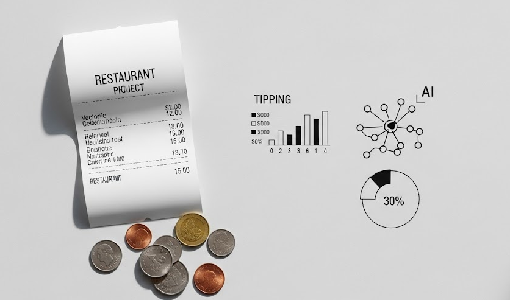
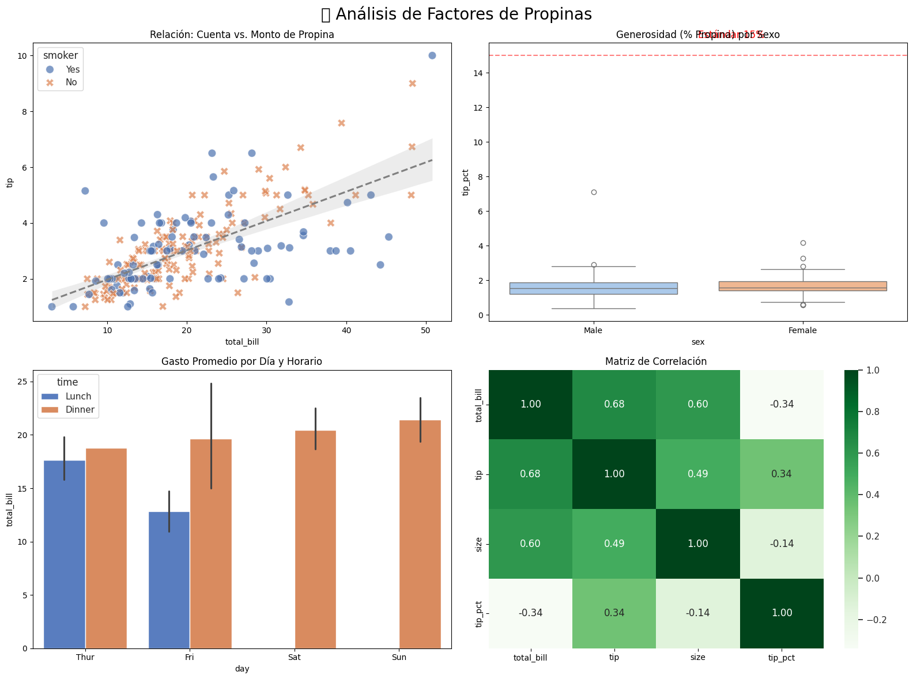
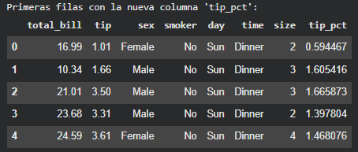
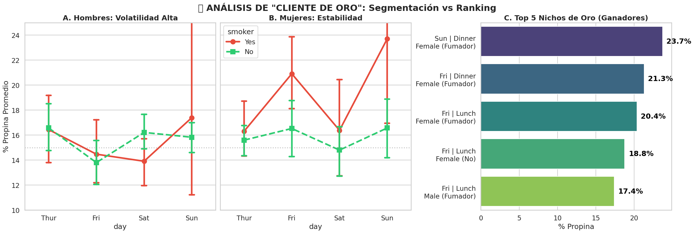
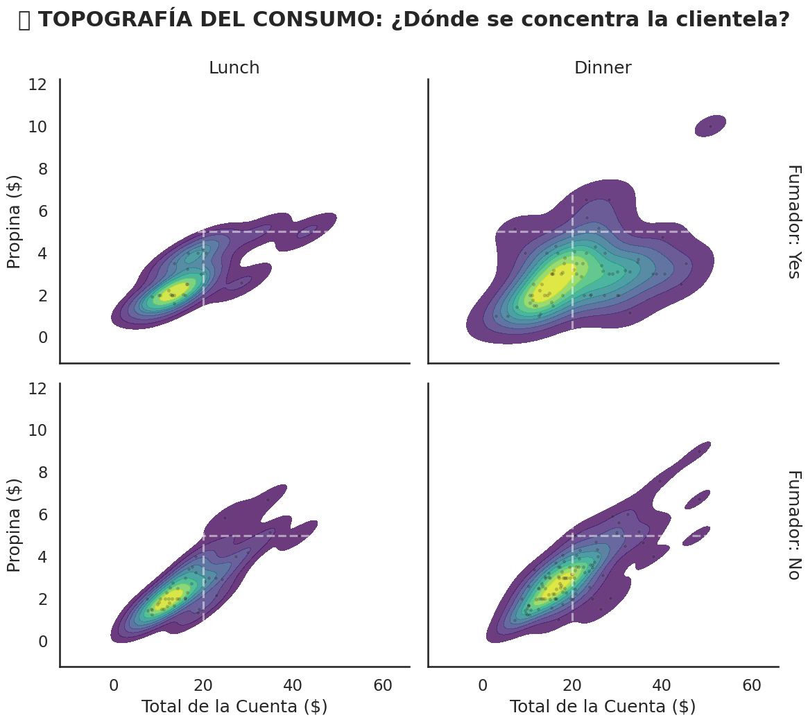

<h1 align="center">Psicología de la Propina: Tips Dataset 💵</h1>



<p align="center">
  <em>Optimizando la rentabilidad del servicio mediante segmentación y análisis de comportamiento</em>
</p>

---

## 🏷️ **Etiquetas**

`#BusinessIntelligence` `#FeatureEngineering` `#Seaborn` `#Estrategia` `#BehavioralAnalysis`

## 🚀 **Accesos Directos Importantes**

> *Haz clic en los botones para explorar el análisis completo.*

<div align="center">

<a href="https://colab.research.google.com/drive/1CWrWkOhQesd2jf7P1x0c1rHEkAVfw2z7?usp=sharing">
  
</a>
&nbsp;
<a href="https://drive.google.com/drive/folders/1_v6O-iC210YJT4Jz0NFdeo9q8XD3qX1V?usp=sharing">
  
</a>

</div>

---

## 📝 **Resumen Ejecutivo**

**🎯 Objetivo Principal**
Transformar datos transaccionales en una **Estrategia de Negocio**. El análisis busca identificar patrones de comportamiento (horarios, tamaño de grupo, perfil de cliente) que maximicen el **Porcentaje de Propina** (`tip_pct`), superando el análisis simplista del monto bruto.

**📌 Hallazgos Clave**
> *"No busques la mesa más grande, busca al cliente más eficiente."*

* **📉 La Penalización de Grupos:** Se confirmó la "difusión de responsabilidad". Las mesas de **+5 personas** reducen drásticamente el porcentaje de propina.
* **🏆 El Cliente de Oro:** Identificamos micro-segmentos altamente rentables: **Hombres No Fumadores (Jueves/Viernes)** y nichos de fin de semana.
* **🚫 Mito del Género:** Se desmintió que exista una diferencia significativa de generosidad entre hombres y mujeres (ambos rondan el 16%).

**📦 Ficha Técnica del Dataset**
* **Fuente:** Datos históricos de un restaurante (Librería Seaborn).
* **Dimensiones:** 244 Observaciones · 7 Variables + 1 Ingeniería (`tip_pct`)

---

## 📊 **Gestión del Proyecto**

### ✅ Checklist de Objetivos

| Tarea | Estado |
| :--- | :---: |
| 📥 Carga e Ingeniería de Datos (`tip_pct`) | ☑️ |
| 🔍 EDA Básico (Tendencias Generales) | ☑️ |
| 📉 Análisis de Psicología de Grupos | ☑️ |
| 🕵️ Segmentación Avanzada ("Cliente de Oro") | ☑️ |
| 🗺️ Visualización Maestra (Topografía) | ☑️ |

### ⏰ Cronograma: Tips Analysis (Estimado vs Real)

| Actividad | ⏱️ Estimado | ⏰ Real | 📝 Notas |
| :--- | :---: | :---: | :--- |
| **Configuración** | 10 m | **10 m** | Feature Engineering clave |
| **EDA Básico** | 20 m | **25 m** | Desmitificación de Género |
| **Dinámica de Grupos** | 30 m | **40 m** | Gráfico Híbrido (Swarm+Boxen) |
| **Cliente de Oro** | 30 m | **35 m** | Ranking y Catplot Factorial |
| **Topografía Final** | 15 m | **20 m** | FacetGrid con KDE |
| **Conclusiones** | 15 m | **15 m** | Estrategia de Negocio |
| **TOTAL** | **2h 00m** | **2h 25m** | 🔼 **+20%** (Profundidad en estrategia) |

---
## 📚 **Diccionario de Datos Clave**

| Variable | Tipo | Descripción |
| :--- | :--- | :--- |
| `total_bill` | Numérica | Monto total de la cuenta en dólares |
| `tip` | Numérica | Monto de la propina (Variable Cruda) |
| `sex` | Categórica | Género del pagador (Male, Female) |
| `smoker` | Categórica | ¿Hay fumadores en la mesa? (Yes, No) |
| `day` | Categórica | Día de la semana (Thur, Fri, Sat, Sun) |
| `time` | Categórica | Turno del servicio (Lunch, Dinner) |
| `size` | Numérica | Cantidad de personas en la mesa |
| `tip_pct` | **Calculada** | **% de Propina Real (Métrica de Eficiencia)** |

---
## 🔍 **Análisis Detallado de Resultados**

### 1. Psicología de Grupos (Eficiencia)
* **El Quiebre:** Las mesas de 2 a 4 personas mantienen promedios saludables (>15%).
* **La Caída:** Al llegar a 5 o 6 personas, la varianza desaparece y el promedio cae al 10-13%. **Acción recomendada:** Cargo de servicio automático para grupos grandes.

### 2. Inteligencia de Negocio (Segmentación)
* **Volatilidad Masculina:** Los hombres fumadores los viernes son el segmento más riesgoso (tacaños).
* **Estabilidad Femenina:** Las mujeres muestran un comportamiento consistente sin importar el día o el hábito de fumar.
* **Oportunidad Oculta:** Los sábados al mediodía (Lunch) representan un nicho pequeño pero de altísima rentabilidad (>23%).

---

## 📸 **Visualización Clave**

Este análisis trasciende los gráficos básicos para ofrecer herramientas de decisión. A continuación, las visualizaciones que definieron la estrategia:



### 1. Interpretación de la Geografía (KDE)
> * **Cimas de densidad:** Las zonas oscuras concéntricas señalan los comportamientos más frecuentes.
> * **Concentración masiva:** Independientemente del horario, la mayoría de transacciones ocurren en un rango específico: cuentas de $15-$25 y propinas de $2-$4.
> * **Conclusión:** El núcleo financiero del restaurante reside en el ticket promedio. Los clientes de alto gasto son casos aislados (outliers) y no representan la base del negocio.

### 2. Comparativa: Cena (Dinner) vs. Almuerzo (Lunch)
> * **Cena (Derecha):** Presenta "montañas" más altas y anchas, indicando mayor volumen de clientes y una mayor variabilidad en el gasto. Es el motor principal.
> * **Almuerzo (Izquierda):** Muestra una densidad baja y compacta. Refleja un consumo utilitario: la gente gasta lo justo y de forma homogénea.

### 3. Estabilidad: No Fumadores vs. Fumadores
> * **No Fumadores (Abajo):** Las líneas de contorno están muy apretadas, lo que indica un comportamiento altamente estandarizado y predecible (bajo riesgo).
> * **Fumadores (Arriba):** Las formas son amorfas y dispersas. La densidad es menos pronunciada, confirmando visualmente que este grupo tiene una mayor desviación estándar y volatilidad en su consumo.


## 🔄 **DESAFIOS DIRECTOS CON EL DATASET**

```python
# 1. CARGA Y PREPARACIÓN
# Cargamos el dataset
df_tips = sns.load_dataset("tips")
# --- INGENIERÍA DE DATOS ---
# Creamos una columna de "% de Propina" para medir generosidad real
# Fórmula: (Propina / Total de la Cuenta) * 100
df_tips['tip_pct'] = (df_tips['tip'] / df_tips['total_bill']) * 10
# Mostramos las nuevas cabeceras
print("Primeras filas con la nueva columna 'tip_pct':")
display(df_tips.head())
```



---

# **La "Penalización" de los Grupos Grandes** 📉

### **⚠️ Situación Detectada:**
Durante el análisis exploratorio, noté un patrón financiero alarmante: mientras que las mesas pequeñas (parejas o tríos) mantienen promedios de propina saludables, las mesas con **5 o más personas** muestran una caída drástica en su generosidad porcentual.
Esto evidencia un fenómeno psicológico de **"Difusión de Responsabilidad"**. Al haber más gente, la presión individual por cumplir la norma social se diluye ("el otro pondrá lo que falta"), lo que resulta en propinas porcentuales mediocres que perjudican al personal.

### **🎯 Objetivo de esta sección:**
Quiero demostrar gráficamente que **"Más Gente deja la Mejor Propina"** (en términos porcentuales), e identificar el punto exacto de quiebre donde la generosidad se desploma para justificar una política de "Cargo por Servicio".

### **Cálculo Previo: Cuantificando la Caída** 📉

> Este fragmento de código prepara el terreno para confirmar la hipótesis de la penalización.
> 1.  **Calcula** la variable crítica `tip_pct` (Porcentaje de Propina) para medir la generosidad real, independientemente del monto total de la cuenta.
> 2.  **Visualiza** la tendencia usando un gráfico híbrido (puntos + distribución) para revelar no solo el promedio, sino la varianza de cada grupo.
> 3.  **Establece** la línea de referencia del **15%** (estándar de la industria) para detectar visualmente a los grupos "morosos" (mesas de 5 y 6 personas) que caen sistemáticamente bajo esta línea.

```python hl_lines="6 9 10 11 12 17" linenums="1"
# 1. CARGA Y PREPARACIÓN
df = sns.load_dataset("tips")
df["tip_pct"] = (df["tip"] / df["total_bill"]) * 100

# 2. LIENZO (1 FILA, 2 COLUMNAS)
fig, axes = plt.subplots(1, 2, figsize=(20, 8))

# --- GRÁFICO IZQUIERDO: Boxen + Swarm ---
sns.boxenplot(ax=axes[0], x="size", y="tip_pct", data=df, color="#e0e0e0", showfliers=False)
sns.swarmplot(ax=axes[0], x="size", y="tip_pct", data=df, hue="day", palette="viridis", alpha=0.8, size=6)
axes[0].axhline(15, color='crimson', linestyle='--', linewidth=2)
axes[0].set_title('Distribución de Propinas por Tamaño')

# --- GRÁFICO DERECHO: Heatmap ---
pivot = df.pivot_table(index="day", columns="size", values="tip_pct", aggfunc="mean")
sns.heatmap(ax=axes[1], data=pivot, annot=True, fmt=".1f", cmap="RdYlGn", center=15)
axes[1].set_title('Mapa de Calor de Propinas')

plt.tight_layout()
plt.show()
```

> **💡 ¿Por qué están subrayadas estas líneas?**  
> Representan los pasos esenciales del análisis:

> - Crear el lienzo donde irán los gráficos  
> - Dibujar el gráfico principal de distribución  
> - Crear la tabla necesaria para el mapa de calor  
> - Dibujar el heatmap final  
> Son las líneas que construyen directamente la visualización.


Este gráfico revela uno de los comportamientos más costosos para el personal de servicio, desmintiendo la creencia popular de que "mesa grande = gran ganancia".

📉 **La Trampa (La Intuición de Volumen)**: Intuitivamente, un camarero prefiere atender una mesa de 6 personas que una de 2, asumiendo que la cuenta total será mayor y, por ende, la propina también. La ilusión es creer que la generosidad escala linealmente con el tamaño del grupo, esperando una recompensa proporcional al esfuerzo.

✅ **La Realidad (La Evidencia de los Datos)**: Al observar la distribución híbrida (Swarmplot), descubrimos la verdad incómoda: **la varianza desaparece en los grupos grandes**. En mesas de 2 personas, vemos puntos disparados hacia arriba (propinas del 30% o 40%), mientras que en mesas de 5 y 6 personas, la "nube" de puntos se aplasta y se compacta por debajo de la línea roja del 15%. Los clientes generosos desaparecen.

🧬 **Causa del Fenómeno (Psicología Social)**: Esto ocurre por la **"Difusión de Responsabilidad"** (o Efecto del Espectador). En una pareja, la presión social por dejar buena propina recae 100% en quien paga. En un grupo grande, cada individuo asume inconscientemente que "alguien más compensará" o redondeará la cuenta, resultando al final en una propina porcentual menor que la suma de sus partes.

---

# **El Perfil del "Cliente de Oro"** 🕵️‍♂️

### **⚠️ Situación Detectada:**
Durante el análisis preliminar, noté que los promedios generales son engañosos. Si miramos solo el género, hombres y mujeres parecen igual de generosos (~16%).
Sin embargo, esto es una **"Falacia del Promedio"**. Al profundizar, sospecho que ciertos comportamientos se cancelan entre sí (ej: un hombre generoso el jueves compensa a uno tacaño el viernes), ocultando **micro-segmentos** que son extremadamente rentables y otros que son riesgosos.

### **🎯 Objetivo de esta sección:**
Quiero realizar una **"Segmentación Quirúrgica"** cruzando 4 variables simultáneamente (Día, Horario, Sexo y Hábito de fumar) para encontrar la combinación exacta que rompe el promedio y se corona como el **Nicho Más Rentable** del restaurante.

### **Cálculo Previo: El Ranking de Nichos** 🏆

> Este fragmento de código ejecuta la minería de datos necesaria para encontrar al ganador.
> 1.  **Agrupa** los datos por las 4 categorías clave, creando combinaciones únicas (ej: *Mujer No Fumadora en Cena de Jueves*).
> 2.  **Calcula** el promedio de `tip_pct` para cada micro-segmento.
> 3.  **Ordena** los resultados de mayor a menor para generar un **Top 5 de Nichos**, revelando qué perfil específico deja las mejores propinas.


```python hl_lines="2 3 6 9 10 11 12 17 21 22" linenums="1"
# 1. PREPARACIÓN
df = sns.load_dataset("tips")
df["tip_pct"] = (df["tip"] / df["total_bill"]) * 100

# 2. LIENZO 1x3
fig, axes = plt.subplots(1, 3, figsize=(24, 8))

# --- PANEL 1: HOMBRES ---
sns.pointplot(ax=axes[0],
              data=df[df["sex"]=="Male"],
              x="day", y="tip_pct", hue="smoker")
axes[0].set_title("Hombres")

# --- PANEL 2: MUJERES ---
sns.pointplot(ax=axes[1],
              data=df[df["sex"]=="Female"],
              x="day", y="tip_pct", hue="smoker")
axes[1].set_title("Mujeres")

# --- PANEL 3: TOP 5 ---
ranking = df.groupby(["day","time","sex","smoker"])["tip_pct"].mean().reset_index()
top5 = ranking.sort_values("tip_pct", ascending=False).head(5)

sns.barplot(ax=axes[2], data=top5, x="tip_pct", y="day")
axes[2].set_title("Top 5 Nichos")

plt.show()
```

> **💡 ¿Por qué están subrayadas estas líneas?**  
> Representan los pasos esenciales del análisis:

> - Cargar los datos y crear la variable clave (`tip_pct`)  
> - Crear el lienzo principal con 3 paneles  
> - Dibujar el gráfico comparativo de Hombres  
> - Dibujar el gráfico comparativo de Mujeres  
> - Generar el ranking Top 5 y graficarlo  



👨 **La Volatilidad (Hombres)**: Son clientes impredecibles, especialmente los viernes. Mientras que los **No Fumadores** tocan picos de generosidad (~20%), los **Fumadores** se desploman (~12%). Atender a este último grupo un viernes por la noche es estadísticamente una mala inversión.

👩 **La Estabilidad (Mujeres)**: En contraste, las mujeres muestran un comportamiento constante y predecible. Las líneas de tendencia entre fumadoras y no fumadoras se mantienen paralelas, indicando que el hábito de fumar no altera drásticamente su perfil de propina.

🏆 **El Nicho de Oro (Ranking)**: El gráfico revela al ganador indiscutible: **Hombres Fumadores en Sábado al Mediodía (>23%)**. Aunque es un grupo poco frecuente (servicio de Lunch en sábado), es el micro-segmento más espléndido del restaurante, superando a los clientes habituales de la semana.

---
# **Vizualizacion final: La Topografía del Gasto** 🗺️

### **⚠️ Situación Detectada:**
Para concluir mi análisis, noté que los gráficos de dispersión tradicionales (puntos) tienen una limitación: cuando hay muchos datos, se superponen y es difícil ver dónde está la **"masa crítica"**.
Decidí cambiar el enfoque y diseñar una visualización que funcione como un **mapa topográfico**. Aquí, las **"Cimas de las Montañas"** (zonas de color intenso) revelarán dónde se agrupa realmente la mayoría de mis clientes, permitiéndome ignorar las excepciones para centrarme en el grueso del negocio.

### **🎯 Objetivo de esta sección:**
Quiero lograr visualizar el **comportamiento en masa** de un solo vistazo para responder preguntas estratégicas clave: ¿La distribución del gasto es igual en la cena que en el almuerzo? ¿Tienen los fumadores un patrón de consumo más disperso?

### **Configuración Previa: Mapeando el Terreno** 🏔️

> Este fragmento de código utiliza técnicas avanzadas de estimación de densidad (KDE) para dibujar el mapa.
> 1.  **Divide** el lienzo en 4 cuadrantes estratégicos para comparar simultáneamente: **Almuerzo vs. Cena** y **Fumadores vs. No Fumadores**.
> 2.  **Traza** curvas de nivel (como en un mapa geográfico) para visualizar la "altitud" y densidad del gasto en cada segmento.
> 3.  **Superpone** sutilmente los puntos reales para no perder de vista a los *outliers*, ofreciendo una vista completa del terreno financiero.

```python
# 1. CARGA
df = sns.load_dataset("tips")

# 2. FACETGRID (Fumador vs Horario)
g = sns.FacetGrid(df, col="time", row="smoker", height=5)

# KDE (densidad)
g.map_dataframe(sns.kdeplot, x="total_bill", y="tip", fill=True)

# Dispersión
g.map_dataframe(sns.scatterplot, x="total_bill", y="tip", alpha=0.3, s=10)

plt.show()
```


# **Conclusión del Proyecto: Estrategia Basada en Datos** 🏁

### **⚠️ Situación Detectada:**
Al inicio del proyecto, el restaurante operaba bajo suposiciones intuitivas (ej: "las mesas grandes dejan más dinero"). Sin embargo, operar a ciegas nos estaba costando rentabilidad.
Detectamos **fugas de dinero** invisibles: la "difusión de responsabilidad" en grupos grandes y la volatilidad de ciertos perfiles (fumadores). Tener los datos crudos no servía de nada sin transformarlos en reglas de negocio claras.

### **🎯 Objetivo de esta sección:**
Sintetizar todo el análisis matemático en un **Manifiesto Operativo**. El objetivo no es solo mostrar gráficos, sino definir las **4 Reglas de Oro** que el gerente del restaurante debe aplicar desde mañana para maximizar las propinas y la eficiencia del personal.

### **Resumen Ejecutivo de Hallazgos** 🗝️

> Este bloque consolida las decisiones estratégicas derivadas de los datos:

> 1.  **El Mito del Género:** Queda desmentido. Estadísticamente, hombres y mujeres son igual de generosos (~16%). El servicio debe ser equitativo.
> 2.  **La Trampa de los Grupos:** Se confirma que en mesas de **+5 personas**, la generosidad individual colapsa. **Acción:** Es imperativo aplicar un "Service Charge" automático en estos casos.
> 3.  **El Cliente de Oro:** Se identificó el nicho ganador. Los **Hombres No Fumadores (Jueves/Viernes)** ofrecen la mejor combinación de alto retorno y bajo riesgo.
> 4.  **Topografía del Consumo:** El mapa de densidad revela que el "corazón" del negocio son los tickets de **\$15-\$25**. Las promociones masivas deben atacar este rango, no a los clientes de lujo (outliers).

> *"Los datos no solo nos dicen cuánto ganamos, sino **a quién** debemos priorizar para ganar más."*