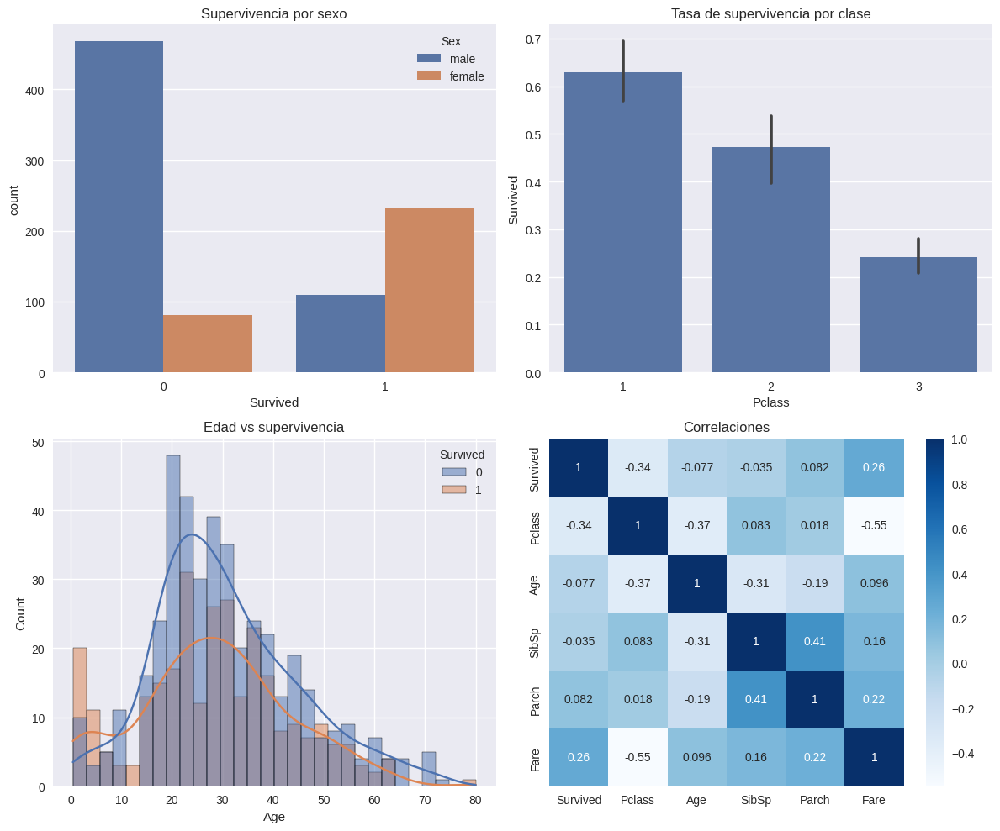
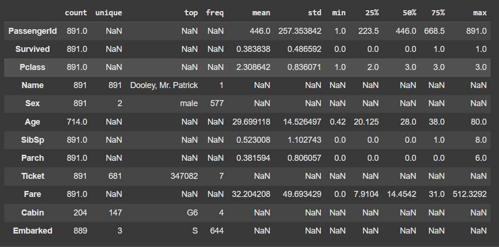

# 📖 **Análisis Exploratorio del Dataset Titanic**


> 🧠 *Explorando los factores que determinaron la supervivencia en el Titanic*

---

## 🏷️ **Etiquetas**

`#EDA` `#Titanic` `#MachineLearning` `#AnálisisDeDatos` `#Exploración`

## 🚀 **Accesos Directos Importantes**

[](https://colab.research.google.com/drive/1F0btMIVnncma9EYwR-2togcSPDW35evv)  
[](https://drive.google.com/drive/folders/1qglTzvqdFPrNMxUhH_MtQFcRrafXEG7x?usp=sharing)

> ✅ *Haz clic en los botones para abrir el notebook y explorar las visualizaciones interactivas.*

---


📦 **Dataset**: Titanic - [Kaggle](https://www.kaggle.com/c/titanic/data)  

📁 **Observaciones**: 891 · **Variables**: 12

---

## 📝 **Resumen Ejecutivo**

🎯 **Objetivo:**  
Realizar un análisis exploratorio detallado del dataset Titanic, entendiendo las relaciones entre variables y su impacto en la supervivencia.

📌 **Hallazgos clave:**

- 📍 **Sexo**: Alta influencia en la supervivencia (mujeres sobreviven más).
- 🎟️ **Clase (Pclass)**: Pasajeros de 1ª clase tienen mayor tasa de supervivencia.
- 👶 **Edad**: Jóvenes adultos predominan en el dataset.

---

## ✅ **Checklist de Objetivos**

| Tarea                                               | Estado |
|-----------------------------------------------------|--------|
| Familiarización con Google Colab y carga del dataset| ☑️      |
| Identificación de variables clave                   | ☑️      |
| Visualizaciones con `seaborn` y `matplotlib`        | ☑️      |
| Análisis de correlaciones                           | ☑️      |

---

## ⏰ **Tiempos Estimados vs Reales**

| Actividad                               | ⏱️ Estimado | ⏰ Real | ✅ Notas |
|----------------------------------------|--------------|----------|----------|
| Configuración en Google Colab          | 30 m         | 28 m     | Setup + carga de datos desde Kaggle |
| Exploración inicial (`info()` / `describe()`) | 30 m | 32 m | Análisis descriptivo |
| Visualizaciones básicas                | 30 m         | 35 m     | Uso de seaborn y matplotlib |
| Valores faltantes / outliers           | 15 m         | 18 m     | Distribuciones y NA |
| Correlaciones                          | 20 m         | 22 m     | Variables numéricas |
| Reflexión final                        | 15 m         | 14 m     | Insights y conclusiones |

📌 **Total real**: 2 h 39 m — 🔼 **+6%** (+9 m)

---

## 🔍 **Análisis Exploratorio**

### 🧮 Dataset

- 🔢 Observaciones: 891
- 🧩 Variables clave: `Survived`, `Sex`, `Age`, `Pclass`, `Fare`

### 📈 Univariado

- Mujeres tienen más probabilidad de sobrevivir.
- La mayoría de pasajeros son jóvenes adultos.

### 🔗 Bivariado

- Alta correlación entre **Sexo** y **Supervivencia**.
- Clase del pasajero y tarifa están ligadas a la supervivencia.

### 🧪 Correlaciones

- `Pclass` y `Fare` tienen correlaciones significativas con `Survived`.
- `SibSp` y `Age` menos relevantes.

---

## 📊 **Indicadores Clave**

| Métrica                        | Valor / Observación                  |
|-------------------------------|--------------------------------------|
| Clases (`Survived`)           | 0 = No, 1 = Sí                        |
| Datos faltantes / duplicados  | 0 / 0                                 |
| Correlación `Pclass` ~ `Fare` | Alta                                  |
| Sexo como predictor           | Altamente significativo              |

---

## 📚 **Diccionario de Datos**

| Variable   | Tipo      | Rango / Valores          | Descripción                              |
|------------|-----------|--------------------------|------------------------------------------|
| `Survived` | Categórica| {0, 1}                   | Supervivencia                            |
| `Pclass`   | Categórica| {1, 2, 3}                | Clase del pasajero                       |
| `Sex`      | Categórica| {male, female}           | Género                                   |
| `Age`      | Numérica  | 0 – 80+                  | Edad del pasajero                        |
| `SibSp`    | Numérica  | 0 – 8                    | Hermanos / Esposo a bordo                |
| `Parch`    | Numérica  | 0 – 6                    | Padres / Hijos a bordo                   |
| `Fare`     | Numérica  | £0 – £512.33             | Tarifa pagada                            |
| `Embarked` | Categórica| {C, Q, S}                | Puerto de embarque                       |
| `Cabin`    | Categórica| —                        | Número de cabina (muchos nulos)         |
| `Ticket`   | Categórica| —                        | Número de ticket                         |
| `Name`     | Categórica| —                        | Nombre completo                          |

---

## 📸 **Visualizaciones Destacadas**

### 🎯 Supervivencia por Clase y Sexo



> Las mujeres de 1ª clase tuvieron la tasa de supervivencia más alta.

---

### 🧓 Histograma de Edad



> Mayoría de pasajeros: adultos jóvenes entre 20 y 35 años.

[🔗 Ver todas las visualizaciones aquí](https://drive.google.com/drive/folders/1M4qND3ec7dxzzagT3HjI05VCggnWIZzy?usp=sharing)

---

## 🏆 **Resultados Clave**

✅ **Variables clave:**  

- **Sexo:** Mujeres sobrevivieron en mayor proporción.  
- **Clase:** 1ª clase con ventaja clara.

⚠️ **Desafíos:**  

- Valores faltantes en `Cabin` y `Age`.  
- Imputar `Age` por mediana segmentada por clase.

🔜 **Próximos pasos:**  

- Modelar con **Logistic Regression** y **Random Forest**  
- Añadir métricas ROC, precisión, recall y F1-score.

---

## 🧩 **Criterios de Aceptación**

- ☑️ Exploración completa del dataset  
- ☑️ Correlaciones clave identificadas  
- ☑️ Visualizaciones subidas a Drive  
- ☑️ Código reproducible

---

## 🚀 **Notebook Interactivo**

[](https://colab.research.google.com/drive/1F0btMIVnncma9EYwR-2togcSPDW35evv)

> 💡 *Haz clic para empezar a trabajar directamente en el análisis y visualizar resultados en tiempo real.*

---

## 🔄 **Reproducibilidad**

Instalación rápida:

```bash
pip install -q scikit-learn matplotlib seaborn
```

```python
import pandas as pd
import seaborn as sns
import matplotlib.pyplot as plt
from sklearn.model_selection import train_test_split

# Cargar datos
data = pd.read_csv('titanic.csv')

# Análisis exploratorio
sns.histplot(data=data, x='Age', hue='Survived', kde=True)
plt.tight_layout()
plt.show()
import pandas as pd
import seaborn as sns
import matplotlib.pyplot as plt
from sklearn.model_selection import train_test_split

# Cargar datos
data = pd.read_csv('titanic.csv')

# Análisis exploratorio
sns.histplot(data=data, x='Age', hue='Survived', kde=True)
plt.tight_layout()
plt.show()
```

🧠 Reflexión Final

El análisis exploratorio del dataset Titanic nos permitió identificar que las variables Sexo y Pclass son determinantes para la supervivencia. Las próximas etapas incluyen la construcción de modelos predictivos más avanzados para mejorar la exactitud y tomar decisiones basadas en estos factores clave.

⏩ Próximos Pasos

Entrenar modelos como Logistic Regression y Random Forest.

Implementar curvas ROC y métricas por clase para análisis de rendimiento del modelo.

Experimentar con imputación avanzada de datos faltantes.
