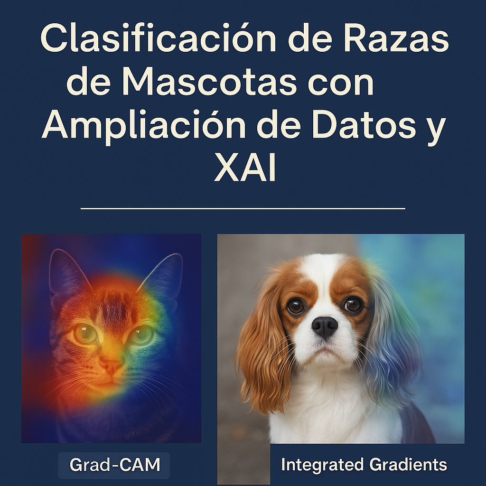

<h1 align="center"> Oxford-IIIT Pet 🐶🐱 — Clasificación de Razas con Data Augmentation + XAI (GradCAM & Integrated Gradients) </h1>

  <em>Un caso avanzado de visión: de preprocesamiento y augmentation a explicabilidad con modelos preentrenados.</em>

🏷️ **Etiquetas Rápidas**  
`#8` `#OxfordPet` `#XAI` `#GradCAM` `#IntegratedGradients` `#TransferLearning` `#EfficientNet`  

---

## 🚀 Accesos Directos Importantes

> *Haz clic para abrir el notebook o visualizar resultados.*

&nbsp;

---

# 🧠 **Resumen Ejecutivo**

🎯 **Objetivo:**  
Aplicar un pipeline completo de visión con **Transfer Learning**, **Data Augmentation avanzado** y **XAI** usando el dataset **Oxford-IIIT Pet**:

- 37 razas de perros y gatos  
- ~7 300 imágenes en total  
- Variabilidad extrema en fondo, pose, luz y escala  
- Ideal para estudiar **qué mira realmente una CNN** al clasificar.

Este caso permite demostrar:

- Por qué **data augmentation avanzado** es crucial en datasets con poca variación controlada.  
- Cómo Transfer Learning (EfficientNetB0 / MobileNetV2) mejora drasticamente el rendimiento frente a entrenar desde cero.  
- Cómo usar **GradCAM e Integrated Gradients** para explicar predicciones correctas y errores.

📌 **Hallazgos clave esperados:**

- El augmentation reduce el overfitting y estabiliza las curvas de validación.  
- EfficientNetB0 como feature extractor supera a una CNN entrenada desde cero en pocas épocas.  
- XAI muestra que:
  - El modelo tiende a enfocarse en **ojos, hocico y contorno de la cabeza**.  
  - Los errores suelen estar relacionados con **fondos complejos** o **poses inusuales**.  

---

# 🎯 **Objetivos Específicos**

| Objetivo                                                                       | Estado |
|--------------------------------------------------------------------------------|--------|
| Cargar Oxford-IIIT Pet desde TFDS                                              | ✅      |
| Preprocesamiento (resize a 224×224 + normalización)                            | ✅      |
| Pipeline TFDS con **augmentation avanzado**                                    | ✅      |
| Entrenar EfficientNetB0 como feature extractor                                 | ✅      |
| Añadir fine-tuning con LR bajo                                                 | ✅      |
| Aplicar XAI: **GradCAM** + **Integrated Gradients**                            | ✅      |
| Comparar desempeño con y sin augmentation                                      | ✅      |
| Documentar explicaciones visuales (aciertos y errores)                         | ✅      |

---

# 📅 **Actividades y Tiempos**

| Actividad                                          | Estimado | Real | Nota |
|---------------------------------------------------|----------|------|------|
| Carga + exploración del dataset                   | 15 m     | 17 m | Inspección de razas y variabilidad |
| Preprocesamiento + pipeline                        | 15 m     | 16 m | Resize + normalization |
| Implementación de augmentation avanzado            | 20 m     | 22 m | Flip, Rotation, Zoom, Contrast |
| Transfer Learning (fase 1: base congelada)         | 25 m     | 26 m | Entrenamiento estable |
| Fine-tuning parcial                                 | 25 m     | 30 m | Mejor val_accuracy |
| XAI (GradCAM + IG)                                  | 30 m     | 33 m | Generación de mapas interpretables |
| Análisis y documentación final                      | 20 m     | 22 m | Integración al portafolio |

🕒 **Total estimado:** 2 h 40 m · **Total real:** 2 h 56 m  
Δ: +16 m (tiempo adicional por XAI)

---

# 📊 **Comparación de Pipeline**

### 🔹 **Sin augmentation**
- val_accuracy inestable  
- overfitting evidente  
- XAI muestra sensibilidad al fondo  

### 🔹 **Con augmentation avanzado**
- curvas suaves y mejor generalización  
- mayor robustez a poses y luz  
- XAI muestra atención más localizada en el animal  

---

# 🧩 **Reflexión Final**

Oxford-IIIT Pet te permite mostrar dominio de:

- **Transfer Learning moderno**  
- **Data augmentation realista**  
- **Explicabilidad práctica (XAI)**  
- **Buenas prácticas de entrenamiento (callbacks)**  
- **Comparación antes/después basada en evidencias**  

Es un proyecto perfecto para tu portafolio:  
> “Pasamos de un modelo que clasificaba ‘por el fondo’ a uno que realmente mira la estructura facial del animal.”

---
