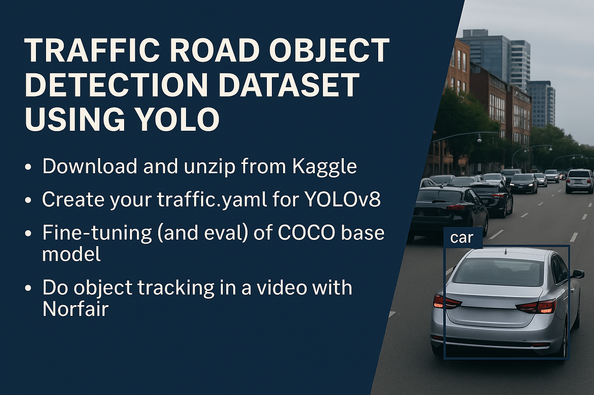

<h1 align="center"> 🚗 Traffic Road Object Detection — Fine-tuning YOLOv8 + Tracking en Video </h1>

  <em>De detección a tracking: construyendo un pipeline completo de visión para escenas reales de tráfico.</em>

🏷️ **Etiquetas Rápidas**  
`#YOLOv8` `#ObjectDetection` `#Tracking` `#Norfair` `#Kaggle` `#ComputerVision`  

---

## 🚀 Accesos Directos Importantes

&nbsp;

---

# 🧠 **Resumen Ejecutivo**

🎯 **Objetivo:**  
Entrenar un modelo YOLOv8 para detectar vehículos en escenas de tráfico **1080×1920** y luego aplicar **tracking en video**, siguiendo el estilo del assignment UT3-11.

Este dataset permite:

- Reproducir la práctica de detección (frutas) → ahora en **escenarios urbanos reales**.  
- Realizar **fine-tuning** con YOLOv8n/s/m.  
- Comparar:
  - YOLO COCO vs YOLO Fine-tuned.  
  - mAP@0.5 y mAP@0.5:0.95.  
- Implementar **tracking** con Norfair.  
- Trabajar con anotaciones reales formato YOLO.

📌 **Características del dataset:**

- Fotos en **1080×1920** (panorámicas de tráfico real).
- Etiquetas YOLO en `.txt`:
