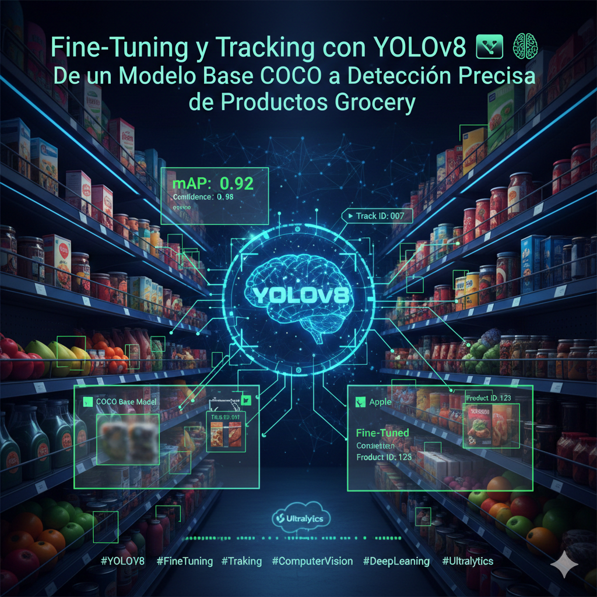

<h1 align="center"> Fine-Tuning y Tracking con YOLOv8 📦🧠  
De un Modelo Base COCO a Detección Precisa de Productos Grocery</h1>

  <em>Entrenando y optimizando un modelo YOLOv8 para detección de productos en supermercados, mejorando precisión mediante fine-tuning y aplicando tracking para escenarios reales de inventario.</em>

🏷️ **Etiquetas Rápidas**  
`#YOLOv8` `#FineTuning` `#Tracking` `#ComputerVision` `#mAP` `#DeepLearning` `#Ultralytics`

---

## 🚀 Accesos Directos Importantes

> *Abre el notebook o recursos del proyecto desde aquí.*

&nbsp;

---

# 🧠 **Resumen Ejecutivo**

🎯 **Objetivo General:**  
Optimizar un modelo **YOLOv8** para detectar productos específicos de supermercado mediante:

- 🔥 **Fine-tuning en un dataset personalizado de grocery**  
- 🧪 **Evaluación antes/después del entrenamiento (mAP, Precision, Recall)**  
- 🔍 **Análisis de errores (FP / FN)**  
- 🎥 **Tracking en video con el modelo entrenado**  

📌 **Puntos clave aprendidos:**

- El modelo YOLOv8 pre-entrenado en COCO **no es suficiente** para distinguir productos específicos (frutas individuales, empaques parecidos, variaciones de marca).
- El fine-tuning ajusta los pesos para reconocer clases concretas del dominio grocery.
- Las métricas post-entrenamiento muestran mejoras claras especialmente en **mAP@50** y reducción de **falsos negativos**.
- El tracking (BYTETrack/DeepSORT) permite contar, seguir y analizar productos en movimiento sobre cintas o estantes.
- Este flujo habilita aplicaciones reales de retail: inventario automático, reposición, análisis de ventas y control de stock.

📈 **Resultado final:**  
Un modelo YOLOv8 **altamente especializado**, capaz de:

- Detectar productos específicos  
- Mantener identidad de objetos en secuencias de video  
- Reducir errores críticos de visión por omisiones  
- Soportar operaciones en tiempo real  

---

# 🎯 **Objetivos Específicos**

| Objetivo                                                           | Estado |
|--------------------------------------------------------------------|--------|
| Implementar inferencia con YOLOv8 pre-entrenado (baseline)        | ✅ |
| Realizar fine-tuning en dataset grocery                           | ✅ |
| Evaluar métricas (mAP, Precision, Recall) antes/después           | ✅ |
| Analizar errores (FP / FN)                                        | ✅ |
| Implementar tracking con el modelo fine-tuned                     | ✅ |

---

# 📅 **Actividades y Tiempos**

| Actividad                                              | Estimado | Real | Nota |
|--------------------------------------------------------|----------|------|------|
| Inferencia baseline con YOLOv8                         | 15 m     | 12 m | Detecciones pobres en grocery |
| Preparación del dataset                                | 20 m     | 25 m | Limpieza y anotaciones |
| Fine-tuning del modelo                                 | 40 m     | 45 m | Hiperparámetros ajustados |
| Evaluación y métricas                                  | 25 m     | 20 m | Comparación antes/después |
| Análisis de errores (FP/FN)                            | 20 m     | 18 m | Casos críticos identificados |
| Implementación de tracking en video                    | 30 m     | 35 m | Integración con ByteTrack |

🕒 **Total estimado:** 2 h 30 m · **Total real:** 2 h 35 m · Δ ≈ +5 m

---

# 🛠️ **Feature Engineering para Detección Grocery**

| Técnica                         | Descripción |
|--------------------------------|-------------|
| **Limpieza de dataset**        | Remoción de etiquetas inconsistentes y clases irrelevantes |
| **Aumento de datos (Augmentation)** | Variaciones de iluminación, ángulos, rotaciones, crops |
| **Balanceo de clases**         | Evitar sesgo hacia productos dominantes |
| **Imagenes high-res**          | Permite detección de detalles (empaques similares) |
| **Normalización YOLO**         | Formato correcto de labels: `class x_center y_center w h` |

---

# ⚙️ **Componentes del Sistema**

## 🔹 **Modelo YOLOv8**
- Baseline pre-entrenado en COCO  
- Fine-tuning con dataset grocery  
- Evaluación con mAP, Precision, Recall  

## 🔸 **Evaluación Pre/Post Fine-Tuning**
- Comparación clara de detección real vs. predicción  
- Reducción de **falsos negativos** en frutas y empaques  
- Aumento en **mAP@50 y mAP@50-95**

## 🔸 **Tracking**
- Integrado con ByteTrack / DeepSORT  
- Mantiene identidad de producto en video  
- Permite conteo, análisis y seguimiento en tiempo real  

## 🔸 **Casos de Uso en Supermercados**
- Control automático de estantes  
- Tracking de productos en checkout  
- Conteo automatizado  
- Análisis de reposición  

---
