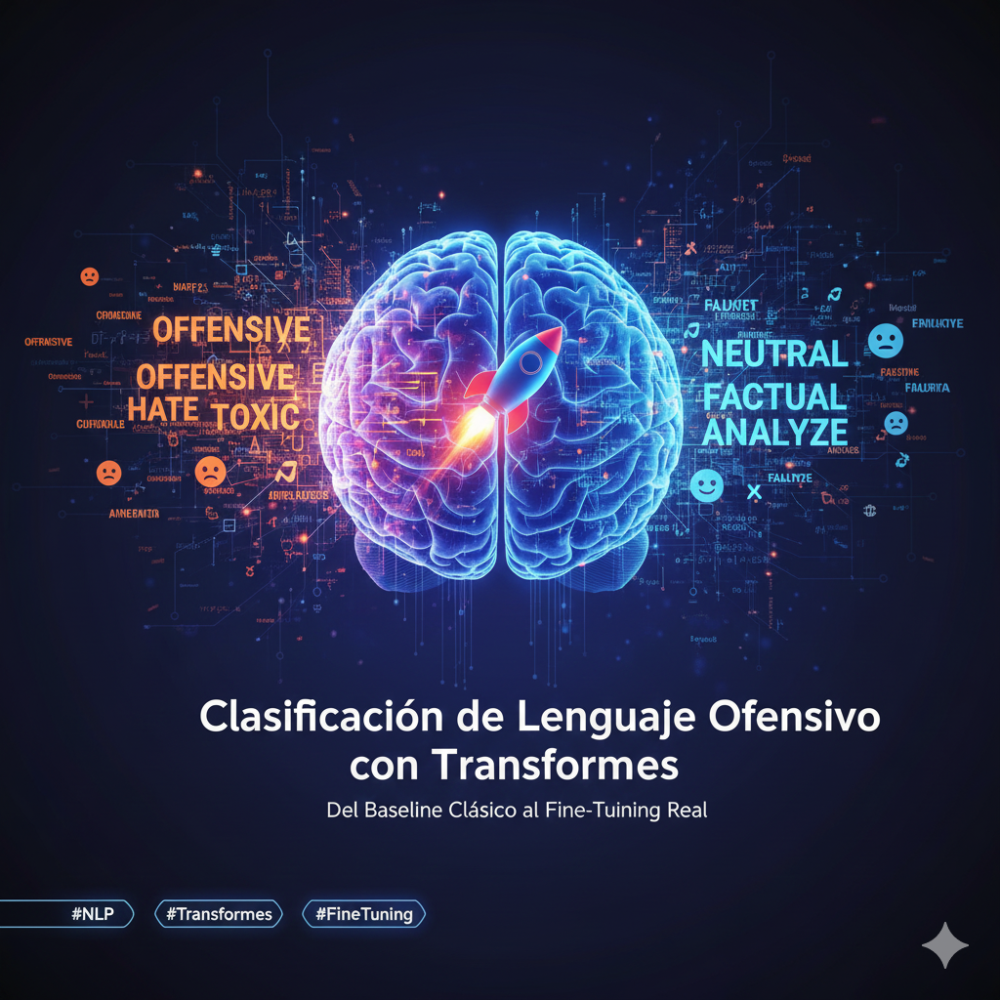

<h1 align="center"> Clasificación de Lenguaje Ofensivo en Español con OffendES 🚨🗣️</h1>




<p align="center">
  <em>Detección automática de lenguaje ofensivo en español usando TF-IDF + Logistic Regression y modelos Transformers fine-tuned. Análisis multiclase y binario con el dataset OffendES.</em>
</p>

---

🏷️ **Etiquetas Rápidas**  
#NLP #Transformers #SpanishNLP #OffensiveLanguage #TextClassification #HateSpeech #MachineLearning #BERT

---

## 🚀 Accesos Directos Importantes

<div align="center">

<a href="https://colab.research.google.com/drive/xxxxxxxxxxxxxxxxxxxx?usp=sharing">

</a>

<a href="https://huggingface.co/datasets/fmplaza/offendes">

</a>

</div>

---

## 🧠 Resumen Ejecutivo

El dataset **OffendES** contiene más de **30k comentarios** en español provenientes de redes sociales, etiquetados en 4 categorías de ofensividad:

- **NO** → No ofensivo  
- **NOE** → No ofensivo, con palabrotas  
- **OFP** → Ofensivo dirigido a persona  
- **OFG** → Ofensivo dirigido a grupo  

Se experimenta con dos enfoques:

1. **Clasificación multiclase (4 clases)**
2. **Clasificación binaria (ofensivo vs no ofensivo)**  
   → *(OFP, OFG) = 1 — (NO, NOE) = 0)*

El objetivo es comparar un baseline tradicional (**TF-IDF + Logistic Regression**) contra un modelo **Transformer en español** fine-tuned para ofensividad.

---

## 📌 Hallazgos Clave

- La división NO/NOE vs OFP/OFG genera un **desbalance claro**.
- TF-IDF funciona sorprendentemente bien, pero:
  - Falla en sarcasmo y contexto.
  - No detecta ofensividad indirecta.
- Los Transformers (p.ej. **RoBERTa-BNE** o **BERTin**) capturan:
  - relaciones semánticas,  
  - insultos implícitos,  
  - referencias culturales.  
- El fine-tuning mejora F1-macro → especialmente en clases minoritarias.

---

## 🎯 Objetivos Específicos

| Objetivo | Estado |
|---------|--------|
| Cargar OffendES desde HuggingFace | ✅ |
| EDA: distribución de clases + longitudes | ✅ |
| Preprocesamiento: limpieza y normalización | ✅ |
| Baseline TF-IDF + Logistic Regression | ✅ |
| Evaluación con matriz de confusión + métricas | ✅ |
| Fine-tuning de Transformer en español | ✅ |
| Comparación final de modelos | ✅ |

---

## 💾 Carga del Dataset (OffendES)

```python
!pip -q install -U datasets transformers scikit-learn

from datasets import load_dataset
import pandas as pd

# Cargar dataset ofensivo en español
ds = load_dataset("fmplaza/offendes")

# Convertimos el split principal a pandas
train_df = ds["train"].to_pandas()
df = train_df[["comment", "label"]].rename(columns={"comment": "text"})

df.head()

```

