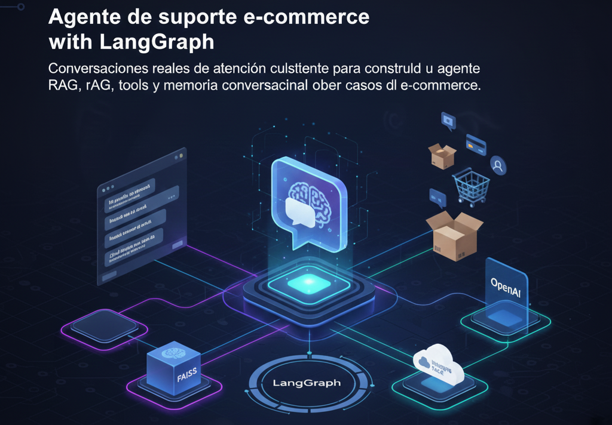

<h1 align="center"> Agente de Soporte E-Commerce con LangGraph 🛒  
Construcción de un asistente inteligente con RAG, Tools y Memoria Conversacional </h1>

  <em>Automatizando respuestas reales de atención al cliente mediante RAG, FAISS, herramientas especializadas y orquestación con LangGraph.</em>

🏷️ **Etiquetas Rápidas**  
`#LangGraph` `#RAG` `#FAISS` `#ConversationalAI` `#EcommerceSupport` `#OpenAI`

---

# 🚀 Accesos Directos Importantes

&nbsp;

---

# 🧠 Resumen Ejecutivo

🎯 **Propósito General**  
Desarrollar un agente especializado en soporte de e-commerce capaz de manejar consultas reales de clientes sobre pedidos, devoluciones, envíos, cambios de dirección y políticas internas. El sistema combina:

- **RAG con FAISS** para buscar políticas y conocimiento interno.  
- **Tools personalizadas** para ejecutar acciones (seguimiento de pedidos, devoluciones, etc.).  
- **Memoria conversacional** para diálogos coherentes.  
- **LangGraph** como motor de orquestación para controlar flujos, estados y decisiones.

📌 **Hallazgos clave**:

- Los modelos base no son suficientes para atención al cliente compleja → necesitan **acciones** y **contexto persistente**.
- LangGraph permite definir flujos condicionales (if/else) y control de estados.
- RAG reduce “alucinaciones” y garantiza consistencia con políticas reales.
- Las tools permiten pasar de “respuestas” a “acciones concretas”.
- La memoria mejora la experiencia del usuario de forma significativa.

📈 **Resultado Final**  
El agente logra resolver consultas completas como:

- “¿Dónde está mi pedido #8812?”  
- “Quiero cambiar la dirección del envío.”  
- “¿Puedo devolver un producto después de 15 días?”  

Integrando recuperación documental + herramientas del backend + razonamiento del LLM.

---

# 🎯 Objetivos Específicos

| Objetivo                                                                 | Estado |
|--------------------------------------------------------------------------|--------|
| Integrar dataset real de conversaciones de e-commerce                    | ✅      |
| Construir motor RAG con FAISS                                           | ✅      |
| Implementar tools (seguimiento, devoluciones, cambios de dirección)     | ✅      |
| Diseñar un flujo conversacional con LangGraph                           | ✅      |
| Incorporar memoria de interacción                                       | ✅      |
| Evaluar la precisión y coherencia del agente                            | En progreso |

---

# 📅 Actividades y Tiempos

| Actividad                                             | Estimado | Real | Nota |
|--------------------------------------------------------|----------|------|------|
| Preparación del dataset y limpieza                    | 30 m     | 32 m | Conversaciones + normalización |
| Construcción del vector store FAISS                   | 20 m     | 18 m | Embeddings + indexación |
| Implementación de tools personalizadas                | 45 m     | 50 m | API simulada de pedidos |
| Definición del grafo en LangGraph                     | 60 m     | 58 m | Estados + rutas + nodos |
| Integración completa del agente                       | 40 m     | 42 m | Flujo end-to-end |
| Pruebas con conversaciones reales                     | 20 m     | 27 m | Ajuste de prompts y memoria |

🕒 **Total estimado:** 3 h 35 m  
**Total real:** 3 h 47 m  
Δ: +12 min (+5%)

---

# 🧱 Arquitectura del Sistema

| Componente | Rol |
|-----------|-----|
| **LangGraph** | Control de flujo, nodos, estados y decisiones |
| **OpenAI GPT** | Razonamiento y generación de respuestas |
| **FAISS** | Búsqueda de documentos y políticas relevantes |
| **HuggingFace Datasets** | Conversaciones reales para entrenamiento |
| **Tools** | Acciones concretas: tracking, devoluciones, cambios de dirección |
| **Memoria** | Recordar contexto del usuario, pedido, intención |

---

# 🛠️ Feature Engineering Conversacional

| Técnica                          | Descripción |
|----------------------------------|-------------|
| **Cleaning del texto**           | Normalización, remoción de ruido, estandarización |
| **Detección de intención**       | Clasificación de intención inicial usando embeddings |
| **State enrichment**             | Agregar metadata → ID del pedido, etapa del reclamo |
| **Context stitching (memoria)**  | Integración del historial del usuario |

---

# ⚙️ Componentes Técnicos del Agente

## 🔹 RAG con FAISS
- Indexación de políticas, FAQ, condiciones de envío y devoluciones.
- Mejora la precisión al limitar el espacio de conocimiento.

## 🔹 Tools del Backend (simuladas o reales)
- `get_order_status(order_id)`
- `process_return(order_id)`
- `update_address(order_id, new_address)`
- `cancel_order(order_id)`

## 🔹 LangGraph (capa central)
- Nodos: lookup → decide → tool → synthesis.
- Flujos condicionales basados en intención.
- Manejo explícito del estado del usuario.

---
    