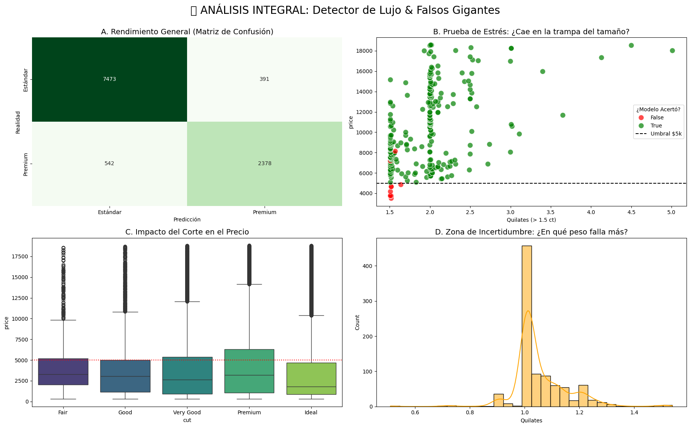
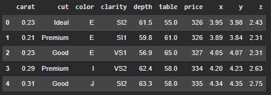
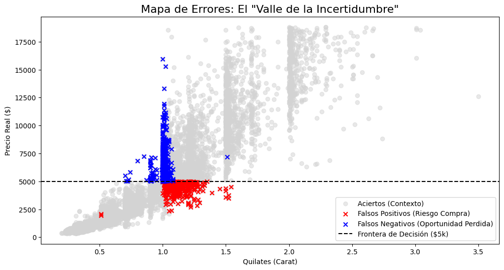
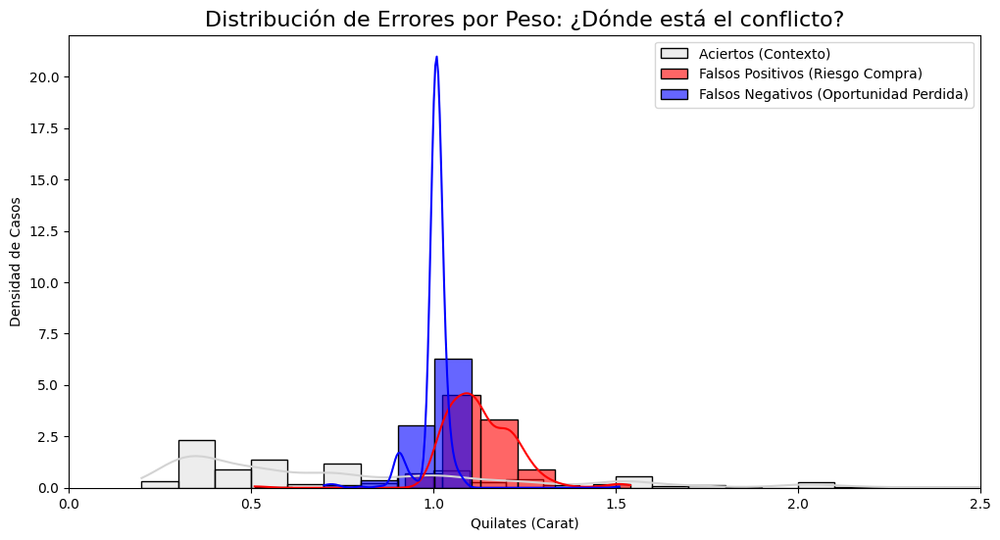
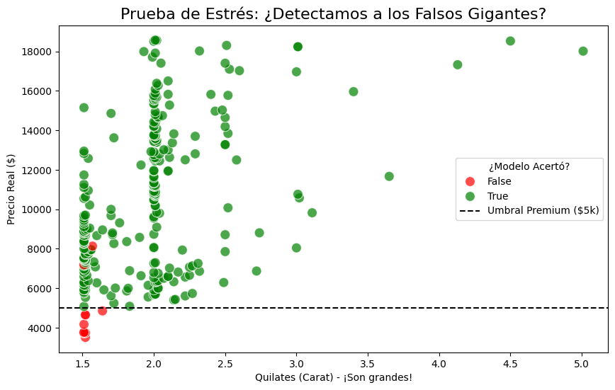
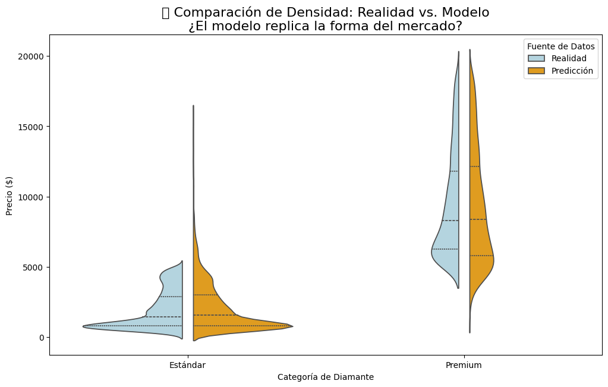

<h1 align="center">Clasificación de Inventario: El Detector de Lujo 💎</h1>


<p align="center">
  <em>Automatizando la tasación mediante Feature Engineering y detección de fraudes geométricos</em>
</p>

---

## 🏷️ **Etiquetas**

`#MachineLearning` `#Clasificación` `#FeatureEngineering` `#FraudDetection` `#Seaborn`

## 🚀 **Accesos Directos Importantes**

> *Haz clic en los botones para abrir el notebook y explorar el análisis completo.*

<div align="center">

<a href="https://colab.research.google.com/drive/17qhZwV40g2rweZdQLkcbFJjaMwUowQ7J?usp=sharing">
  
</a>
&nbsp;
<a href="https://drive.google.com/drive/folders/11rYhh7oSJ2nJ5baRXxLNrZYkBwdUykTO?usp=sharing">
  
</a>

</div>

---

## 📝 **Resumen Ejecutivo**

**🎯 Objetivo Principal**
Transformar un problema de tasación manual subjetiva en un modelo de clasificación binaria automatizado. El objetivo es identificar **"Piezas Premium" (Valor > $5,000 USD)** basándose en geometría y calidad, superando la intuición básica del peso.

**📌 Hallazgos Clave**

> * "El **Volumen** y la **Calidad del Corte** superan al simple peso como predictores de valor real."

* **📐 Victoria de los Datos:** El modelo alcanzó una precisión del **90.60%**, superando en +20 puntos al azar (Dummy Classifier).
* **🐘 Detección de Falsos Gigantes:** La IA aprendió a rechazar diamantes grandes (>1.5 ct) pero de mala calidad ("Fair"), evitando la compra de "piedras muertas".
* **⚠️ El Punto Ciego:** Se identificó una zona de alto riesgo en el rango **0.95 - 1.05 quilates**, donde el mercado infla precios artificialmente, requiriendo revisión humana.

    **📦 Ficha Técnica del Dataset**

* **Fuente:** Dataset clásico de Diamonds (Seaborn/Kaggle).
* **Dimensiones:** ~54,000 Observaciones · 10 Variables (Originales) + 3 Sintéticas.

---

## 📊 **Gestión del Proyecto**

### ✅ Checklist de Objetivos

| Tarea | Estado |
| :--- | :---: |
| 📥 Carga y Feature Engineering (`Volume`, `Cut_Score`) | ☑️ |
| 🤖 Entrenamiento de Modelos (Dummy vs. LogReg) | ☑️ |
| 📉 Análisis de Errores (Matriz de Confusión) | ☑️ |
| 🧩 Resolución de Casos Borde (Falsos Gigantes) | ☑️ |

### ⏰ Cronograma: Diamonds Classification

| Actividad | ⏱️ Estimado | ⏰ Real | 📝 Notas |
| :--- | :---: | :---: | :--- |
| **Ingeniería de Características** | 20 m | **25 m** | Creación de `Volume` y mapeo ordinal |
| **Modelado Base vs Real** | 30 m | **35 m** | Comparativa de Accuracy (+20% mejora) |
| **Caso 1: Autopsia de Errores** | 25 m | **30 m** | Identificación del pico de error en 1.0ct |
| **Caso 2: Falsos Gigantes** | 25 m | **20 m** | Prueba de estrés con diamantes grandes/malos |
| **Dashboard Integral** | 20 m | **25 m** | Visualización de 4 paneles |
| **TOTAL** | **2h 00m** | **2h 15m** | 🔼 **+12%** (Ajuste por profundidad de análisis) |

---

## 📚 **Diccionario de Datos Clave**

| Variable | Tipo | Unidad | Descripción |
| :--- | :--- | :--- | :--- |
| `price` | Numérica | USD | Precio del diamante (Variable original) |
| `IsPremium` | Binaria | 0/1 | **Target:** 1 si Precio > $5,000 (Creada) |
| `carat` | Numérica | ct | Peso del diamante |
| `Volume` | Numérica | mm³ | `x * y * z`. Representa la presencia visual |
| `cut` | Ordinal | — | Calidad (Fair, Good, Very Good, Premium, Ideal) |
| `Cut_Score` | Numérica | 1-5 | Transformación numérica de la calidad |

---

## 🔍 **Análisis Detallado de Resultados**

### 1. Variables Discriminantes (La Fórmula del Valor)

* **Factor n.º 1:** `Volume` (Geometría). El ojo compra tamaño visual, no densidad.
* **Factor n.º 2:** `Cut_Score` (Brillo). Un corte 'Ideal' multiplica el valor; un corte 'Fair' lo destruye, actuando como un techo de precio.

### 2. Detección de Conflictos (Análisis Avanzado)

* **El Valle de la Incertidumbre:** El modelo falla específicamente en la frontera de **1.00 quilate**. Aquí, el precio salta por psicología de mercado, no por física, confundiendo al algoritmo.
* **Resistencia al Engaño:** En la "Prueba de Estrés", el modelo demostró que no se deja deslumbrar por el tamaño. Clasificó correctamente como "Estándar" a diamantes de 2 quilates con corte malo.

---

## 📸 **Visualización Clave**

Este dashboard resume la capacidad del modelo para distinguir valor real de aparente.



* **A. Matriz de Confusión:** Confirma una solidez general del 90%. La diagonal verde oscura indica que la mayoría de decisiones son aciertos.
* **B. Prueba de Estrés:** Los puntos verdes bajo la línea de $5k demuestran que el modelo rechaza los "Falsos Gigantes".
* **C. Impacto del Corte:** Valida que el corte 'Fair' deprime el precio, justificando por qué el modelo penaliza estas piedras.
* **D. Histograma de Errores:** Revela el "Punto Ciego" alrededor del 1.0 quilate.

---

## 🔄 **DESAFIOS DIRECTOS CON EL DATASET**

Instalación rápida:

```bash
pip install -q pandas seaborn scikit-learn matplotlib
```

```python
import pandas as pd
import seaborn as sns
# Carga y Feature Engineering Rápido
df = sns.load_dataset('diamonds')
df['IsPremium'] = (df['price'] > 5000).astype(int)
df['Volume'] = df['x'] * df['y'] * df['z']
df = df[df['Volume'] > 0] # Limpieza de errores físicos
#MOSTRAR LAS PRIMERAS FILAS ---
df.head()
```



# **Caso 1: El Dilema de la "Joya Falsa"** 💎

### **⚠️ Situación Detectada:**
Un modelo con 90% de precisión es bueno, pero el 10% de error restante representa un riesgo financiero real. Me preocupa el impacto de los **Falsos Positivos** (comprar una piedra "Estándar" a precio de "Premium") y los **Falsos Negativos** (vender una joya valiosa a precio de ganga).
Si estos errores no son aleatorios, sino que siguen un patrón físico, estamos ante una vulnerabilidad sistemática del negocio.

### **🎯 Objetivo de esta sección:**
Quiero realizar una **"Autopsia de Errores"** para identificar si existe un "Punto Ciego" (un rango específico de peso o calidad) donde la IA falla constantemente, y así crear una regla de **"Revisión Humana Obligatoria"** para mitigar el riesgo.

### **Cálculo Previo: Aislando el Error** 🕵️‍♂️

> Este fragmento de código prepara el terreno para la investigación forense.

> 1.  **Entrena** el modelo logístico y genera predicciones sobre el set de prueba.
> 2.  **Filtra** y aísla exclusivamente los casos donde el modelo se equivocó (`Predicción != Realidad`).
> 3.  **Analiza** la distribución de estos errores respecto al peso (`carat`) para ver si se agrupan en una zona específica.


```python hl_lines="8 9 10 11 14 15 16" linenums="1"
# --- Datos y features clave ---
df = sns.load_dataset('diamonds')
df = df.assign(
    IsPremium = (df['price'] > 5000).astype(int),
    Volume = df['x'] * df['y'] * df['z'],
    Cut_Score = df['cut'].map({'Fair':1,'Good':2,'Very Good':3,'Premium':4,'Ideal':5})
)
df = df[df['Volume'] > 0]  # limpiamos outliers

X = df[['carat','Volume','Cut_Score']]
y = df['IsPremium']

# --- Modelo ---
X_train, X_test, y_train, y_test = train_test_split(X, y, test_size=0.2, random_state=42)
log = LogisticRegression(max_iter=1000, solver='liblinear').fit(X_train, y_train)
y_pred = log.predict(X_test)

# --- Errores importantes ---
res = X_test.copy()
res['Realidad'], res['Pred'], res['Precio'] = y_test, y_pred, df.loc[X_test.index,'price']

FP = res[(res['Realidad']==0)&(res['Pred']==1)]   # riesgo de comprar caro algo barato
FN = res[(res['Realidad']==1)&(res['Pred']==0)]   # oportunidad perdida

print("FP:", len(FP), "  FN:", len(FN))
```



### 📉 **Falsos Positivos**  

**“Basura vendida como Oro”**  
➡️ **391 casos**

### 💸 **Falsos Negativos**  

**“Tesoros perdidos”**  
➡️ **542 casos**

### 🖼️ **Visualización Final: El “Valle de la Incertidumbre”** 💎⚠️

> Este bloque es el cierre visual del análisis. Convierte los errores del modelo en una **señal clara y accionable**.

> 1. **Genera el Gráfico:** Cruza la variable clave del mercado (**Carat**) contra el **Precio Real** de cada diamante.

> 2. **Resalta los Errores:** Marca en rojo los **Falsos Positivos** (riesgo de pagar de más) y en azul los **Falsos Negativos** (oportunidad perdida).

> 3. **Traza el Umbral:** Dibuja la línea negra punteada en **$y = 5000$**, la frontera que define si un diamante es *Premium*.

> 4. **Interpreta el Mapa:** La mezcla de puntos rojos y azules revela la zona crítica donde el modelo pierde precisión —el verdadero **Valle de la Incertidumbre**.


### 📊 **Distribución de Errores por Peso** ⚖️

- La curva **gris** muestra el patrón normal del inventario: picos en 0.3, 0.5, 0.7 y 1.0 ct.
- Las curvas **roja (FP)** y **azul (FN)** se concentran en **1.0 ct**.
- Causa: el precio salta artificialmente al pasar de 0.99 a 1.00 ct.
- Problema: el modelo usa física (Volumen/Peso) y no entiende este salto psicológico → se confunde en la frontera de 1 ct.

```python hl_lines="5 6 9 10 11 12" linenums="1"
# --- Distribución de errores por carat (versión reducida) ---
plt.figure(figsize=(12, 6))

# Aciertos (gris)
sns.histplot(resultados[resultados['Realidad']==resultados['Prediccion']]['carat'],
             color='lightgray', kde=True, alpha=0.3)

# Falsos Positivos (rojo)
sns.histplot(falsos_positivos['carat'], color='red', kde=True, alpha=0.6)

# Falsos Negativos (azul)
sns.histplot(falsos_negativos['carat'], color='blue', kde=True, alpha=0.6)

plt.title('Distribución de Errores por Carat')
plt.xlabel('Carat')
plt.xlim(0, 2.5)
plt.show()
```



---

# **Caso 2: El Misterio de los "Falsos Gigantes"** 🐘

### **⚠️ Situación Detectada:**
He detectado una práctica común en el mercado conocida como los **"Cortes Comerciales"**. Son diamantes donde el cortador sacrificó la belleza (brillo) deliberadamente para maximizar el peso (`carat`).
El resultado es una piedra grande y pesada, pero de baja calidad óptica. Mi preocupación estratégica es que el modelo, al ver un quilataje alto, asuma automáticamente que es **"Premium"**, cayendo en la trampa del tamaño y recomendando la compra de piedras que son difíciles de revender.

### **🎯 Objetivo de esta sección:**
Quiero someter al modelo a una **"Prueba de Estrés"** específica. Voy a aislar el segmento de **Diamantes Grandes (> 1.5 ct) con Peor Corte (Fair)** y evaluar qué tan bien distingue la IA entre un "Gigante Real" (valioso) y un "Falso Gigante" (pura masa sin valor). Si el modelo clasifica a los "Falsos Gigantes" como Premium, tenemos un fallo lógico grave.

### **Configuración Previa: Aislando la Trampa** 🧪

> Este fragmento de código realiza una segmentación quirúrgica del dataset:

> 1.  **Filtra** los datos para encontrar solo los casos extremos y hostiles: Peso alto + Calidad baja.
> 2.  **Evalúa** la precisión del modelo específicamente en este nicho para ver si se degrada.
> 3.  **Visualiza** la relación Peso vs. Precio coloreada por la predicción, buscando confirmar si la IA es capaz de trazar la línea divisoria correctamente a pesar del tamaño.

```python hl_lines="5 6 10 11" linenums="1"
# --- Entrenamiento mínimo ---
df = sns.load_dataset('diamonds')
df = df.assign(
    IsPremium = (df['price'] > 5000).astype(int),
    Volume = df['x'] * df['y'] * df['z'],
    Cut_Score = df['cut'].map({'Fair':1,'Good':2,'Very Good':3,'Premium':4,'Ideal':5})
)
df = df[df['Volume'] > 0]

X = df[['carat','Volume','Cut_Score']]
y = df['IsPremium']

log = LogisticRegression(max_iter=1000, solver='liblinear').fit(*train_test_split(X, y, test_size=0.2, random_state=42))

# --- Falsos Gigantes (prueba de estrés) ---
trampa = df[(df['carat'] > 1.5) & (df['cut']=='Fair')]
pred = log.predict(trampa[X.columns])

print("Falsos Gigantes:", len(trampa))
print("Precisión:", accuracy_score(trampa['IsPremium'], pred))
```



### 🖼️ **Visualización Final: ¿El modelo replica la forma del mercado?** 🎻💎

- **1. Genera el Gráfico:**  
  Se construyen violines divididos comparando **precios reales** y **precios predichos** en las categorías *Estándar* y *Premium*.

- **2. Resalta las Curvas:**  
  - 🔵 **Azul (Realidad):** muestra la forma verdadera del mercado.  
  - 🟧 **Naranja (Predicción):** refleja cómo el modelo imagina esa distribución.

- **3. Traza la Forma:**  
  En Estándar, ambas curvas mantienen casi la misma forma → el modelo reproduce bien los precios bajos.  
  En Premium, la realidad presenta una **cola larga** hacia precios altos, mientras que el modelo **aplana** esa cola y reduce la variabilidad.

- **4. Interpreta el Mapa:**  
  Las formas son similares, indicando que el modelo entiende la estructura general del mercado.  
  Sin embargo, la predicción es más “suave”, especialmente en Premium → el modelo aún no captura toda la dispersión real en precios elevados.


### **Realidad vs. Predicción en la Forma del Mercado** 💎

> Este bloque evalúa si el modelo no solo acierta etiquetas, sino si logra **replicar la distribución real de precios** del mercado de diamantes.

> 1. **Genera el Gráfico:** Se trazan violines divididos que comparan los **precios reales** y los **precios predichos** para ambas categorías: *Estándar* y *Premium*.

> 2. **Resalta las Fuentes de Datos:**  
>    - 🔵 **Azul – Realidad:** muestra la estructura verdadera del mercado.  
>    - 🟧 **Naranja – Predicción:** muestra cómo el modelo imagina esa distribución.

> 3. **Traza la Forma:** En los violines se observa si ambos lados mantienen **la misma geometría**, especialmente en la cola alta de precios donde se concentra el valor Premium.

> 4. **Interpreta el Mapa:**  
>    En Estándar, las dos curvas coinciden casi por completo → el modelo replica bien los precios bajos.  
>    En Premium, la forma general es similar, pero el modelo **suaviza demasiado** la cola alta → tiende a aplanar precios elevados.  
>    Esto confirma que el modelo entiende la división Estándar/Premium, pero **no captura toda la variabilidad real** en los precios altos.

```python hl_lines="2 3 4 11 12" linenums="1"
# Unimos datos reales y predicciones en un solo DF para compararlos en un violin plot
df_comp = pd.concat([
    pd.DataFrame({'Precio': df.loc[X_test.index,'price'], 'Clase': y_test, 'Tipo': 'Realidad'}),     # precios reales
    pd.DataFrame({'Precio': df.loc[X_test.index,'price'], 'Clase': y_pred, 'Tipo': 'Predicción'})    # predicciones del modelo
])

# Cambiamos 0/1 por etiquetas entendibles
df_comp['Clase'] = df_comp['Clase'].map({0: 'Estándar', 1: 'Premium'})

# Gráfico violin dividido: compara forma de la distribución Realidad vs Predicción
sns.violinplot(data=df_comp, x="Clase", y="Precio", hue="Tipo",
               split=True, inner="quart",
               palette={"Realidad": "lightblue", "Predicción": "orange"})

plt.title('Comparación Realidad vs Predicción')
plt.show()
```



###  **Análisis: ¿El modelo replica la forma del mercado?** 📈

- En la categoría **Estándar**, la distribución real (azul) tiene una cola corta y precios bajos muy concentrados.  
  → El modelo (naranja) reproduce esta forma casi igual: buena calibración en la clase barata.

- En la categoría **Premium**, la realidad muestra una **cola muy larga** hacia precios altos, típica del mercado de diamantes caros.  
  → El modelo también sigue esa forma, pero **aplana ligeramente** la cola, reduciendo la variabilidad de los precios altos.

- El punto clave: las dos mitades del violín (Realidad vs Predicción) tienen **formas similares**, lo que indica que el modelo aprendió bien la estructura del mercado.

- Sin embargo, la predicción tiende a ser **más “suave”**, especialmente en Premium, señal de que el modelo aún no captura del todo la dispersión real en precios elevados.

