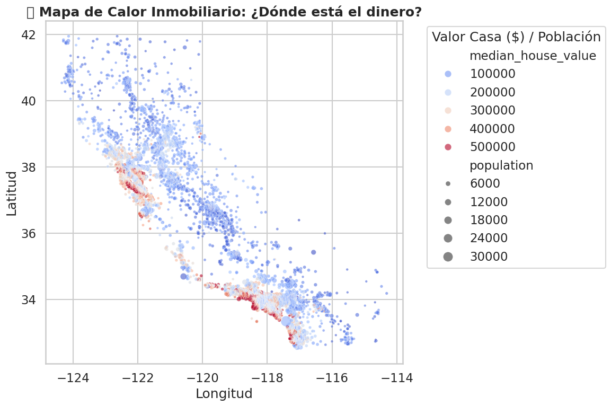
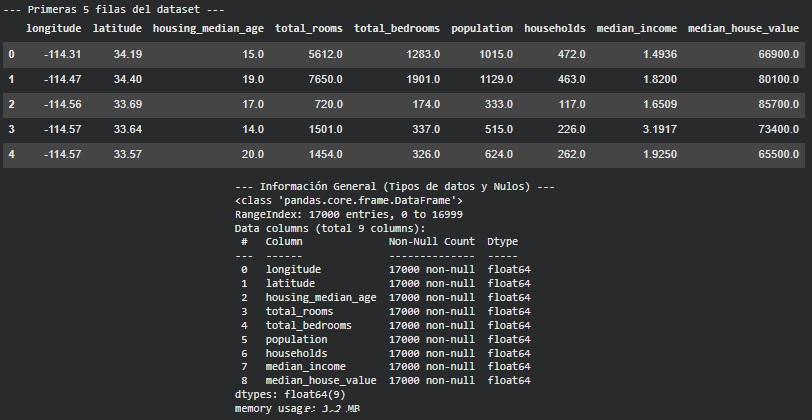
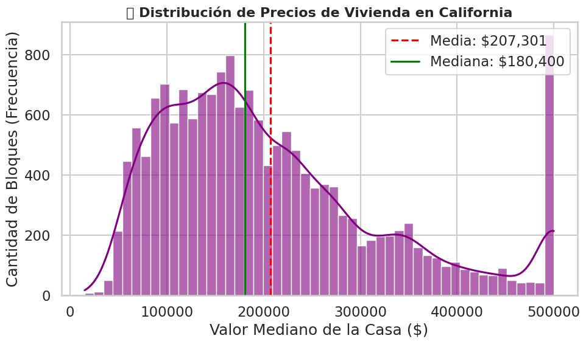
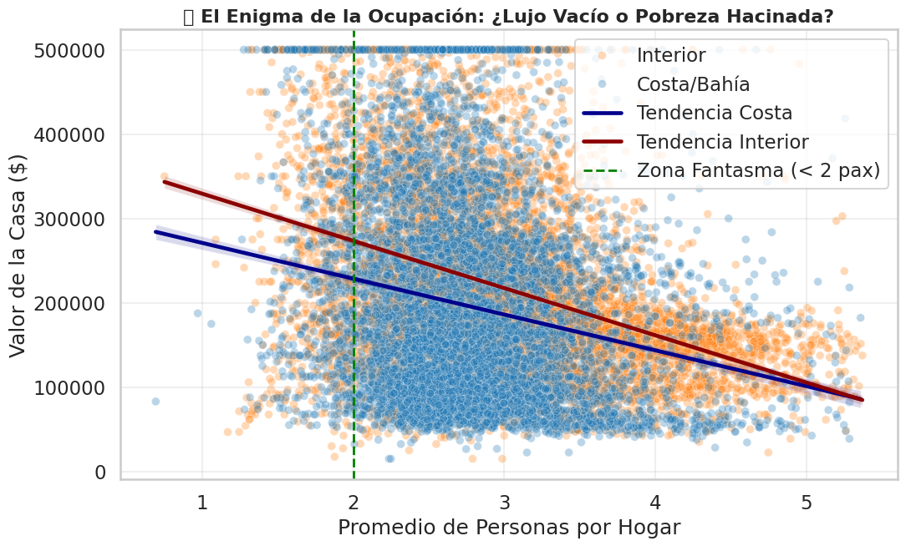
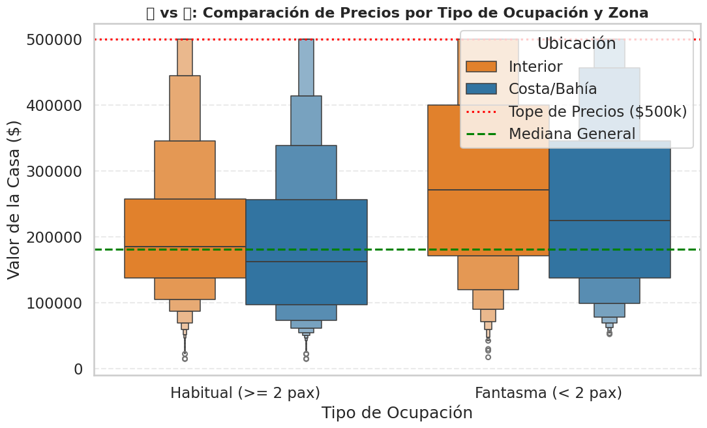
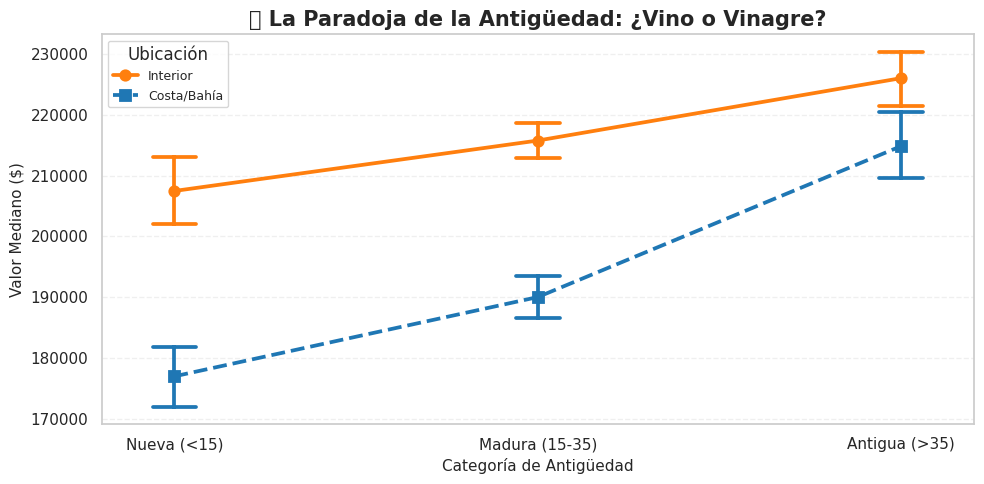

<h1 align="center">Valoración Inmobiliaria: El Oráculo de Precios 🏠</h1>


<p align="center">
  <em>Predicción de valor mediante análisis geoespacial y detección de anomalías económicas</em>
</p>

---

🏷️ **Etiquetas**  
`#MachineLearning` `#Regresión` `#GeoSpatial` `#RealEstate` `#Seaborn`

---

## 🚀 Accesos Directos Importantes

> *Haz clic en los botones para abrir el notebook y explorar el análisis completo.*

<div align="center">

<a href="https://colab.research.google.com/drive/1BtVqpaGvNrAl90IEga2JcqFLTCMrTROo?usp=sharing">
  
</a>
&nbsp;
<a href="https://drive.google.com/drive/folders/1vUQ99KauN47oq98qeLm1-e861zo_sQqT?usp=drive_link">
  
</a>

</div>
---

## 📝 Resumen Ejecutivo

### 🎯 Objetivo Principal

Transformar un análisis descriptivo tradicional en un **modelo de valoración inmobiliaria** capaz de explicar y predecir patrones de precios en California.  
El objetivo es identificar **los factores que elevan o reducen el Valor Mediano de la Vivienda (`MedianHouseValue`)**, superando la intuición básica de “más ingresos = casas más caras”.

### 📌 Hallazgos Clave

> "La ubicación domina al ingreso: vivir cerca de la costa cambia por completo las reglas del mercado."

- 🌊 **La Tiranía de la Costa:**  
  El análisis confirma que **la ubicación costera duplica el valor** de viviendas equivalentes en el interior, incluso manteniendo constantes ingresos y antigüedad.

- 👻 **El Enigma de las Casas Fantasma:**  
  Se detectó un segmento de viviendas **con menos de 2 habitantes** ubicadas en la costa cuyo valor es extremadamente alto.  
  No son barrios vacíos: son **propiedades de lujo y residencias vacacionales**.

- 🏛️ **La Paradoja de la Antigüedad:**  
  La relación Edad–Precio se invierte según la zona:  
  - En la **costa**, mayor antigüedad → **mayor valor** (atractivo vintage).  
  - En el **interior**, mayor antigüedad → **depreciación** (mantenimiento, obsolescencia).  
  Este patrón demuestra la **necesidad de modelos con interacción Zona × Edad**.

---


## 📦 Ficha Técnica del Dataset

- **Fuente:** California Census Data (1990).  
- **Dimensiones:** 17,000+ observaciones  
- **Variables:** 8 originales + 3 sintéticas (`Avg_Occupancy`, `Zona`, `Antiguedad_Cat`).

---

## 📊 Gestión del Proyecto

### ✅ Checklist de Objetivos

| Tarea                                           | Estado |
|------------------------------------------------|--------|
| 📥 Carga y Limpieza (Censura en \$500k)        | ☑️     |
| 🗺️ Análisis Geoespacial (Mapa de Calor)        | ☑️     |
| 👻 Resolución del Caso 1: Casas Fantasma       | ☑️     |
| 🏛️ Resolución del Caso 2: Paradoja de Antigüedad | ☑️  |

### ⏰ Cronograma: California Valuation

| Actividad                  | ⏱️ Estimado | ⏰ Real | 📝 Notas                               |
|---------------------------|------------|--------|----------------------------------------|
| EDA Geoespacial           | 20 m       | 25 m   | Visualización de Latitud/Longitud      |
| Análisis de Ingresos      | 20 m       | 20 m   | Detección del tope de \$500k           |
| Caso 1: Ocupación         | 30 m       | 35 m   | Feature Engineering `Avg_Occupancy`    |
| Caso 2: Antigüedad        | 30 m       | 30 m   | Segmentación por Edad y Zona           |
| Interpretación Estratégica| 20 m       | 25 m   | Redacción de reglas de valoración      |
| **TOTAL**                 | **2h 00m** | **2h 15m** | 🔼 +12% (Profundidad en análisis zonal) |

---

## 📚 Diccionario de Datos Clave

| Variable            | Tipo     | Unidad    | Descripción                                      |
|---------------------|----------|-----------|--------------------------------------------------|
| `median_house_value`| Numérica | USD       | Target: Valor mediano de la casa                 |
| `median_income`     | Numérica | 10k USD   | Ingreso mediano del bloque                       |
| `latitude` / `longitude` | Numérica | Grados | Coordenadas geográficas                          |
| `housing_median_age`| Numérica | Años      | Antigüedad mediana de la vivienda                |
| `Avg_Occupancy`     | Calculada| Pax/Casa  | Habitantes promedio por hogar                    |
| `Zona`              | Calculada| Cat       | Segmentación: Costa vs. Interior                 |

---

## 🔍 Análisis Detallado de Resultados

### 1. Variables Discriminantes (La Fórmula del Precio)

- **Factor n.º 1: Location (Costa vs Interior).**  
  Es el determinante más fuerte del valor: vivir cerca del océano establece un **precio base mucho más alto**, incluso antes de considerar ingresos o antigüedad.

- **Factor n.º 2: Income (Poder adquisitivo local).**  
  Incrementa directamente el valor percibido de la vivienda, pero aparece un **techo artificial de $500k**, producto de la censura del dataset original.

---

### 2. Detección de Conflictos (Análisis Avanzado)

- **El Enigma de la Ocupación:**  
  Aunque se esperaría que baja ocupación indique abandono, se detectó un patrón contrario:  
  **viviendas con menos de 2 habitantes en la costa presentan los precios más altos**.  
  Estas corresponden a **casas de lujo, segundas residencias o propiedades vacacionales**.

- **La Paradoja de la Edad:**  
  La relación entre antigüedad y valor **cambia según la zona**:  
  - En la **costa**, lo “antiguo” se percibe como “histórico / vintage”, aumentando el valor.  
  - En el **interior**, la antigüedad se traduce en depreciación por mantenimiento u obsolescencia.  

  Esta inversión de patrones demuestra que un **modelo lineal global fallaría**,  
  porque no captura la **interacción Zona × Antigüedad**.

---

## 📸 Visualización Clave

Este dashboard resume cómo la ubicación y la ocupación definen el valor inmobiliario.



- **A. Mapa de Calor:** Confirma visualmente la concentración de riqueza en la franja costera (puntos rojos).  
- **B. El Enigma Fantasma:** El gráfico de dispersión revela la anomalía de la izquierda: casas con `< 2` habitantes que alcanzan los precios más altos del mercado.  
- **C. Paradoja de la Edad:** Las líneas divergentes muestran cómo lo "viejo" se revaloriza en la costa (línea azul ascendente) pero se deprecia en el interior (línea naranja plana).


## 🔄 **DESAFIOS DIRECTOS CON EL DATASET**

Instalación rápida:

```bash
pip install -q pandas seaborn scikit-learn matplotlib
```

```python
import pandas as pd
import seaborn as sns
import matplotlib.pyplot as plt

# 1. CARGA DE DATOS
# Usamos el archivo que ya viene en Colab por defecto
df = pd.read_csv('sample_data/california_housing_train.csv')

# 2. VISTAZO INICIAL A LOS DATOS
print("--- Primeras 5 filas del dataset ---")
display(df.head())

print("\n--- Información General (Tipos de datos y Nulos) ---")
df.info()

print("\n--- Estadísticas Descriptivas ---")
display(df.describe())
```



## 📊 Distribución de Precios: Radiografía del Mercado Inmobiliario

Antes de construir cualquier modelo, es crucial entender **cómo se distribuyen los precios reales** dentro del dataset de California.  
Este gráfico permite detectar:

- **Sesgos severos**, como el tope artificial de \$500,000 impuesto en el censo original.  
- **Asimetría en la distribución**, revelando un mercado donde pocos bloques tienen precios extremadamente altos.  
- **Diferencia entre media y mediana**, clave para saber si el mercado está "jalado" por valores atípicos.

Además, se incluyen líneas verticales que representan:

- 🔴 **Media**: Indica el promedio general, pero es muy sensible a valores extremos.  
- 🟢 **Mediana**: Mide el “precio típico” y es más robusta ante outliers.

Este gráfico responde a una pregunta esencial:

> **¿Es el mercado inmobiliario de California equilibrado… o está altamente sesgado hacia precios altos?**

A continuación se genera el histograma con curva KDE:



### 📊 Interpretación del Gráfico: ¿Cómo respira el mercado inmobiliario?

Este gráfico responde a una pregunta esencial:

> **¿Es el mercado inmobiliario de California equilibrado… o está altamente sesgado hacia precios altos?**

#### 🔍 Lecturas Clave del Histograma

- **Sesgo hacia la derecha:**  
  La mayoría de barrios se concentran en valores bajos o intermedios, mientras una cola larga empuja el mercado hacia precios altos. Esto revela desigualdad estructural.

- **Media vs. Mediana separadas:**  
  La media está mucho más a la derecha que la mediana, señal de **outliers** poderosos que inflan artificialmente el valor promedio.

- **El famoso tope de \$500,000:**  
  El corte abrupto al final del gráfico delata la **censura del dataset original**.  
  Este límite crea una acumulación artificial de valores máximos que un modelo debe tratar con cuidado.

---

# **Caso 1: El Enigma de las "Casas Fantasma"** 👻

### **⚠️ Situación Detectada:**
La intuición inmobiliaria suele decir:  
> *“Zonas pobres → mucho hacinamiento; zonas ricas → pocas personas por vivienda.”*

Pero en los datos de California aparece algo que rompe esta regla:  
bloques censales con **ocupación extremadamente baja (< 1 persona por casa)** y, al mismo tiempo, **valores de vivienda muy altos**.  
Esto sugiere la existencia de un mercado oculto de **“viviendas de lujo vacías”** o de uso **vacacional/inversión**, especialmente cerca de la costa.

### **🎯 Objetivo de esta sección:**
Quiero aislar el impacto de la **densidad de ocupación** (`Population / Households`) sobre el **valor de la vivienda**.

La hipótesis de trabajo es que la relación no es lineal, sino con forma de **“U” o bifurcada**:

- **Hacinamiento extremo** → puede indicar **vulnerabilidad económica** y menor valor por vivienda.  
- **Vacancia extrema** → puede indicar **exclusividad y lujo** (casas de temporada o inversión).

El objetivo es verificar si estos patrones se **concentran en la Costa** frente al **Interior**, para entender mejor la lógica económica detrás de las “Casas Fantasma”.

### **Cálculo Previo: Creando la Métrica de Ocupación** 📏

> Este fragmento de código prepara el terreno para analizar el fenómeno de las "Casas Fantasma":

> 1. **Calcula** el promedio de habitantes por hogar (`Avg_Occupancy = Population / Households`) en cada bloque censal.  
> 2. **Filtra** los casos extremos irreales (por ejemplo, más de 15–20 personas por vivienda) para reducir errores de carga o outliers imposibles.  
> 3. **Segmenta** por zona (`Costa` vs `Interior`) para comparar si la baja ocupación de alto valor es un fenómeno exclusivo de la franja costera o también se da tierra adentro.

```python hl_lines="8 5 11 20 14 15 16" linenums="1"
# Crear métrica clave: ocupación promedio
df['Avg_Occupancy'] = df['population'] / df['households']

# Filtrar valores irreales (> percentil 99)
df = df[df['Avg_Occupancy'] < df['Avg_Occupancy'].quantile(0.99)]

# Segmentar Costa vs. Interior (heurística por longitud)
df['Zona'] = df['longitude'].apply(lambda lon: 'Costa/Bahía' if lon < -119 else 'Interior')

# --- 2. GRÁFICO PRINCIPAL ---
plt.figure(figsize=(12, 7))

# Dispersión de ocupación vs valor
sns.scatterplot(
    data=df, x='Avg_Occupancy', y='median_house_value',
    hue='Zona', alpha=0.3, s=50
)

# Línea vertical: zona fantasma (< 2 personas)
plt.axvline(2, color='green', linestyle='--', label='Zona Fantasma (< 2 pax)')

plt.title('👻 El Enigma de la Ocupación: ¿Lujo Vacío o Pobreza Hacinada?')
plt.xlabel('Promedio de Personas por Hogar')
plt.ylabel('Valor de la Casa ($)')
plt.legend()
plt.grid(alpha=0.3)
plt.show()

# --- 3. MINI VEREDICTO ---
fantasmas = df[df['Avg_Occupancy'] < 2]
print(f"Casas Fantasma: {len(fantasmas)} bloques")
print(f"Valor promedio Fantasma: ${fantasmas['median_house_value'].mean():,.0f}")
print(f"Promedio General:         ${df['median_house_value'].mean():,.0f}")
```



### **🧩 ¿Qué revela este gráfico?**

Este scatter responde a una pregunta clave del análisis:

> **¿Baja ocupación significa abandono… o lujo silencioso?**

Lo que observas aquí es una radiografía socioeconómica inesperada:  
zonas con **muy poca gente viviendo en cada hogar** muestran, paradójicamente, **los valores inmobiliarios más altos**, especialmente cerca de la costa.

### **Lecturas Clave del Gráfico📊**

#### **1. La Zona Fantasma (< 2 personas por hogar)**  

- El umbral marcado en verde delimita el rango donde aparece el fenómeno.  
- En lugar de pobreza o abandono, este sector concentra **bloques con precios cercanos al máximo del dataset**.  
- Indica **residencias vacacionales, segundas propiedades o viviendas de lujo con baja ocupación real**.

#### **2. Costa vs Interior: Dos Historias Distintas**

- Los puntos **azules** (Costa/Bahía) dominan la parte superior del gráfico.  
  → **Las casas de lujo vacías se ubican mayormente en la costa**, no en el interior.
- Los puntos **naranjas** (Interior) muestran una relación más “normal”:  
  → más gente por hogar suele asociarse con **valores más bajos**.

#### **3. Tendencias que Confirman el Patrón**

- Las líneas de tendencia muestran que, en ambas zonas,  
  **mayor ocupación → menor valor de vivienda**.  
- Sin embargo:  
  - La **línea azul (Costa)** intercepta valores muy altos incluso con ocupación mínima.  
  - La **línea roja (Interior)** jamás alcanza esos niveles premium.

```python hl_lines="8 9 25 26 13" linenums="1"
# Filtrar outliers (> p99)
df = df[df['Avg_Occupancy'] < df['Avg_Occupancy'].quantile(0.99)]

# Segmentar Costa vs Interior
df['Zona'] = df['longitude'].apply(lambda lon: 'Costa/Bahía' if lon < -119 else 'Interior')

# Categorizar ocupación: Fantasma vs Habitual
df['Tipo_Ocupacion'] = df['Avg_Occupancy'].apply(
    lambda x: 'Fantasma (< 2 pax)' if x < 2 else 'Habitual (>= 2 pax)'
)

# --- 2. GRÁFICO COMPARATIVO ---
plt.figure(figsize=(12, 7))

# Boxenplot: compara distribuciones y precios extremos
sns.boxenplot(
    data=df,
    x='Tipo_Ocupacion',
    y='median_house_value',
    hue='Zona',
    palette={'Costa/Bahía': '#1f77b4', 'Interior': '#ff7f0e'}
)

# Líneas guía: tope censurado y mediana general
plt.axhline(500000, color='red', linestyle=':', label='Tope $500k')
plt.axhline(df['median_house_value'].median(), color='green', linestyle='--', label='Mediana')
```



### **⚠️ Situación Detectada**
Las viviendas con **menos de 2 personas por hogar** mostraban valores inusualmente altos.  
Este gráfico compara la **distribución completa** de precios para validar si el efecto es real.

#### **1. Precio más alto en “Casas Fantasma”**

- La distribución de **< 2 pax** tiene valores más elevados, sobre todo en **Costa/Bahía**.

#### **2. Costa supera ampliamente al Interior**

- En ambos tipos de ocupación, los precios costeros son consistentemente mayores.

#### **3. El tope de $500k es evidente**

- La línea roja muestra la censura del dataset: muchos valores “pegados” al máximo.

---

# **Caso 2: La Paradoja de la Antigüedad** 🏛️⏳

### **⚠️ Situación Detectada:**

La regla común del mercado dice:  
> *“Una casa nueva vale más que una casa vieja.”*  

Pero en California, esta lógica se fractura:  

- En **zonas costeras** (San Francisco, Santa Bárbara), las viviendas antiguas se valorizan por su historia y arquitectura.  
- En el **interior**, la antigüedad suele significar desgaste, mantenimiento costoso y menor valor.

Este comportamiento contradictorio implica que un modelo lineal global podría **malinterpretar la variable `housing_median_age`**, asignándole un efecto único que en realidad cambia según la zona.

### **🎯 Objetivo de esta sección:**
Mostrar que la relación **Edad → Precio** depende fuertemente del contexto geográfico.  
Es decir:

- En la **Costa**, la vejez puede ser un **premio** (vintage, histórico).  
- En el **Interior**, la vejez funciona como un **castigo** (depreciación).  

Demostrarlo permite evidenciar que la **ubicación modifica el significado económico de otros atributos**, y no solo suma valor por sí misma.

### **⏳ Configuración Previa: Segmentación por Edad**

> Este bloque de datos prepara la comparación:

1. **Clasifica** las viviendas en tres grupos: **Nuevas**, **Maduras**, **Antiguas**.  
2. **Divide** nuevamente los datos en **Costa vs Interior** para ver cómo interactúan ambos factores.  
3. **Permite visualizar** si la antigüedad sube o baja el valor según la zona, confirmando la paradoja.

```python hl_lines="8 5 20 14 15 16" linenums="1"
# Segmentar Costa vs Interior
df["Zona"] = df["longitude"].apply(lambda lon: "Costa/Bahía" if lon < -119 else "Interior")

# Categorías de antigüedad
df["Antiguedad_Cat"] = pd.cut(
    df["housing_median_age"],
    bins=[0, 15, 35, 100],
    labels=["Nueva (<15)", "Madura (15-35)", "Antigua (>35)"],
    ordered=True
)
# --- 2. GRÁFICO PRINCIPAL ---
plt.figure(figsize=(10, 5))
sns.pointplot(
    data=df,
    x="Antiguedad_Cat",
    y="median_house_value",
    hue="Zona",
    palette={"Costa/Bahía": "#1f77b4", "Interior": "#ff7f0e"},
    markers=["o", "s"],
    linestyles=["-", "--"]
)
# ---. RESUMEN NUMÉRICO ---
print(df.pivot_table(
    index="Antiguedad_Cat", columns="Zona",
    values="median_house_value", aggfunc="mean"
))
```



### 📊 Interpretación Súper Corta: Paradoja de la Antigüedad 🏛️⏳

- **Costa/Bahía:** A mayor antigüedad, **mayor valor**. Las casas viejas se vuelven “vintage premium”.
- **Interior:** La edad también sube el precio, pero **mucho menos**; la antigüedad no es un factor de lujo.
- **Conclusión:** La antigüedad **no significa lo mismo según la zona**; en la costa premia, en el interior apenas aporta.


```python hl_lines="8 5 20 14 15 16" linenums="1"
# Ocupación promedio
df['Avg_Occupancy'] = df['population'] / df['households']

# Filtrar outliers (> p99)
df = df[df['Avg_Occupancy'] < df['Avg_Occupancy'].quantile(0.99)]

# Costa vs Interior
df['Zona'] = df['longitude'].apply(lambda lon: 'Costa/Bahía' if lon < -119 else 'Interior')

# Categoría: Fantasma vs Habitual
df['Tipo_Ocupacion'] = df['Avg_Occupancy'].apply(
    lambda x: 'Fantasma (< 2 pax)' if x < 2 else 'Habitual (>= 2 pax)'
)
```


### 🎻 Interpretación Súper Corta: Violines de Ocupación 🏘️

- **Casas Fantasma (< 2 pax):** muestran valores más altos y colas más gruesas hacia precios elevados, especialmente en **Costa/Bahía**.  
- **Habituales (>= 2 pax):** distribuciones más bajas y más "compactas"; menos presencia de viviendas premium.  
- **Costa vs Interior:** en ambos tipos de ocupación, la **costa domina el rango alto** del mercado.

> **Conclusión inmediata:** La baja ocupación no indica abandono, sino **lujo concentrado**, reforzando el patrón detectado en el caso 1.

---
