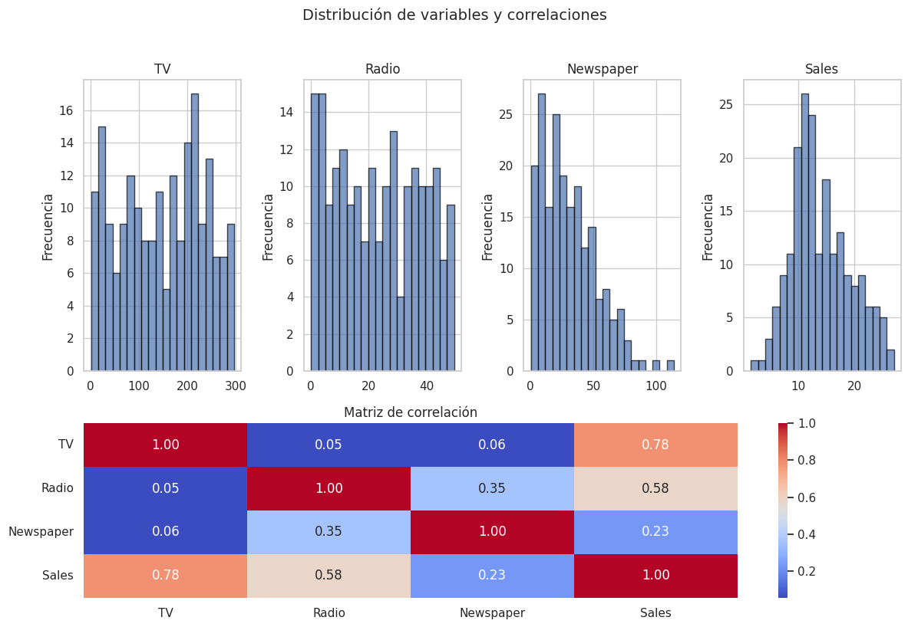
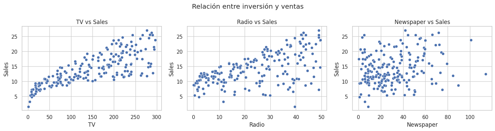
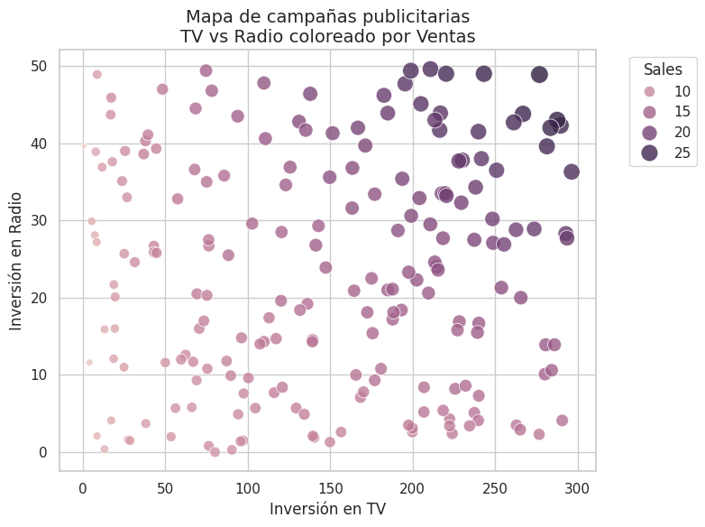
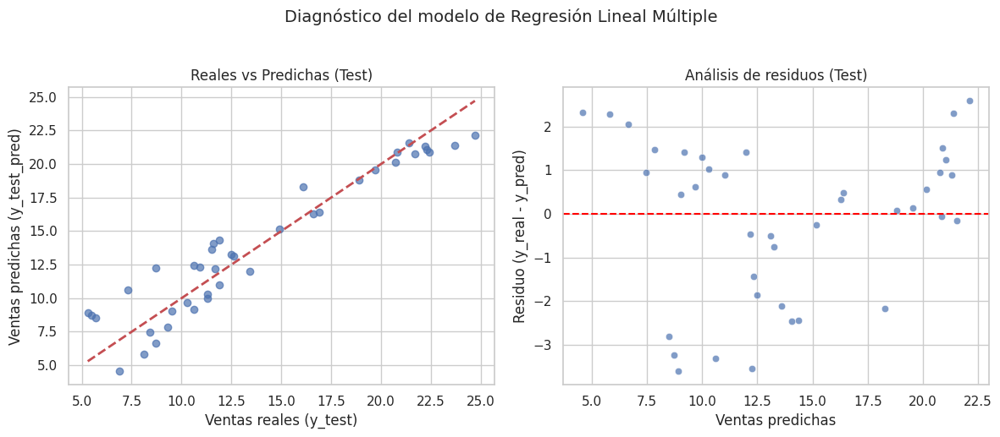
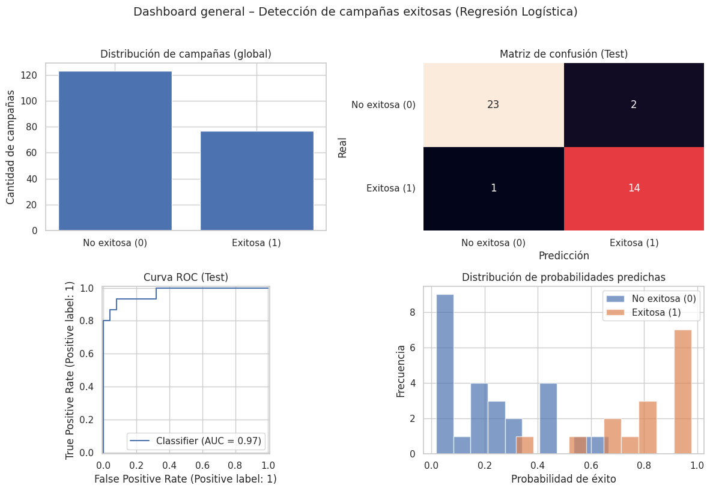
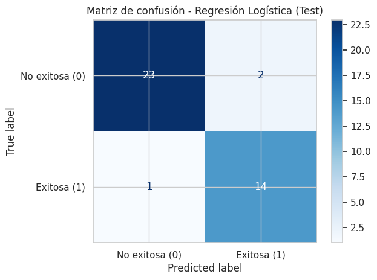

<h1 align="center"> Buscando la venta exitosa en AdvertisingDataSet 📈</h1>


<p align="center">
  <em>Modelos de regresion lineal y logistica aplicados a Advertising</em>
</p>


🏷️ **Etiquetas**  
`#RegresiónLineal` `#RegresiónLogística` `#MachineLearning` `#Adversiting` `#ModeloBase` 


## 🚀 Accesos Directos Importantes

> *Haz clic en los botones para abrir el notebook y explorar las visualizaciones interactivas.*

<div align="center">

<a href="https://colab.research.google.com/drive/1OU2GE0-RXk2OLj5wGFH1N_pOTXh4JgGf?usp=sharing">
  
</a>
&nbsp;
<a href="https://drive.google.com/drive/folders/1U9-2l4veZGv5S73zt9tG45FoxTVPyvD0?usp=sharing">
  
</a>

</div>

---

## 📝 Resumen Ejecutivo

### 🎯 Objetivo Principal

Transformar un análisis descriptivo simple del dataset **Advertising** en **dos soluciones predictivas**:

1. Un **modelo de Regresión Lineal Múltiple** para **predecir las ventas (`Sales`)** según la inversión en publicidad.
2. Un **modelo de Regresión Logística** para **clasificar campañas como exitosas o no exitosas**, según si superan un umbral de ventas (`Sales ≥ 15`).

El propósito es apoyar decisiones de marketing respondiendo dos preguntas clave:

- **“¿Cuántas ventas puedo esperar con este plan de inversión?”** (Regresión Lineal)  
- **“¿Qué tan probable es que esta campaña sea un éxito?”** (Regresión Logística)

---

### 📌 Hallazgos Clave

> "No todos los canales publicitarios rinden igual: TV lidera, Radio potencia, Prensa es la gran candidata al recorte."

- 📺 **La Fuerza de la TV:**  
  La Regresión Lineal muestra que la inversión en **TV** es el factor con mayor impacto marginal sobre `Sales`.  
  Aumentar TV suele producir el incremento más fuerte en ventas, comparado con Radio y Prensa.

- 📻 **El Efecto Amplificador de la Radio:**  
  Aunque su efecto individual es menor que el de TV, la Radio refuerza las ventas cuando se combina con TV.  
  Es especialmente útil en escenarios “balanceados” de inversión.

- 📰 **El Cuestionamiento de Newspaper:**  
  El canal **Newspaper** suele aportar menos al modelo:  
  su coeficiente es bajo y, en algunos escenarios, casi no mejora las métricas de predicción.  
  Esto la vuelve candidata a **recorte o rediseño de estrategia**.

- ✅ **Probabilidad de Éxito:**  
  La Regresión Logística permite clasificar campañas como **Exitosas (1)** o **No exitosas (0)** y obtener una **probabilidad de éxito**.  
  Métricas como **Accuracy**, **Recall** y **ROC–AUC** muestran que el modelo distingue razonablemente entre campañas ganadoras y perdedoras, útil para **priorizar planes de medios antes de lanzarlos**.

---

## 📦 Ficha Técnica del Dataset

- **Fuente:** Dataset clásico de publicidad (Advertising – ISLR).  
- **Dimensiones:** ≈ 200 observaciones (campañas publicitarias).  
- **Variables originales:**
  - `TV`: inversión en publicidad televisiva.
  - `Radio`: inversión en publicidad radial.
  - `Newspaper`: inversión en prensa escrita.
  - `Sales`: ventas obtenidas (en miles de unidades).

- **Variables derivadas:**
  - `Campaña_Exitosa` (0/1):  
    - `1` si `Sales ≥ 15`  
    - `0` si `Sales < 15`  

---

## 📊 Gestión del Proyecto

### ✅ Checklist de Objetivos

| Tarea                                                                      | Estado |
|---------------------------------------------------------------------------|--------|
| 📥 Carga y exploración inicial de `advertising.csv`                        | ☑️     |
| 📈 Visualización representativa (mapa TV–Radio coloreado por `Sales`)      | ☑️     |
| 🧮 Entrenamiento del modelo de **Regresión Lineal Múltiple**               | ☑️     |
| 📏 Evaluación del modelo lineal (MAE, RMSE, R², reales vs predichas, residuos) | ☑️ |
| ✅ Definición de `Campaña_Exitosa` y entrenamiento de **Regresión Logística** | ☑️  |
| 📊 Dashboard de clasificación (distribución, matriz de confusión, ROC, histogramas) | ☑️ |
| 🧪 Simulación de escenarios de inversión (ventas y probabilidad de éxito)  | ☑️     |
| 📝 Síntesis e interpretación estratégica de los resultados                 | ☑️     |

---

### ⏰ Cronograma: Advertising – Soluciones Predictivas

| Actividad                                         | ⏱️ Estimado | ⏰ Real | 📝 Notas                                      |
|--------------------------------------------------|------------:|-------:|----------------------------------------------|
| Carga de datos y EDA básico                      | 20 m        | 20 m   | Verificación de columnas y resumen estadístico. |
| Gráficos iniciales (histogramas, correlaciones, scatter TV–Radio–Sales) | 25 m | 28 m | Ajuste de un gráfico representativo principal. |
| Caso 1: Regresión Lineal (entrenamiento + métricas + diagnóstico) | 35 m | 38 m | Análisis de coeficientes y residuos.         |
| Caso 1: Simulación de escenarios de presupuesto  | 20 m        | 22 m   | Construcción de tabla comparativa de escenarios. |
| Caso 2: Definición de `Campaña_Exitosa` y Regresión Logística | 30 m | 32 m | Ajuste del modelo y configuración del umbral. |
| Caso 2: Dashboard de clasificación (matriz, ROC, histos) | 30 m | 33 m | Interpretación visual del rendimiento del modelo. |
| Redacción de interpretaciones y resumen ejecutivo| 25 m        | 26 m   | Conexión de los modelos con decisiones de negocio. |
| **TOTAL**                                        | **2h 45m**  | **2h 59m** | 🔼 +14 m (mayor detalle en visualizaciones y dashboards). |

---

## 📚 Diccionario de Datos Clave

| Variable            | Tipo      | Unidad         | Rol / Descripción                                      |
|---------------------|-----------|----------------|--------------------------------------------------------|
| `TV`                | Numérica  | Unidades monetarias de inversión | Inversión en publicidad televisiva.         |
| `Radio`             | Numérica  | Unidades monetarias de inversión | Inversión en publicidad radial.            |
| `Newspaper`         | Numérica  | Unidades monetarias de inversión | Inversión en prensa escrita.               |
| `Sales`             | Numérica  | Miles de unidades vendidas       | **Target** para el problema de regresión.  |
| `Campaña_Exitosa`   | Binaria   | 0 / 1         | **Target** para clasificación (Regresión Logística): 1 si `Sales ≥ 15`. |

---

## 🔍 Análisis Detallado de Resultados

### 1. Regresión Lineal: La Calculadora de Ventas

- **Impacto marginal de los canales:**  
  Los coeficientes del modelo indican cuánto cambian las ventas esperadas al aumentar en una unidad la inversión en cada canal, manteniendo los otros constantes:
  - **TV** suele tener el coeficiente más alto → es el motor principal de ventas.
  - **Radio** también aporta de manera positiva, pero con menor intensidad.
  - **Newspaper** presenta un impacto marginal reducido, llegando a ser casi prescindible en algunos escenarios.

- **Calidad del ajuste (MAE, RMSE, R²):**  
  - Un **R² alto** (en general) indica que una parte importante de la variabilidad en `Sales` puede explicarse solo con `TV`, `Radio` y `Newspaper`.  
  - **MAE** y **RMSE** muestran errores promedio razonables, lo que hace que el modelo sea útil para **pronósticos aproximados** a nivel de campaña.

- **Diagnóstico visual:**  
  - El gráfico de **Ventas reales vs predichas** muestra los puntos cercanos a la diagonal: buen alineamiento entre realidad y predicción.  
  - El gráfico de **residuos vs predicción** no evidencia patrones fuertes (como curvas o embudos), lo que sugiere que un modelo lineal simple es razonable para este problema.

> 💡 Conclusión del Caso 1:  
> El modelo de Regresión Lineal funciona como una **calculadora de ventas** que permite evaluar el impacto de modificar la mezcla de inversión publicitaria.

---

### 2. Regresión Logística: El Semáforo de Campañas

- **Definición de éxito:**  
  Una campaña se considera **Exitosa (1)** si `Sales ≥ 15`.  
  Esto transforma el problema en **clasificación binaria**, ideal para Regresión Logística.

- **Capacidad de discriminación:**  
  - La matriz de confusión muestra el balance entre:
    - Campañas realmente exitosas que el modelo identifica correctamente (TP),
    - Campañas malas correctamente descartadas (TN),
    - Falsos positivos (promesas falsas) y falsos negativos (oportunidades perdidas).  
  - La **curva ROC** y el **ROC–AUC** evidencian que el modelo separa razonablemente bien campañas buenas de malas, superando ampliamente el comportamiento aleatorio.

- **Probabilidades de éxito útiles para negocio:**  
  - En lugar de solo “0/1”, el modelo entrega una **probabilidad de éxito** para cada combinación de inversión.  
  - Esto permite fijar políticas del tipo:
    - *“Lanzar campañas solo si la probabilidad de éxito ≥ 0.75”*  
    - *“Aumentar TV o Radio hasta superar el 80% de probabilidad de éxito”*.

- **Simulación de escenarios:**  
  - Se probaron diferentes configuraciones (TV fuerte, Radio reforzada, recorte de Newspaper, etc.), obteniendo para cada una:
    - Ventas esperadas (por Regresión Lineal).
    - Probabilidad de éxito (por Regresión Logística).  

> 💡 Conclusión del Caso 2:  
> La Regresión Logística actúa como un **semáforo previo al gasto**, indicando qué campañas son más prometedoras antes de invertir el presupuesto real.

---

## 📸 Visualización Clave

Este proyecto puede resumirse visualmente con:

- **A. Matriz de correlacion:**  
  Un scatter donde el eje X es TV, Y es Radio, y el color/tamaño refleja las ventas.  
  Permite ver de un vistazo dónde se ubican las **campañas más rentables**.



## 🔄 **DESAFIOS DIRECTOS CON EL DATASET**

Instalación rápida:

```bash
pip install -q pandas seaborn scikit-learn matplotlib
```

```python
import pandas as pd
import numpy as np
import matplotlib.pyplot as plt
import seaborn as sns

# 2. CARGA DEL DATASET
df = pd.read_csv("Advertising.csv")

# Vista rápida
df.head()

print("🔹 Shape:", df.shape)
print("\n🔹 Info:")
print(df.info())

print("\n🔹 Descriptivos:")
print(df.describe())

print("\n🔹 Valores nulos por columna:")
print(df.isna().sum())
```


## 📊 Relación Inversión–Ventas: Radiografía del Mix Publicitario

Antes de construir cualquier modelo, es crucial entender **cómo responden las ventas reales (`Sales`) ante la inversión en cada canal**.  
Este panel de dispersión (TV–Sales, Radio–Sales y Newspaper–Sales) permite detectar:

- **Patrones de respuesta claros**, donde un aumento en inversión se asocia sistemáticamente con mayores ventas.  
- **Canales ruidosos**, en los que el mismo nivel de inversión produce resultados muy distintos, indicando menor capacidad explicativa.  
- **Zonas de posible saturación**, donde incrementar el gasto ya no parece traducirse en un aumento proporcional de `Sales`.

Además, este gráfico facilita comparar visualmente:

- 📺 **TV** como posible canal principal, con una nube de puntos claramente ascendente.  
- 📻 **Radio**, con tendencia positiva pero mayor dispersión.  
- 📰 **Newspaper**, donde la relación con `Sales` es mucho más difusa y su aporte al modelo se vuelve cuestionable.

Este gráfico responde a una pregunta esencial:

> **¿Todos los canales publicitarios impulsan las ventas con la misma claridad,  
> o existe un medio dominante que explica la mayor parte del rendimiento de las campañas?**

A continuación se genera el panel de dispersión comparando `TV`, `Radio` y `Newspaper` frente a `Sales`.



### 📊 Interpretación del Gráfico: ¿Cómo responde el mercado a la inversión publicitaria?

Este gráfico responde a una pregunta esencial:

> **¿Todos los canales publicitarios impulsan las ventas por igual… o existe un medio claramente dominante en el rendimiento de las campañas?**

#### 🔍 Lecturas Clave del Panel de Dispersión

- **TV: la relación más limpia y poderosa**  
  En el gráfico **TV vs Sales** los puntos forman una nube claramente ascendente:  
  a mayor inversión en TV, las ventas aumentan de forma casi lineal.  
  Esto indica que **TV es el canal con señal más fuerte y estable**, el principal candidato a explicar y predecir `Sales`.

- **Radio: efecto positivo, pero con más “ruido”**  
  En **Radio vs Sales** también se observa una tendencia creciente, pero con mayor dispersión vertical.  
  Para un mismo nivel de inversión en Radio, las ventas pueden variar bastante.  
  Esto sugiere que Radio **sí contribuye al éxito**, pero su impacto es más variable y depende de otros factores.

- **Newspaper: relación débil y poco estructurada**  
  En **Newspaper vs Sales** la nube de puntos se ve mucho más caótica, sin una pendiente tan clara.  
  La inversión en prensa escrita muestra un **retorno menos consistente**, lo que la convierte en la gran candidata a revisión o recorte dentro del mix publicitario.

---

# 📺 **Caso 1: Optimización de Presupuesto Publicitario** 💰

### **⚠️ Situación Detectada:**

La gerencia de marketing está invirtiendo en campañas de **TV**, **Radio** y **Prensa**, pero las decisiones de presupuesto se toman de forma intuitiva:

- Se privilegia TV “porque siempre ha funcionado”.
- No está claro si Radio realmente aporta o solo “acompaña”.
- Prensa se mantiene por costumbre, sin evidencia de retorno.

El resultado: **presupuestos poco defendibles**, dificultad para justificar incrementos o recortes y la sensación de que se podría vender más con el mismo dinero si se optimizara la mezcla de medios.

La empresa necesita respuestas concretas:

- ¿Cuánto aporta realmente cada canal a las ventas?
- ¿Qué pasaría con las ventas si redistribuyo el presupuesto?
- ¿Hay gasto “muerto” en algún medio?

### **🎯 Objetivo de esta sección:**

Construir y analizar un modelo de **Regresión Lineal Múltiple** que permita:

- **Cuantificar el impacto marginal** de cada canal (`TV`, `Radio`, `Newspaper`) sobre `Sales`.
- **Predecir las ventas esperadas** para distintos planes de inversión.
- Generar **escenarios de simulación**:
  - “¿Qué pasa si aumentamos la inversión en TV y recortamos Newspaper?”
  - “¿Cuánto deberíamos invertir en Radio para alcanzar una meta de ventas específica?”

Más que buscar el modelo “perfecto”, el foco está en obtener una **herramienta explicable** que apoye decisiones de presupuesto y ayude a responder:  
> “¿Dónde conviene poner el próximo dólar de publicidad?”

### **Cálculo Previo: Configurando el Oráculo de Ventas** 📈

> Este fragmento de código prepara el terreno para que el modelo pueda aprender
> la relación entre inversión publicitaria y ventas:

> 1. **Define** la matriz de características `X` con las tres palancas de marketing: `TV`, `Radio` y `Newspaper`.  
> 2. **Separa** la variable objetivo `y = Sales`, que representa las ventas en miles de unidades.  
> 3. **Divide** el dataset en conjuntos de entrenamiento y prueba para evaluar al modelo en campañas “no vistas”.  
> 4. **Entrena** una **Regresión Lineal Múltiple**, obteniendo el intercepto y los coeficientes β para cada canal, que luego usaremos para interpretar qué medio impulsa más las ventas.

```python hl_lines="9 10 18 19 20 21 22 31 32" linenums="1"
# ============================================================
# 3. DEFINICIÓN DEL PROBLEMA DE REGRESIÓN
#    X = TV, Radio, Newspaper
#    y = Sales
# ============================================================
FEATURES = ["TV", "Radio", "Newspaper"]
TARGET = "Sales"

X = df[FEATURES]
y = df[TARGET]

print("Shape de X:", X.shape)
print("Shape de y:", y.shape)

# ============================================================
# 4. TRAIN / TEST SPLIT
# ============================================================
X_train, X_test, y_train, y_test = train_test_split(
    X,
    y,
    test_size=0.2,       # 80% train, 20% test
    random_state=42
)

print("Tamaño entrenamiento:", X_train.shape[0])
print("Tamaño prueba:", X_test.shape[0])

# ============================================================
# 5. ENTRENAR MODELO DE REGRESIÓN LINEAL MÚLTIPLE
# ============================================================
lin_reg = LinearRegression()
lin_reg.fit(X_train, y_train)

print("Intercepto (β0):", lin_reg.intercept_)
print("Coeficientes (βi) para cada feature:")

coef_df = pd.DataFrame({
    "Feature": FEATURES,
    "Coeficiente": lin_reg.coef_
})
display(coef_df)
```



### 📊 Diagnóstico del Modelo: ¿Qué tan bien predice el Oráculo de Ventas?

Una vez entrenado el modelo de **Regresión Lineal Múltiple**, es crucial evaluar si:

- Las predicciones siguen de cerca a los valores reales.
- Los errores (residuos) se comportan como “ruido” y no esconden patrones.

Este panel de dos gráficos permite ver:

- A la izquierda, **Ventas reales vs Ventas predichas**:  
  si los puntos se alinean cerca de la diagonal roja, el modelo está capturando bien la relación entre inversión y `Sales`.

- A la derecha, **Residuos vs Ventas predichas**:  
  buscamos una nube sin forma clara alrededor de la línea 0.  
  Si no hay curvas ni embudos, la suposición de linealidad y de errores “aleatorios” es razonable.

A continuación se genera el panel de diagnóstico del modelo:

```python hl_lines="2 5 15 16 17" linenums="1"
# Asegúrate de tener y_test y y_test_pred ya definidos
residuos = y_test - y_test_pred

# Figura con 2 subplots (1 fila, 2 columnas)
fig, axes = plt.subplots(1, 2, figsize=(12, 5))

# 1️⃣ Ventas reales vs predichas (TEST)
axes[0].scatter(y_test, y_test_pred, alpha=0.7)
axes[0].plot(
    [y_test.min(), y_test.max()],
    [y_test.min(), y_test.max()],
    "r--",
    linewidth=2
)
axes[0].set_xlabel("Ventas reales (y_test)")
axes[0].set_ylabel("Ventas predichas (y_test_pred)")
axes[0].set_title("Reales vs Predichas (Test)")

# 2️⃣ Análisis de residuos (TEST)
sns.scatterplot(
    x=y_test_pred,
    y=residuos,
    alpha=0.7,
    ax=axes[1]
)
axes[1].axhline(0, color="red", linestyle="--")
axes[1].set_xlabel("Ventas predichas")
axes[1].set_ylabel("Residuo (y_real - y_pred)")
axes[1].set_title("Análisis de residuos (Test)")

plt.suptitle("Diagnóstico del modelo de Regresión Lineal Múltiple", fontsize=14, y=1.03)
plt.tight_layout()
plt.show()
```



### **🧩 ¿Qué revela este gráfico?**

Este panel de diagnóstico responde a una pregunta clave del proyecto:

> **¿Nuestro “Oráculo de Ventas” está prediciendo de forma fiable… o solo está adivinando?**

Lo que ves es una **radiografía del modelo de Regresión Lineal Múltiple** aplicado al dataset Advertising:

- A la izquierda: cómo se alinean las **ventas predichas** con las **ventas reales**.  
- A la derecha: cómo se comportan los **errores (residuos)** a lo largo del rango de predicción.

En conjunto, estos gráficos nos dicen si podemos **confiar** en el modelo para tomar decisiones de presupuesto.

---

### **Lecturas Clave del Gráfico 📊**

#### **1. Reales vs Predichas: el modelo “sigue” bien al mercado**

- La mayoría de puntos se agrupan alrededor de la **línea roja diagonal**.  
- Eso significa que, para muchas campañas, la venta predicha está **muy cerca** de la venta real.  
- No vemos nubes completamente dispersas ni patrones raros:
  → el modelo está capturando una **relación lineal razonablemente fuerte** entre inversión (`TV`, `Radio`, `Newspaper`) y `Sales`.

#### **2. Residuos: errores sin patrones peligrosos**

- En el gráfico de **residuos vs ventas predichas**, los puntos flotan alrededor de la línea horizontal 0.  
- No aparece una curva marcada ni un “embudo” (errores creciendo solo en ciertas zonas), lo que indica que:
  - Los errores se comportan como **ruido relativamente aleatorio**.
  - La suposición de linealidad es aceptable para este rango de datos.
- Hay variabilidad (algunos errores son mayores que otros), pero no hay un patrón sistemático del tipo:
  > “El modelo siempre se equivoca para campañas muy altas o muy bajas”.

---
### 🔮 Predicción para un Escenario Específico

**Inversión seleccionada:**

- TV: **150**
- Radio: **30**
- Newspaper: **20**

**Resultado del modelo:**

> 🔮 **Ventas esperadas (Sales): ≈ 15.42**

### 📊 Comparación de Escenarios de Inversión y Ventas Predichas

| # | Nombre                        | TV  | Radio | Newspaper | Sales_predichas |
|---|------------------------------|----:|------:|----------:|----------------:|
| 0 | Escenario A (TV fuerte)      | 200 | 10    | 5         | **13.83**       |
| 1 | Escenario B (Balanceado)     | 120 | 25    | 15        | **13.12**       |
| 2 | Escenario C (Radio fuerte)   | 80  | 40    | 10        | **14.15**       |
| 3 | Escenario D (Recorte Newspaper) | 150 | 30 | 0 | **15.36** |

### 🎯 Veredicto del Caso 1: ¿Cómo usar el modelo para decidir presupuesto?

Además del diagnóstico visual, el modelo se puso a prueba con **escenarios concretos de inversión**:
    se observa que:

  - El **Escenario D (Recorte Newspaper)** logra **ventas casi iguales** al escenario base (15.36 vs 15.42) **sin invertir en Newspaper**.  
    → Señal clara de que **Prensa aporta muy poco margen adicional** en este rango de inversión.
  - Escenarios con buen balance entre **TV y Radio** tienden a rendir mejor que los que “reparten” presupuesto hacia Newspaper.
  - TV se confirma como el **canal dominante**, mientras que Radio funciona como **refuerzo útil** y Newspaper como **candidato a recorte o rediseño**.

> En resumen, el Caso 1 muestra que el modelo no sólo ajusta bien los datos históricos,  
> sino que ya funciona como una **calculadora de escenarios**: permite simular planes de inversión,  
> comparar alternativas y justificar decisiones como *“mantener fuerte TV, reforzar Radio y recortar Newspaper”*.
---

# ✅ **Caso 2: Detección de Campañas Exitosas con Regresión Logística** 🎯

### **⚠️ Situación Detectada:**

La gerencia ya no quiere mirar solo **cuántas ventas** generó cada campaña, sino algo más directo para la toma de decisiones:

> **“¿Esta campaña fue un éxito… o un fracaso?”**

En los reportes internos se definió que una campaña es **exitosa** cuando supera cierto umbral de ventas (por ejemplo, `Sales ≥ 15`).  
Sin embargo, hoy esa etiqueta de *Exitosa / No exitosa* se asigna **después** de gastar el presupuesto, sin una herramienta para anticipar el resultado.

Esto genera varios problemas:

- Se aprueban campañas con **baja probabilidad de éxito**, solo por intuición o presión comercial.  
- No existe un criterio cuantitativo para **priorizar** entre varios planes de inversión.  
- Es difícil justificar ante Dirección por qué una campaña “prometía” si luego no alcanza el umbral de ventas.

La empresa necesita responder preguntas como:

- ¿Qué combinación de inversión en `TV`, `Radio` y `Newspaper` **aumenta realmente la probabilidad de éxito**?  
- ¿Podemos **filtrar campañas débiles** antes de lanzar, para no quemar presupuesto?  
- ¿Existe un umbral de probabilidad a partir del cual conviene aprobar o rechazar una campaña?

### **🎯 Objetivo de esta sección:**

Construir y analizar un modelo de **Regresión Logística Binaria** que permita:

- **Clasificar campañas** como:
  - 🟢 **Exitosas (`Campaña_Exitosa = 1`)**  
  - 🔴 **No exitosas (`Campaña_Exitosa = 0`)**  
  a partir de la inversión en `TV`, `Radio` y `Newspaper`.
- Estimar la **probabilidad de éxito** de una campaña antes de ejecutarla.
- Derivar **reglas de decisión** del tipo:
  - “Si la probabilidad de éxito ≥ 0.75, la campaña se aprueba”.
  - “Si la probabilidad es baja, se ajusta el mix (más TV, menos Newspaper) o se descarta”.

Más que buscar un clasificador “perfecto”, el foco está en obtener un **semáforo probabilístico** que:

- Ayude a **priorizar** campañas con alto potencial.
- Evite gastar dinero en campañas con baja probabilidad de éxito.
- Traduzca el lenguaje técnico del modelo en decisiones claras de negocio, respondiendo:  

> “¿Qué campañas vale la pena lanzar y cuáles conviene repensar antes de invertir?”

### **Cálculo Previo: Definiendo qué es una “Campaña Exitosa”** 🎯

> Este fragmento de código prepara el terreno para que el modelo pueda aprender  
> a distinguir campañas **exitosas** de **no exitosas**:

> 1. **Define** un umbral de éxito (`umbral_exito = 15`) sobre las ventas `Sales`.  
> 2. **Crea** la variable binaria `Campaña_Exitosa`, donde:  
>    - `1` = campaña exitosa (`Sales ≥ 15`)  
>    - `0` = campaña no exitosa (`Sales < 15`).  
> 3. **Configura** la matriz de características `X_log` con las mismas palancas de marketing: `TV`, `Radio` y `Newspaper`.  
> 4. **Separa** la variable objetivo `y_log = Campaña_Exitosa`.  
> 5. **Realiza** un `train_test_split` **estratificado** para mantener la proporción de campañas exitosas/no exitosas en train y test.  
> 6. **Entrena** una **Regresión Logística Binaria**, obteniendo el intercepto y los coeficientes β que indican cómo cada canal afecta los *odds* de éxito.

```python hl_lines="3 18 19 26 27 28 29 30 31 39 40 41" linenums="1"

# 2. CREAR VARIABLE BINARIA: Campaña_Exitosa
#    Regla: 1 si Sales >= 15, si no 0
umbral_exito = 15

df["Campaña_Exitosa"] = (df["Sales"] >= umbral_exito).astype(int)

print("Distribución de la variable objetivo (Campaña_Exitosa):")
display(df["Campaña_Exitosa"].value_counts())
print("\nProporción:")
display(df["Campaña_Exitosa"].value_counts(normalize=True))

# 3. DEFINICIÓN DEL PROBLEMA DE CLASIFICACIÓN
#    X = TV, Radio, Newspaper
#    y = Campaña_Exitosa
FEATURES_LOG = ["TV", "Radio", "Newspaper"]
TARGET_LOG = "Campaña_Exitosa"

X_log = df[FEATURES_LOG]
y_log = df[TARGET_LOG]

print("Shape de X_log:", X_log.shape)
print("Shape de y_log:", y_log.shape)

# 4. TRAIN / TEST SPLIT (con estratificación por clase)

X_log_train, X_log_test, y_log_train, y_log_test = train_test_split(
    X_log,
    y_log,
    test_size=0.2,
    random_state=42,
    stratify=y_log   # para mantener proporción de exitosas/no exitosas
)

print("Tamaño entrenamiento:", X_log_train.shape[0])
print("Tamaño prueba:", X_log_test.shape[0])

# 5. ENTRENAR MODELO DE REGRESIÓN LOGÍSTICA

log_reg = LogisticRegression(
    solver="liblinear",  # bueno para problemas binarios pequeños
    random_state=42
)

log_reg.fit(X_log_train, y_log_train)

print("Intercepto (β0):", log_reg.intercept_)
print("Coeficientes (βi) para cada feature:")

coef_log_df = pd.DataFrame({
    "Feature": FEATURES_LOG,
    "Coeficiente (β)": log_reg.coef_[0]
})
display(coef_log_df)
```

### 📊 Dashboard del Modelo: ¿Detecta bien las campañas exitosas?

Después de definir `Campaña_Exitosa` y entrenar la **Regresión Logística**,  
necesitamos saber si el modelo realmente **distingue campañas ganadoras de campañas débiles**.

Este dashboard resume cuatro miradas clave:

- Arriba izquierda: **Distribución de campañas** (cuántas exitosas vs no exitosas).  
- Arriba derecha: **Matriz de confusión** (aciertos y errores del modelo).  
- Abajo izquierda: **Curva ROC**, que muestra su capacidad para separar ambas clases.  
- Abajo derecha: **Histograma de probabilidades de éxito**, separado por campañas realmente exitosas y no exitosas.

A continuación se genera el dashboard general del caso 2:



### 📊 Resultados...

En este caso, usamos **Regresión Logística Binaria** para predecir si una campaña será:

- `0` → **No exitosa**  
- `1` → **Exitosa** (`Sales ≥ 15`)

a partir de la inversión en `TV`, `Radio` y `Newspaper`.

---

### 1️⃣ Configuración y distribución de la variable objetivo

- Total de observaciones: **200 campañas**
- Conjunto de entrenamiento: **160**
- Conjunto de prueba: **40**

**Distribución de `Campaña_Exitosa`:**

| Clase            | Cantidad | Proporción |
|------------------|---------:|-----------:|
| 0 – No exitosa   | 123      | 0.615      |
| 1 – Exitosa      | 77       | 0.385      |

> El problema está **moderadamente desbalanceado** (más campañas no exitosas),  
> por lo que métricas como **Recall** y **ROC–AUC** son tan importantes como la Accuracy.

---

### 2️⃣ Importancia de los canales (coeficientes β)

Tras entrenar el modelo con:

\[
X = [\text{TV},\ \text{Radio},\ \text{Newspaper}], \quad y = \text{Campaña\_Exitosa}
\]

se obtuvieron los siguientes coeficientes:

| Feature    | Coeficiente (β) |
|-----------|----------------:|
| TV        | +0.0184         |
| Radio     | +0.1068         |
| Newspaper | −0.0161         |
| Intercepto (β₀) | −5.23 (aprox.) |

**Lectura rápida:**

- **Radio** tiene el coeficiente más alto → incrementos en Radio **elevan fuertemente** los *odds* de éxito.
- **TV** también contribuye positivamente, pero con efecto marginal más suave.
- **Newspaper** aparece con coeficiente **ligeramente negativo**, sugiriendo que, en este dataset, la prensa escrita **no mejora la probabilidad de éxito** e incluso podría estar asociada a campañas menos efectivas.

---

### 3️⃣ Desempeño del modelo (Train vs Test)

| Conjunto | Accuracy | Precision | Recall | F1-Score | ROC–AUC |
|---------|---------:|----------:|-------:|---------:|--------:|
| Train   | 0.963    | 0.938     | 0.968  | 0.952    | 0.989   |
| Test    | 0.925    | 0.875     | 0.933  | 0.903    | 0.971   |

**Conclusiones clave:**

- El modelo mantiene **muy buen rendimiento en Test** (Accuracy ≈ 92.5%, ROC–AUC ≈ 0.97) sin caer en sobreajuste extremo.
- El **Recall en Test (0.933)** indica que el modelo **recupera la mayoría de las campañas exitosas**, algo crucial para no dejar pasar oportunidades de marketing.
- La **Precision en Test (0.875)** también es alta → la mayoría de campañas que el modelo etiqueta como “exitosas” realmente lo son, evitando falsas promesas.




