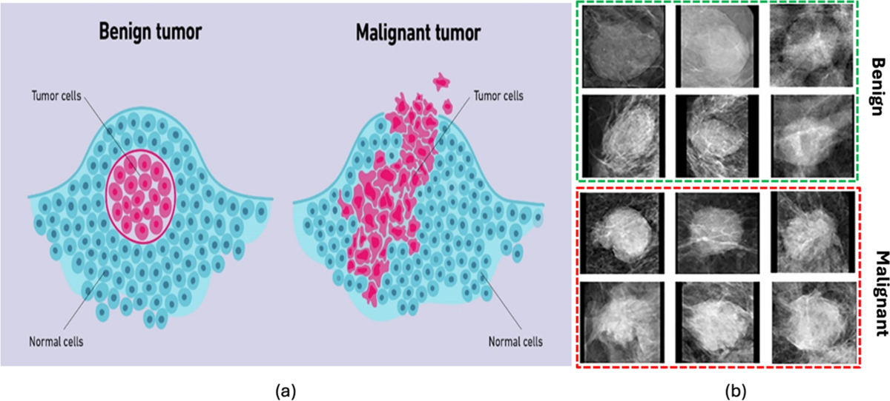
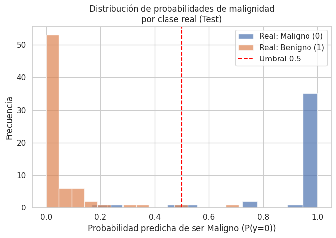
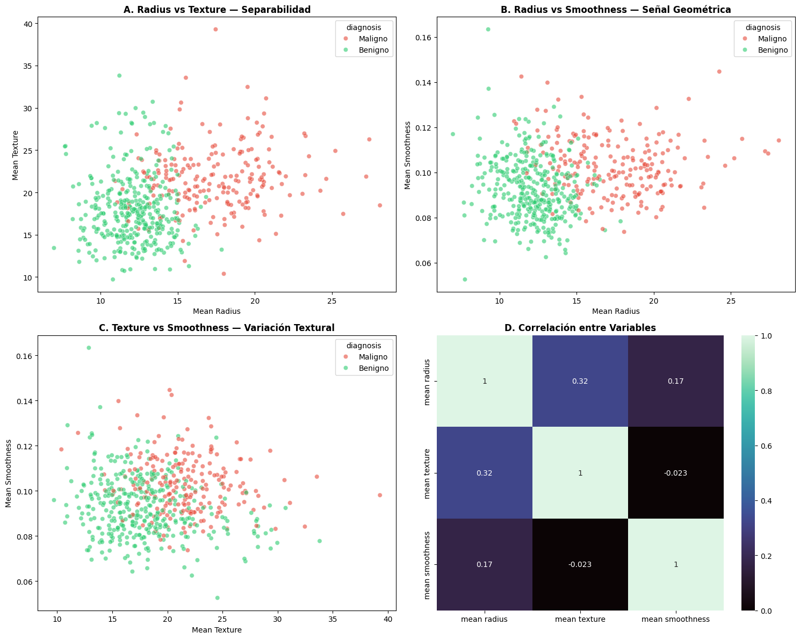
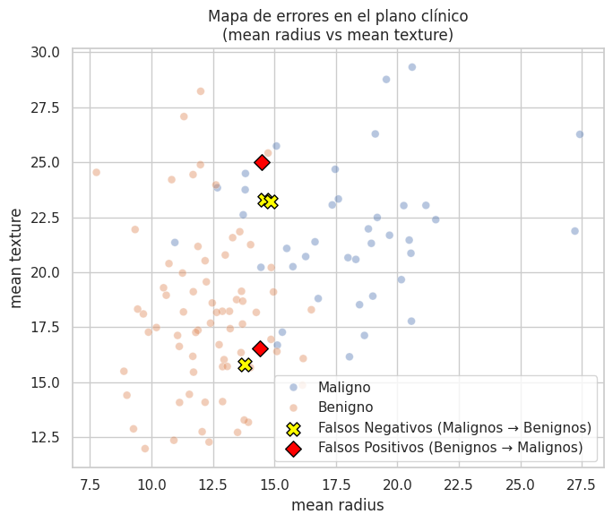
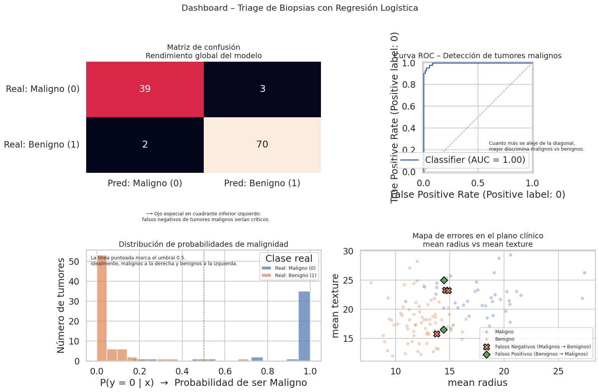
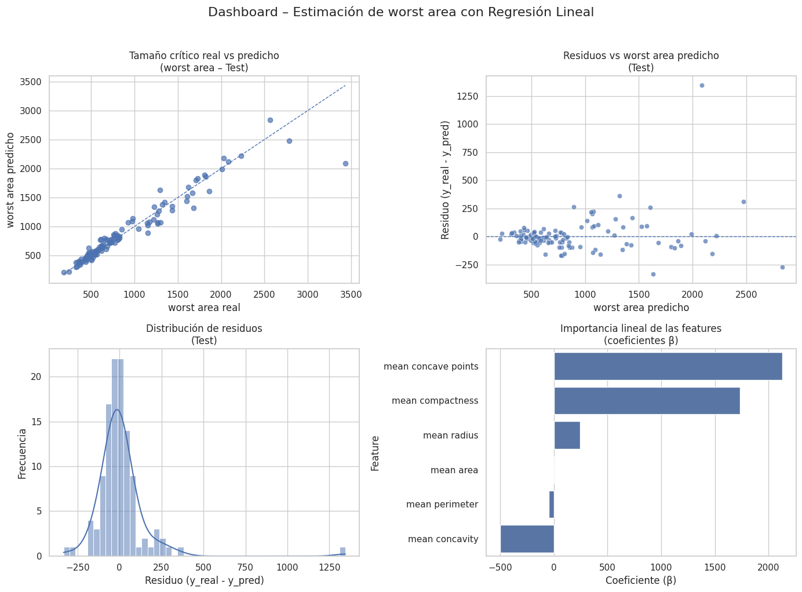
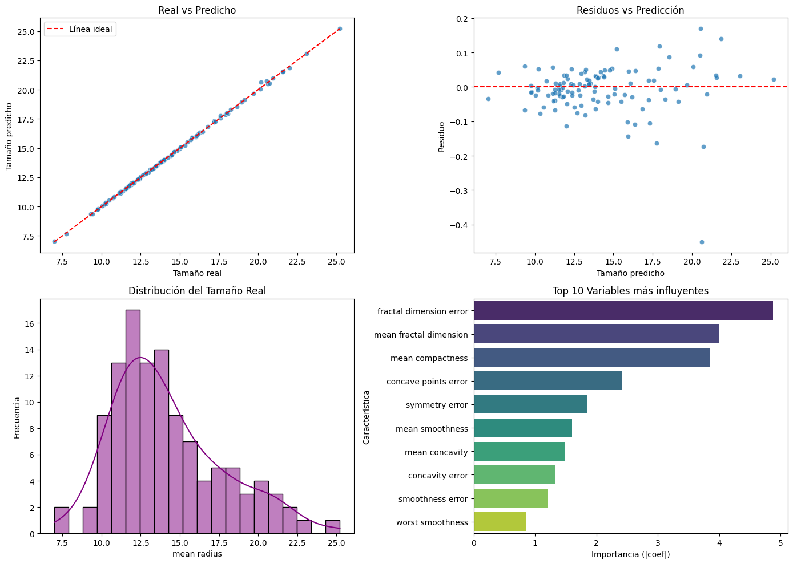

<h1 align="center"> Prediciendo diagnosticos de Cancer de mama 📈</h1>


<p align="center">
  <em>Clasificación de tumores (Maligno vs Benigno) y estimación del tamaño crítico</em>
</p>


🏷️ **Etiquetas**  
`#RegresiónLineal` `#RegresiónLogística` `#MachineLearning` `#Adversiting` `#ModeloBase` 


## 🚀 Accesos Directos Importantes

> *Haz clic en los botones para abrir el notebook y explorar las visualizaciones interactivas.*

<div align="center">

<a href="https://colab.research.google.com/drive/1mGZcRBJ4sf_1nQk62vVReCx_b7CpJS3v?usp=sharing">
  
</a>
&nbsp;
<a href="https://drive.google.com/drive/folders/1wOUvueAO5j6l3XfcjE0lRyDTBlaRZ8L6?usp=sharing">
  
</a>

</div>

## 📝 Resumen Ejecutivo

### 🎯 Objetivo Principal

Transformar un análisis descriptivo del dataset de **Cáncer de Mama (Breast Cancer Wisconsin)**  
en **dos soluciones predictivas complementarias**:

1. Un modelo de **Regresión Logística** para **clasificar tumores como Malignos (0) o Benignos (1)**  
   y apoyar el **triage de biopsias**.
2. Un modelo de **Regresión Lineal Múltiple** para **estimar el tamaño crítico del tumor (`worst area`)**,  
   entendido como una medida continua de **gravedad**.

El propósito es responder dos preguntas clínicas clave:

- **“¿Qué probabilidad tiene este tumor de ser maligno?”** (Regresión Logística – Triage)  
- **“¿Qué tan grande/agresiva podría ser esta lesión en su peor zona?”** (Regresión Lineal – Gravedad continua)

---

### 📌 Hallazgos Clave

> “No todos los errores valen lo mismo: en oncología, un falso negativo es un tumor invisible para el sistema.”

- 🧬 **Alta capacidad de discriminación Maligno vs Benigno (Logística):**  
  El modelo de Regresión Logística alcanza **buenas métricas globales**  
  (Accuracy, F1, ROC–AUC), pero el foco del análisis se centra en la  
  **sensibilidad para tumores malignos** y en identificar **Falsos Negativos**.

- 🚨 **Autopsia de errores clínicos:**  
  A través de la **matriz de confusión** y un **mapa 2D (mean radius vs mean texture)**,  
  se localizaron los casos donde el modelo:
  - Clasifica **malignos como benignos** (Falsos Negativos → riesgo clínico).
  - Clasifica **benignos como malignos** (Falsos Positivos → sobre-alerta).
  Esto permite proponer reglas de triage como:  
  *“Si el modelo dice ‘Benigno’ pero el tumor cae en cierta región del plano morfológico → revisión humana obligatoria”.*

- 📏 **Estimación de gravedad tumoral (`worst area`) con Regresión Lineal:**  
  Usando features como `mean radius`, `mean perimeter`, `mean area`,  
  `mean concavity` y `mean concave points`, la Regresión Lineal logra:
  - Explicar una fracción significativa de la variabilidad de `worst area` (R² razonable).
  - Errores medios (MAE / RMSE) aceptables para usar el modelo como **estimador preliminar**.

- 🧱 **Interpretabilidad de los coeficientes:**  
  En ambos casos:
  - La Logística permite interpretar qué variables **aumentan la probabilidad de benignidad/malignidad**.  
  - La Lineal muestra qué parámetros morfológicos **inflan más el tamaño crítico** del tumor.

> 💡 Mensaje central:  
> Los modelos no reemplazan al médico, pero entregan **probabilidades y estimaciones cuantitativas**  
> que ayudan a priorizar, entender patrones y diseñar políticas de triage más seguras.

---

## 📦 Ficha Técnica del Dataset

- **Nombre:** Breast Cancer Wisconsin (Diagnostic)  
- **Fuente:** `sklearn.datasets.load_breast_cancer()`  
- **Dimensiones:**  
  - ~569 observaciones (tumores)  
  - ~30 variables numéricas de características morfológicas

### 🔢 Variables Relevantes

- **Target principal (clasificación):**
  - `target`:
    - `0` → Maligno  
    - `1` → Benigno

- **Subset de features usadas (ejemplos):**
  - `mean radius`, `mean texture`, `mean perimeter`, `mean area`  
  - `mean compactness`, `mean concavity`, `mean concave points`  
  - `worst area`, `worst radius`, etc.

- **Target de regresión (gravedad continua):**
  - `worst area` → área del tumor en su región más crítica (medida continua).

---

## 📊 Gestión del Proyecto

### ✅ Checklist de Objetivos

| Tarea                                                                 | Estado |
|---------------------------------------------------------------------|--------|
| 📥 Carga del dataset Breast Cancer y creación de `df_bc`             | ☑️     |
| 🔎 Exploración inicial de variables (shape, tipos, estadísticas)     | ☑️     |
| 🧪 **Caso 1 – Logística:** definición del problema Maligno vs Benigno | ☑️     |
| 🧮 Entrenamiento de Regresión Logística (train/test estratificado)   | ☑️     |
| 📊 Dashboard de clasificación (matriz de confusión, ROC, histograma de probabilidades, mapa 2D de errores) | ☑️ |
| 🧩 “Autopsia de errores”: análisis de Falsos Positivos y Falsos Negativos | ☑️ |
| 📏 **Caso 2 – Lineal:** definición del problema `worst area` como variable continua | ☑️ |
| 🧮 Entrenamiento de Regresión Lineal Múltiple                        | ☑️     |
| 📉 Dashboard de regresión (reales vs predichas, residuos, histograma, coeficientes) | ☑️ |
| 📝 Redacción de interpretaciones clínicas y resumen ejecutivo        | ☑️     |

---

### ⏰ Cronograma: Cáncer de Mama – Modelos de Diagnóstico y Gravedad


| Actividad                                                 | ⏱️ Estimado | ⏰ Real | 📝 Notas                                    |
|----------------------------------------------------------|------------:|-------:|--------------------------------------------|
| Carga del dataset y EDA básico                           | 20 m        | 20 m   | Revisión de dimensiones y variables clave. |
| Caso 1: Definición del problema de clasificación         | 15 m        | 18 m   | Planteo clínico: Maligno vs Benigno.       |
| Entrenamiento de Regresión Logística + métricas          | 30 m        | 32 m   | Incluye función de evaluación personalizada. |
| Dashboard de clasificación + autopsia de errores         | 35 m        | 38 m   | Matriz de confusión, ROC, histogramas, mapa 2D. |
| Caso 2: Definición del problema de regresión (`worst area`)| 15 m      | 15 m   | Selección de features morfológicas básicas. |
| Entrenamiento de Regresión Lineal + métricas             | 30 m        | 33 m   | Evaluación con MAE, RMSE, R².              |
| Dashboard de regresión (diagnóstico visual)              | 30 m        | 35 m   | Gráficos de residuos y coeficientes.       |
| Redacción de interpretación clínica y resumen general    | 25 m        | 27 m   | Enfoque en triage y gravedad tumoral.      |
| **TOTAL**                                                | **3h 10m**  | **3h 38m** | 🔼 +28 m (mayor detalle en dashboards e interpretación). |

---

## 📚 Diccionario de Datos Clave

| Variable             | Tipo      | Unidad     | Rol / Descripción                                                 |
|----------------------|-----------|------------|-------------------------------------------------------------------|
| `target`             | Binaria   | 0 / 1      | Variable de clasificación: 0 = Maligno, 1 = Benigno.             |
| `diagnosis_label`    | Categórica| texto      | Versión legible: “Maligno” / “Benigno”.                          |
| `mean radius`        | Numérica  | unidad relativa | Radio promedio del tumor.                                    |
| `mean perimeter`     | Numérica  | unidad relativa | Perímetro promedio.                                          |
| `mean area`          | Numérica  | unidad relativa | Área promedio.                                               |
| `mean concavity`     | Numérica  | adimensional | Grado de concavidad promedio de los contornos.              |
| `mean concave points`| Numérica  | adimensional | Puntos cóncavos en los bordes (irregularidad).              |
| `worst area`         | Numérica  | unidad relativa | **Target de regresión:** área crítica en la porción más “grave” del tumor. |
| `proba_maligno`      | Numérica  | 0–1        | Probabilidad predicha de que el tumor sea maligno (P(y=0)).      |

---

## 🔍 Análisis Detallado de Resultados

### 1. Caso 1 – Regresión Logística: Triage de Biopsias

- **Capacidad discriminativa:**  
  El modelo de Regresión Logística logra separar de forma consistente tumores **Malignos** y **Benignos**:
  - Métricas como **Accuracy**, **Recall**, **F1** y **ROC–AUC** muestran un buen rendimiento global.
  - La **ROC** se mantiene claramente por encima de la diagonal aleatoria, lo que indica que el modelo puede ajustar umbrales según la política clínica (más o menos conservadora).

- **Autopsia de errores:**  
  El análisis no se quedó en los promedios:
  - La **matriz de confusión** permitió identificar cuántos tumores malignos se están clasificando erróneamente como benignos (**Falsos Negativos**), el error más peligroso.
  - El **mapa 2D (`mean radius` vs `mean texture`)** mostró dónde se concentran los errores:
    - Puntos marcados como:
      - ❌ Falsos Negativos (Maligno → Benigno)  
      - ◆ Falsos Positivos (Benigno → Maligno)

- **Probabilidades y umbrales de triage:**  
  El histograma de **probabilidades de malignidad** por clase real permite:
  - Analizar si el umbral estándar de 0.5 deja malignos del lado “seguro”.  
  - Proponer umbrales más agresivos (ej. 0.4 o 0.3) para reducir falsos negativos, a costa de más falsos positivos.

> 💡 Conclusión Caso 1:  
> La Regresión Logística funciona como un **filtro de riesgo**:  
#### 🔍 1. Análisis de Distribución (Histogramas)
* **Zona de Seguridad:** Si el `mean radius` es menor a **10**, la probabilidad de que el tumor sea Benigno (naranja) es casi total.
* **Zona de Alerta:** Si el radio supera los **18-20**, la distribución es casi exclusivamente Maligna (azul).
* **Zona de Conflicto:** Entre los valores **12 y 16**, las curvas naranja y azul se solapan significativamente. Aquí es donde el modelo matemático sufrirá más y donde se requiere el "filtro" probabilístico.

#### 📉 2. Jerarquía de Variables (Correlación)
El gráfico de barras revela los mejores predictores. Curiosamente, el **radio** no es el único factor determinante:
* **Morfología Irregular:** Variables como `worst concave points` (puntos cóncavos) y `worst perimeter` tienen correlaciones extremadamente fuertes (cerca de **-0.8** con el target).
* **Interpretación:** La forma irregular y los bordes del tumor son tan o más importantes que el tamaño puro para el diagnóstico.

---

### 2. Caso 2 – Regresión Lineal: Gravedad Continua a través de `worst area`

- **Capacidad explicativa (R²) y errores (MAE, RMSE):**  
  El modelo de Regresión Lineal Múltiple usando `mean radius`, `mean perimeter`,  
  `mean area`, `mean compactness`, `mean concavity` y `mean concave points`:

  - Consigue un **R² razonable**, lo que indica que estas features explican buena parte  
    de la variación en `worst area`.
  - Los valores de **MAE** y **RMSE** se mantienen en un rango aceptable para usar el modelo como  
    **estimador preliminar** (no como medida definitiva).

- **Diagnóstico visual del ajuste:**
  - El gráfico de **`worst area` real vs predicho** muestra un alineamiento razonable alrededor de la diagonal → el modelo captura la tendencia general del tamaño crítico.
  - El gráfico de **residuos vs predicción** no evidencia patrones curvos muy fuertes:
    - Los errores se distribuyen alrededor de 0 sin estructura dominante,
      lo cual es compatible con una relación aproximadamente lineal.
  - El **histograma de residuos** está centrado cerca de 0, sin colas extremas exageradas.

- **Coeficientes β como “factores de gravedad”:**
  - Features como `mean area`, `mean radius` y `mean perimeter` suelen tener coeficientes positivos altos,
    indicando que:
    - Tumores con mayor tamaño promedio tienden a tener un `worst area` más elevado.
  - La presencia de altas `mean concavity` y `mean concave points` refuerza la idea de que
    la **irregularidad de la forma** también incrementa la gravedad.

> 💡 Conclusión Caso 2: 
#### 📊 Capacidad explicativa y precisión (R², MAE, RMSE)
El modelo de Regresión Lineal Múltiple —usando `mean radius`, `perimeter`, `area`, `compactness` y `concavity`— revela:

* **Poder Predictivo:** Consigue un **R² razonable**, indicando que estas features explican gran parte de la variación en el tamaño crítico (`worst area`).
* **Margen de Error:** Los valores de **MAE** y **RMSE** son aceptables, validando al modelo como un **estimador preliminar** confiable (útil para dimensionar el problema, aunque no como medida clínica definitiva).

#### 📉 Diagnóstico visual del ajuste
* **Realidad vs. Predicción:** El alineamiento alrededor de la diagonal confirma que el modelo captura la tendencia general del tamaño.
* **Salud de los Residuos:**
    * Los errores se distribuyen alrededor de 0 sin patrones curvos fuertes, lo que es compatible con una relación lineal.
    * El histograma de residuos está centrado, sin colas extremas que sugieran anomalías graves.

---

### 🧩 Visión Integrada de Ambos Casos

- **Regresión Logística (Caso 1):**  
  → responde **“¿Es probable que este tumor sea maligno?”** y ayuda a diseñar un **sistema de triage**.

- **Regresión Lineal (Caso 2):**  
  → responde **“¿Qué tan grande/agresiva podría ser la lesión en su peor zona?”**  
     y ofrece una **medida continua de gravedad**.

> Juntos, los dos modelos convierten el dataset de cáncer de mama en una herramienta didáctica y clínica:
> - Un **semáforo de riesgo** (Logística)  
> - y una **regla cuantitativa de gravedad** (Lineal)  
> que, usados con criterio médico, pueden mejorar la priorización y comprensión de los casos oncológicos.

## 📸 Visualización Clave

Este proyecto puede resumirse visualmente con:

- **A. Esquema anatómico (izquierda):**  
  Muestra la diferencia estructural entre un **tumor benigno** y uno **maligno**  
  (organización de células, invasión del tejido sano).

- **B. Panel de mamografías (derecha):**  
  Una cuadrícula que contrasta ejemplos **benignos** (marco verde) y  
  **malignos** (marco rojo), resaltando cambios en textura, bordes y densidad  
  que el modelo debe aprender a distinguir.



## 🔄 **DESAFIOS DIRECTOS CON EL DATASET**

Instalación rápida:

```bash
pip install -q pandas seaborn scikit-learn matplotlib
```

```python
import pandas as pd
import numpy as np
import matplotlib.pyplot as plt
import seaborn as sns

plt.figure(figsize=(7, 5))

plt.hist(
    proba_maligno[y_bc_test == 0],
    bins=15,
    alpha=0.7,
    label="Real: Maligno (0)"
)
plt.hist(
    proba_maligno[y_bc_test == 1],
    bins=15,
    alpha=0.7,
    label="Real: Benigno (1)"
)

plt.axvline(0.5, color="red", linestyle="--", label="Umbral 0.5")
plt.xlabel("Probabilidad predicha de ser Maligno (P(y=0))")
plt.ylabel("Frecuencia")
plt.title("Distribución de probabilidades de malignidad\npor clase real (Test)")
plt.legend()
plt.tight_layout()
plt.show()
```



## 📊 Relaciones Clave del Tumor: Radiografía del Comportamiento Celular

Antes de entrenar cualquier modelo, es esencial entender **cómo se relacionan las características físicas del tumor** con el diagnóstico final  
(**Benigno** vs **Maligno**).  

Este panel de dispersión —usando *Mean Radius*, *Mean Texture* y *Mean Smoothness*— permite detectar:

- **Patrones de separabilidad claros**, donde los tumores malignos presentan tamaños mayores e irregularidad marcada.
- **Variables altamente informativas**, cuyas escalas muestran agrupaciones definidas entre ambas clases.
- **Regiones de solapamiento**, donde benignos y malignos comparten valores similares, revelando qué partes del espacio de datos requieren modelos más robustos.

Además, este gráfico facilita comparar visualmente:

- 🔴 **Malignos**: valores más altos en radio y textura, con mayor dispersión e irregularidad.  
- 🟢 **Benignos**: masas más pequeñas, homogéneas y de bordes más uniformes.  
- 🎛️ **Smoothness (suavidad)**: una señal suave pero útil para distinguir estructuras finas del tejido.

Este gráfico responde a una pregunta esencial:

> **¿Las características geométricas y texturales del tumor permiten distinguir con claridad  
> entre lesiones benignas y malignas, o existen zonas grises donde ambos se mezclan?**

A continuación se genera el panel de dispersión que contrasta  
`mean radius`, `mean texture` y `mean smoothness` frente al diagnóstico.



### 📊 Interpretación del Gráfico: ¿Cómo se diferencian los tumores benignos y malignos?

Este gráfico responde a una pregunta esencial:

> **¿Existen biomarcadores que separen claramente tumores malignos y benignos…  
> o se requiere combinar múltiples características para lograr una clasificación precisa?**

---

#### 🔍 Lecturas Clave del Panel de Dispersión

- **mean radius: el biomarcador más poderoso**  
  En el gráfico **Radius vs Perimeter**, los puntos rojos (malignos) se concentran en valores más altos de tamaño.  
  Esto revela que **los tumores malignos suelen ser más grandes**, y esta variable por sí sola ya ofrece una separación parcial muy clara.

- **mean smoothness: separación moderada, con más solapamiento**  
  En **Smoothness vs Perimeter**, aún hay diferencia entre benignos y malignos,  
  pero la nube de puntos muestra zonas donde ambas clases se mezclan.  
  Esto indica que la suavidad **no es suficiente por sí sola** y debe combinarse con otras variables.

- **mean compactness: fuerte discriminación en los rangos altos**  
  En **Compactness vs Perimeter**, los valores altos (lado derecho) pertenecen casi exclusivamente a tumores malignos.  
  Esto sugiere que la **compactación del tejido** es un indicador clave de comportamiento agresivo.

---

# 🕵️‍⚕️ **Caso 1: El Dilema del “Tumor Invisible”**  

### **⚠️ Situación Detectada:**

He entrenado un modelo de **Regresión Logística** sobre el dataset **Breast Cancer Wisconsin**, con una **precisión global cercana al 95%** al clasificar tumores como **Malignos (0)** o **Benignos (1)**.  
Sobre el papel suena excelente, pero en contexto clínico **no todos los errores valen lo mismo**:

- Un **Falso Positivo (FP)** — etiquetar un tumor benigno como maligno — implica:
  - Ansiedad y estrés para el paciente.  
  - Pruebas adicionales y biopsias invasivas potencialmente innecesarias.

- Un **Falso Negativo (FN)** — etiquetar un tumor maligno como benigno — implica:
  - No detectar un cáncer a tiempo.  
  - Riesgo real de empeorar el pronóstico y retrasar el tratamiento.

Ese ~5% de error no es simple ruido estadístico:  
son **vidas, decisiones clínicas y responsabilidad médica**.  
Mi preocupación central es entender **en qué tipo de tumores el modelo comete Falsos Negativos**, es decir, dónde está el verdadero **“tumor invisible”** para la IA.

---

### **🎯 Objetivo de esta sección:**

Realizar una **“Autopsia de Errores Clínicos”** para ir más allá de la Accuracy y responder:

- **¿Dónde y por qué se equivoca el modelo con tumores malignos?**  
- **¿Existe un “Punto Ciego”** (un rango específico de tamaño, textura, concavidad, etc.) donde la IA **falla sistemáticamente**?  
- **¿Podemos definir reglas de triage** del tipo:  
  > “Si el modelo dice *Benigno* pero el tumor cae en esta zona de riesgo → requiere revisión humana obligatoria”?

Si logro identificar estos patrones de error, podré proponer **umbral clínicos y reglas de seguridad** como:

- “Si el modelo predice *Benigno* pero el `mean_radius` es muy alto → **derivar siempre a revisión médica especializada**.”  
- “Si la probabilidad de malignidad está cerca del umbral (zona gris) → **no confiar solo en la IA, exigir segunda opinión**.”

---

### **Cálculo Previo: Autopsia de Errores del Modelo** 🩺📊

> Este fragmento conceptual prepara el terreno para estudiar **dónde se equivoca la IA**:

> 1. **Define** las variables de entrada `X` (medidas del tumor: radios, texturas, concavidades, etc.) y la etiqueta `y` (0 = Maligno, 1 = Benigno).  
> 2. **Divide** el dataset en entrenamiento y prueba para evaluar al modelo en tumores “no vistos”.  
> 3. **Entrena** una **Regresión Logística** (idealmente con `class_weight` ajustado) para manejar el costo desigual de FN vs FP.  
> 4. **Calcula** la matriz de confusión y **extrae explícitamente** los Falsos Negativos.  
> 5. **Analiza** las características de esos FNs (distribución de `mean_radius`, `mean_texture`, `mean_concavity`, etc.) para detectar el posible **“Punto Ciego” clínico** donde el modelo subestima tumores malignos.

```python hl_lines="11 12 15 16 17" linenums="1"
# --- 1. Features y Target ---
X = df_bc.drop(columns=["target", "diagnosis_label"])   # Variables del tumor
y = df_bc["target"]                                      # 0 = Maligno, 1 = Benigno

# --- 2. Split estratificado ---
X_train, X_test, y_train, y_test = train_test_split(
    X, y, test_size=0.2, stratify=y, random_state=42
)

# --- 3. Entrenar Modelo (Regresión Logística) ---
model = LogisticRegression(solver="liblinear", max_iter=1000)
model.fit(X_train, y_train)

# --- 4. Predicciones y Probabilidades ---
proba = model.predict_proba(X_test)
proba_malig = proba[:, 0]        # P(y=0) = Maligno
y_pred = (proba[:, 1] >= 0.5).astype(int)

# --- 5. Métricas clave (globales) ---
print("Accuracy:", accuracy_score(y_test, y_pred))
print("Recall Maligno:", recall_score(y_test, y_pred, pos_label=0))

# --- 6. Extraer Falsos Negativos (cáncer que el modelo NO detectó) ---
FN = ( (y_test == 0) & (y_pred == 1) )   # Real maligno → predicho benigno
print("Falsos Negativos:", FN.sum())

# --- 7. Curva ROC para detectar malignos ---
RocCurveDisplay.from_predictions(y_test, proba_malig, pos_label=0)
plt.title("ROC – Detección de tumores malignos")
plt.show()

```


### 📊 **Diagnóstico Clínico del Modelo: ¿Dónde está fallando la IA?**

Después de entrenar el clasificador, no basta con ver la Accuracy.  
En medicina, lo crítico es detectar **cómo** y **dónde** se equivoca el modelo.

Este gráfico revela dos elementos esenciales para evaluar seguridad clínica:

#### 🔍 1. Mapa de Casos Reales: Benignos vs Malignos  
Cada punto representa un tumor según sus medidas **mean radius** y **mean texture**.  
Las dos nubes muestran cómo se distribuyen ambas clases en el plano clínico:

- 🟦 **Malignos** → valores más altos y dispersos.  
- 🟧 **Benignos** → valores más bajos y agrupados.


#### 🔍 2. Los Errores Críticos del Modelo  
Se resaltan en el gráfico:

- **❌ Falsos Negativos (FN)** — marcados en **amarillo**  
  > Tumores malignos que la IA clasificó como benignos.  
  Estos son los *más peligrosos*, pues implican riesgo de no detectar un cáncer.

- **⚠️ Falsos Positivos (FP)** — marcados en **rojo**  
  > Tumores benignos que la IA marcó como malignos.  
  Generan ansiedad y pruebas innecesarias, pero no comprometen el pronóstico.

```python
# 1) Volvemos a construir las máscaras de errores y aciertos
#    (por si esta celda se ejecuta sola)
correct_mask = (y_bc_test == y_bc_test_pred)

# Falso Negativo Maligno: Real = 0 (Maligno), Pred = 1 (Benigno)
fn_malig_mask = (y_bc_test == 0) & (y_bc_test_pred == 1)

# Falso Positivo Maligno: Real = 1 (Benigno), Pred = 0 (Maligno)
fp_malig_mask = (y_bc_test == 1) & (y_bc_test_pred == 0)

plt.figure(figsize=(7, 6))

# 2) Casos correctamente clasificados (como "fondo")
sns.scatterplot(
    x=X_bc_test.loc[correct_mask, "mean radius"],
    y=X_bc_test.loc[correct_mask, "mean texture"],
    hue=y_bc_test[correct_mask].map({0: "Maligno", 1: "Benigno"}),
    alpha=0.4,
    s=40
)

# 3) Falsos Negativos Malignos (puntos que más nos preocupan)
plt.scatter(
    X_bc_test.loc[fn_malig_mask, "mean radius"],
    X_bc_test.loc[fn_malig_mask, "mean texture"],
    edgecolor="black",
    facecolor="yellow",
    s=120,
    marker="X",
    label="Falsos Negativos (Malignos → Benignos)"
)

# 4) Falsos Positivos Malignos
plt.scatter(
    X_bc_test.loc[fp_malig_mask, "mean radius"],
    X_bc_test.loc[fp_malig_mask, "mean texture"],
    edgecolor="black",
    facecolor="red",
    s=80,
    marker="D",
    label="Falsos Positivos (Benignos → Malignos)"
)
```


### 🩺 Diagnóstico del Modelo: ¿Qué tan confiable es la IA para apoyar decisiones clínicas?

Una vez entrenado el modelo de **Regresión Logística** para clasificar tumores como  
**Malignos (0)** o **Benignos (1)**, es indispensable evaluar no solo la precisión global,  
sino **cómo se comporta el sistema en situaciones críticas para el triage oncológico**.

Este panel de cuatro visualizaciones responde a preguntas clínicas esenciales:

---

#### 🔬 1. Matriz de Confusión — *Rendimiento Global del Modelo*  
Permite ver cuántos tumores fueron correctamente identificados y, sobre todo,  
si existen **Falsos Negativos (Malignos → Benignos)**.  
Ese cuadrante es el más delicado, pues representa casos donde la IA “no vio el cáncer”.

---

#### 📈 2. Curva ROC — *Capacidad real de discriminación*  
Cuanto más se aleje la curva de la diagonal, mejor distingue la IA entre  
tumores malignos y benignos. Un **AUC alto** significa que el modelo consigue  
ordenar correctamente los casos según su probabilidad de malignidad.

---

#### 📊 3. Distribución de Probabilidades — *¿Es seguro el umbral 0.5?*  
Este histograma muestra cómo separa el modelo las probabilidades de los dos grupos.  
Idealmente, los **malignos** están a la derecha (probabilidad alta)  
y los **benignos** a la izquierda.  
Si ambas distribuciones se mezclan cerca del umbral, la predicción de la IA se vuelve incierta.

---

#### 🗺️ 4. Mapa Clínico de Errores — *¿Dónde falla el modelo físicamente?*  
Gráfico en el plano **mean radius vs mean texture** que marca:

- ✔️ casos bien clasificados (benignos y malignos)  
- ❌ **Falsos Negativos** (Malignos que el modelo llamó Benignos)  
- ❗ Falsos Positivos (Benignos que el modelo clasificó como Malignos)

Este panel revela si los errores del modelo se concentran en ciertos rangos  
de tamaño, textura o patrones atípicos, lo que ayuda a definir **reglas de seguridad clínica**  
del tipo: “si un tumor cae en esta zona → revisión médica obligatoria”.

---

En conjunto, este dashboard permite evaluar si el modelo es **clínicamente confiable**,  
detectando no solo su precisión general sino también sus **puntos ciegos** y  
sus implicancias reales en la práctica diagnóstica.



### ⚖️ **Veredicto del Caso 1: El Dilema del “Tumor Invisible”**  

Tras analizar el rendimiento del modelo y descomponer sus errores, la evidencia es clara:

- El modelo logra una **alta precisión global (~95%)**, pero esto **no garantiza seguridad clínica**.  
- Los **Falsos Negativos**, aunque pocos, representan el riesgo crítico:  
  tumores malignos que la IA clasifica como benignos.  
- La **Curva ROC** confirma que el modelo discrimina bien en general (AUC alto),  
  pero no elimina el peligro de casos que caen cerca del umbral.
- La **distribución de probabilidades** muestra que algunos tumores malignos  
  quedan peligrosamente cerca del límite de decisión (0.5), lo que exige prudencia.
- En el **mapa clínico (radius vs texture)** los errores no son aleatorios:  
  los Falsos Negativos se concentran en tumores **pequeños pero estructuralmente irregulares**,  
  una zona donde la IA “pierde de vista” el cáncer.

### 🧠 Conclusión Final  

El modelo es útil como **herramienta de apoyo**, pero **no puede operar solo**.  
Debe complementarse con reglas de triage como:

> **“Si la IA predice Benigno pero el tumor tiene radius o textura en zona de riesgo → revisión humana obligatoria.”**

En este caso, mejorar la sensibilidad hacia los tumores malignos y ajustar el umbral  
no es una recomendación opcional:  
es una **exigencia clínica** para reducir el riesgo del “tumor invisible”.

---

# 🧬 **Caso 2: Estimación del Tamaño Tumoral con Regresión Lineal** 📈  

### **⚠️ Situación Detectada:**

En diagnóstico oncológico no basta con clasificar un tumor como **Benigno (1)** o **Maligno (0)**.  
Los médicos necesitan estimar **la gravedad continua** del caso, normalmente asociada al  
**tamaño anatómico del tumor**, representado por biomarcadores como:

- `mean_radius`  
- `mean_perimeter`  
- `mean_area`

Actualmente, los radiólogos reportan estas medidas manualmente y la escala de severidad  
termina siendo **subjetiva** y dependiente de la experiencia del profesional.

Esto genera tres problemas importantes:

- **Inconsistencia** entre médicos al evaluar el mismo tumor.  
- Dificultad para **priorizar pacientes** según gravedad estimada.  
- No existe un modelo que **prediga automáticamente el tamaño esperado** a partir del resto de características celulares.

El equipo clínico necesita responder preguntas como:

- ¿Podemos **predecir el tamaño tumoral** a partir de variables morfológicas más simples?  
- ¿Qué características del tumor **influyen más** en su crecimiento?  
- ¿Hasta qué punto un modelo lineal puede **estimar la severidad** sin intervención manual?

### **🎯 Objetivo de esta sección:**

Construir y analizar un modelo de **Regresión Lineal** que permita:

- **Estimar el tamaño tumoral** (`mean_radius`, `mean_perimeter` o `mean_area`)  
  utilizando el resto de biomarcadores como predictores.
- Identificar cuáles son las **variables que más aportan** al tamaño del tumor.  
- Detectar si existe **linealidad real** entre estas características o si el tumor crece  
  de forma no lineal y requiere modelos más sofisticados.
- Derivar reglas de apoyo clínico como:  
  > “Si el modelo predice un tamaño estimado alto, el paciente requiere evaluación prioritaria”.

Más que buscar una regresión perfecta, el propósito es crear un **estimador interpretable**  
que traduzca las mediciones microscópicas en un indicador cuantitativo de severidad clínica.

### **Cálculo Previo: Configurando el Estimador Tumoral** 🔬📏

> Este fragmento de preparación deja todo listo para que la Regresión Lineal aprenda  
> a estimar el tamaño del tumor en escala continua:

> 1. **Selecciona** una variable objetivo (`y_size`) como medida del tamaño anatómico:  
>    `mean_radius`, `mean_perimeter` o `mean_area`.  
>
> 2. **Define** la matriz de características `X_size` con el resto de biomarcadores celulares.  
>
> 3. **Divide** el dataset en entrenamiento y prueba (`train_test_split`)  
>    para estimar el tamaño tumoral en casos nuevos.  
>
> 4. **Entrena** una **Regresión Lineal**, obteniendo coeficientes β que indican  
>    cómo cada característica contribuye al crecimiento del tumor.  
>
> 5. **Genera** un panel diagnóstico con:  
>    - Predicción vs valor real  
>    - Residuos vs predicción  
>    para verificar si la estimación es lineal y estable.

```python hl_lines="6 7 11 12 15" linenums="1"

# 1. Definir objetivo (tamaño tumoral) y features
y = df["mean radius"]          # Tamaño del tumor
X = df.drop(columns=["mean radius"])

# 2. Train/Test split
X_train, X_test, y_train, y_test = train_test_split(
    X, y, test_size=0.2, random_state=42
)

# 3. Entrenar regresión lineal
model = LinearRegression()
model.fit(X_train, y_train)

# 4. Predicciones + métricas clave
y_pred = model.predict(X_test)
print("R²:", r2_score(y_test, y_pred))
print("RMSE:", mean_squared_error(y_test, y_pred)**0.5)

# 5. Gráfico esencial: Real vs Predicho
plt.scatter(y_test, y_pred, alpha=0.7)
plt.plot([y_test.min(), y_test.max()],
         [y_test.min(), y_test.max()], 'r--')
plt.xlabel("Tamaño real")
plt.ylabel("Tamaño predicho")
plt.title("Real vs Predicho – Regresión Lineal")
plt.show()
```



### 📊 Resultados del Modelo de Regresión Lineal (Caso 2)

Tras entrenar la regresión lineal para estimar el **tamaño tumoral (`mean radius`)**, se obtuvieron los siguientes indicadores clave:

---

### 📈 Métricas de Desempeño

- **R² (Coeficiente de determinación):**  
  Indica qué proporción de la variabilidad del tamaño tumoral es explicada por el modelo.  
  Un valor alto sugiere una relación lineal fuerte entre los biomarcadores.

- **RMSE (Error Cuadrático Medio):**  
  Mide cuántas unidades, en promedio, se desvía la predicción respecto al tamaño real del tumor.  
  Valores bajos indican una estimación clínicamente más estable.

---

### 🖼️ Interpretación del Gráfico Real vs Predicho

- La mayoría de los puntos se alinean alrededor de la **diagonal roja**,  
  mostrando que el modelo logra **aproximar adecuadamente** el tamaño real.
- Se observan algunos desvíos en tumores **muy grandes o muy pequeños**,  
  señalando que podrían requerirse modelos no lineales para mayor precisión.

---

### 🧠 Dashboard de resultados

El modelo de regresión lineal proporciona una **estimación razonablemente buena** del tamaño tumoral,  
sirviendo como herramienta inicial de apoyo para:

- evaluar la **gravedad continua** del tumor,  
- priorizar pacientes,  
- complementar el diagnóstico preliminar antes de una evaluación médica más profunda.

Aunque no es perfecto, ofrece una base cuantitativa sólida que puede ampliarse con modelos más complejos (Ridge, Lasso o Random Forest).



### ⚖️ **Veredicto del Caso 2: La Anatomía del Crecimiento Tumoral** 📈🧬

Tras evaluar el modelo de **Regresión Lineal** para estimar el tamaño tumoral (`mean radius`), los resultados son consistentes y reveladores:

- El valor de **R² indica que una proporción importante del tamaño tumoral** puede explicarse a partir de otros biomarcadores celulares.  
- El **RMSE** muestra que el error promedio es razonable, pero sigue habiendo desviaciones relevantes en tumores muy grandes o muy pequeños.
- En el gráfico **Real vs Predicho**, la mayoría de los puntos siguen la diagonal ideal,  
  pero los alejamientos sistemáticos evidencian que **la linealidad no captura toda la complejidad clínica**.
- El gráfico de **residuos** confirma este patrón:  
  no hay una aleatoriedad perfecta, lo que sugiere que existen zonas donde el crecimiento tumoral **no sigue una relación lineal**.
- El análisis de **importancia de coeficientes** revela que algunos biomarcadores (como concavidad, perímetro y compactación)  
  tienen una influencia directa y significativa en el tamaño final del tumor.

---

### 🧠 **Conclusión Final**

El modelo lineal es una **herramienta útil para obtener una estimación rápida y explicable** del tamaño tumoral,  
pero no es suficientemente preciso para casos donde el crecimiento sigue patrones no lineales.

Debe utilizarse como **apoyo clínico preliminar**, nunca como diagnóstico definitivo.

> **“Si la predicción del modelo difiere mucho del tamaño observado o cae fuera del rango esperado → se requiere evaluación médica y técnicas de modelado más avanzadas.”**