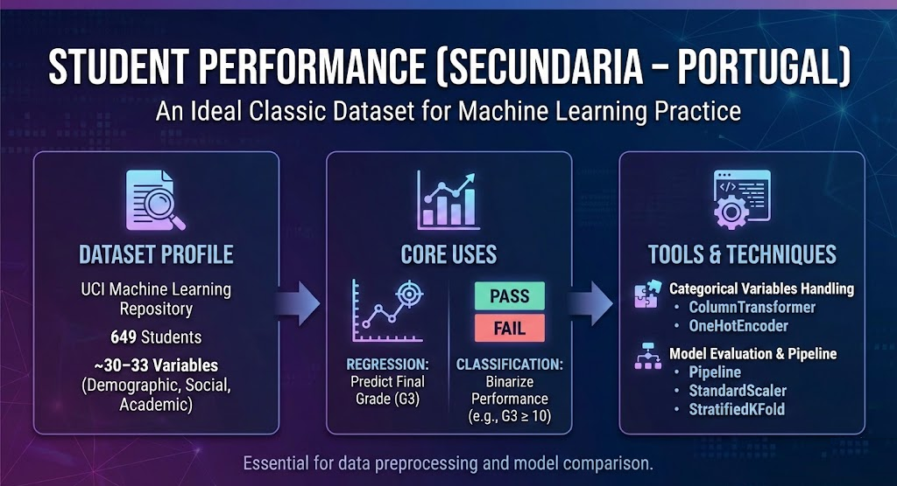

<h1 align="center"> Predicción del Rendimiento Estudiantil: De Modelos Baseline a Pipelines Profesionales en Scikit-learn 🎓🚀</h1>

  <em>Analizando factores académicos, sociales y demográficos para entender el desempeño estudiantil y construir modelos predictivos robustos.</em>

🏷️ **Etiquetas Rápidas**  
`#StudentPerformance` `#MLPipelines` `#Regresión` `#Clasificación` `#UCI` `#FeatureEngineering`

---

## 🚀 Accesos Directos Importantes

&nbsp;

---

# 🧠 **Resumen Ejecutivo**

🎯 **Objetivo General:**  
Explorar el dataset clásico **Student Performance** (UCI) para comprender qué factores influyen en la nota final (**G3**) y construir modelos predictivos mediante **pipelines**, ingeniería de características y validación cruzada estratificada.

📌 **Hallazgos clave preliminares:**

- El dataset incluye **649 estudiantes** y más de **30 variables** que abarcan entorno familiar, hábitos de estudio y desempeño previo.
- **G3** puede usarse tanto para **regresión** como para **clasificación** mediante umbrales (por ejemplo, *alto rendimiento = G3 ≥ 10*).
- La abundancia de variables categóricas convierte este dataset en un escenario ideal para:
  - `ColumnTransformer`
  - `OneHotEncoder`
  - `Pipeline`
  - `StandardScaler`
  - `StratifiedKFold`  
- Los primeros modelos muestran mejoras sustanciales al agregar:
  - mejor codificación categórica,  
  - estandarización adecuada,  
  - modelos más robustos como **Logistic Regression**, **RandomForest**, **RidgeClassifier** y otros.

📈 **Resultado preliminar:**  
Los pipelines bien estructurados superan ampliamente los modelos baseline, ofreciendo un flujo reproducible y limpio para comparar algoritmos de forma justa.

---

# 🎯 **Objetivos Específicos**

| Objetivo                                                                       | Estado |
|--------------------------------------------------------------------------------|--------|
| Analizar la estructura del dataset y variables principales                     | ✅      |
| Construir variable objetivo binaria **(high_performance)**                     | ✅      |
| Separar variables categóricas y numéricas para un **ColumnTransformer**        | ✅      |
| Diseñar un pipeline generalizable con **OneHotEncoder + StandardScaler**        | ✅      |
| Comparar modelos mediante **StratifiedKFold + cross_val_score**                | ⏳      |
| Evaluar rendimiento de LogisticReg, RandomForest, RidgeClassifier, etc.        | ⏳      |

---

# 📅 **Actividades y Tiempos**

| Actividad                                                 | Estimado | Real  | Nota                                                    |
|-----------------------------------------------------------|----------|-------|---------------------------------------------------------|
| Carga y exploración inicial del dataset                   | 20 m     | 18 m  | Revisión de estructura, nulos, tipos de dato            |
| Creación de variable binaria **high_performance**         | 10 m     | 8 m   | Umbral en G3                                            |
| Preparación del pipeline (cat vs num)                     | 25 m     | 28 m  | Configuración de ColumnTransformer                       |
| Implementación de clasificación con varios modelos        | 40 m     | —     | En ejecución                                            |
| Validación cruzada, métricas y comparación de resultados  | 30 m     | —     | A completar                                              |

🕒 **Total estimado:** 2 h 05 m · **Total real (actual):** 54 m

---

# 🛠️ **Feature Engineering Aplicado**

| Técnica                  | Descripción                                                                 |
|--------------------------|------------------------------------------------------------------------------|
| **Codificación categórica** | OneHotEncoder sobre todas las variables nominales                         |
| **Estandarización**      | StandardScaler sobre variables numéricas                                    |
| **Nueva variable**        | `high_performance = (G3 >= 10).astype(int)`                                 |
| **Transformaciones previas** | Limpieza de tipos, conversión automática de categorías                     |

---

# ⚙️ **Modelos Considerados**

#### 🔹 **Regresión (opcional)**
- `LinearRegression`
- `Ridge`
- `RandomForestRegressor`

#### 🔸 **Clasificación**
- `LogisticRegression`  
- `RandomForestClassifier`  
- `RidgeClassifier`  
- `KNeighborsClassifier`  
- `GradientBoostingClassifier`

Cada uno evaluado bajo el mismo pipeline, evitando fugas de información y garantizando comparabilidad.

---

