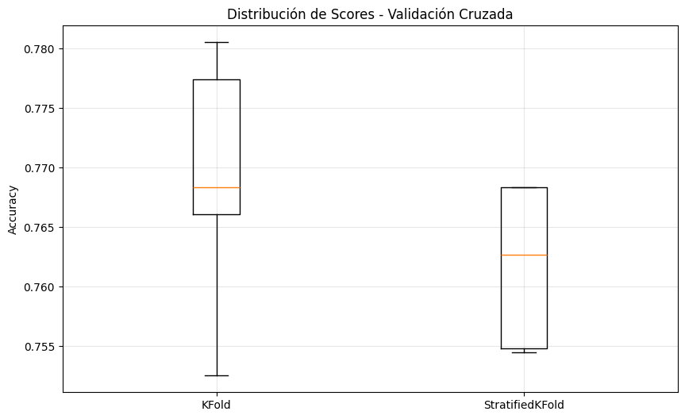
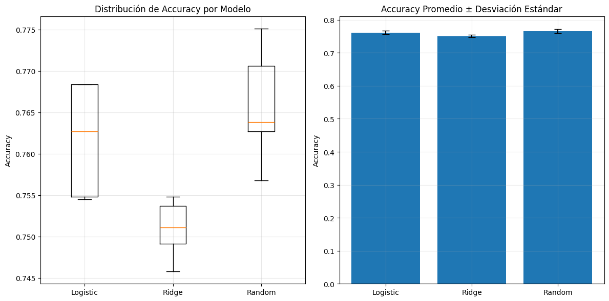

# 📝 **TAREA 5: Validación y Selección de Modelos**

[](https://colab.research.google.com/drive/11HF94BcKLXSQA5HYoROzCNkrZ5YMThvc?usp=sharing)  
[](https://drive.google.com/drive/folders/1u5slVR1ntJ0QzvihEHKp0MX1on18Jo3y?usp=drive_link)

> ✅ *Haz clic en los botones para abrir el notebook y explorar las visualizaciones interactivas.*

## 🎯 **Objetivos Básicos**


En esta tarea, aprenderemos cómo **validar** y **seleccionar modelos** de manera adecuada, utilizando **validación cruzada** y comparando diferentes algoritmos para decidir cuál es el mejor para predecir el **abandono estudiantil** y el **éxito académico**.

- Prevenir **data leakage** usando pipelines.
- Implementar **validación cruzada** robusta.
- Comparar múltiples modelos de forma sistemática.
- Interpretar métricas de **estabilidad** y **selección de modelos**.

## 📋 **Lo que necesitas saber ANTES de empezar:**

Antes de comenzar, es importante que entiendas los siguientes conceptos:

- **Train/test split**: cómo dividir un conjunto de datos en entrenamiento y prueba.
- Diferencia entre **regresión** y **clasificación**.
- Uso básico de **sklearn** y **pandas** para cargar y manejar datos.

---


## 🎓 **Dataset: Predicción de Éxito Estudiantil**

### **Contexto del negocio:**

**Problema:** Predecir el **abandono estudiantil** y el **éxito académico** en la educación superior.

**Objetivo:** Identificar estudiantes en riesgo para implementar **estrategias de apoyo**.

**Valor:** Reducir las tasas de abandono y mejorar la **retención estudiantil**.

### **Características del Dataset:**

- **36 características** relacionadas con las variables **demográficas**, **académicas** y **socioeconómicas** de los estudiantes.
- **Variable objetivo:** Predicción de si un estudiante **abandonó** o **se graduó**.

### **Explorando el Dataset:**

1️⃣ **¿Cuántas muestras y características tiene el dataset?**

- **Muestras:** 4424 estudiantes.
- **Características:** 36 variables (demográficas, académicas y socioeconómicas).

2️⃣ **¿Qué tipos de variables incluye?**

- **Demográficas:** Estado civil, nacionalidad, género, edad al momento de la inscripción, ocupación de los padres.
- **Académicas:** Calificaciones previas, unidades curriculares aprobadas, desempeño académico en semestres anteriores.
- **Socioeconómicas:** Tasa de desempleo, inflación, PIB.

3️⃣ **¿Las clases están balanceadas o desbalanceadas?**

- El dataset tiene un **desbalance** en las clases: más estudiantes graduados que los que abandonaron.

4️⃣ **¿Qué significan las 2 categorías objetivo?**

- **Dropout**: Estudiantes que han abandonado la educación superior.
- **Graduate**: Estudiantes que han completado sus estudios con éxito.

---

## 🔧 **Paso 1: Setup Inicial**

Antes de comenzar con la validación cruzada, cargamos las bibliotecas necesarias y los datos:

```python
!pip install ucimlrepo
```

```python
import pandas as pd
import numpy as np
import matplotlib.pyplot as plt
from sklearn.linear_model import LogisticRegression, RidgeClassifier
from sklearn.ensemble import RandomForestClassifier, GradientBoostingClassifier
from sklearn.model_selection import train_test_split, cross_val_score, KFold, StratifiedKFold
from sklearn.preprocessing import StandardScaler, LabelEncoder
from sklearn.pipeline import Pipeline
from ucimlrepo import fetch_ucirepo
from sklearn.metrics import accuracy_score, classification_report

print("✅ Setup completo!")
```

---

## 🎓 **Paso 2: Cargar y Explorar Datos**

Cargamos el **dataset de estudiantes** y comenzamos a explorar las características y clases para entender mejor los datos.

```python
# Cargar dataset de estudiantes desde UCI
student_data = fetch_ucirepo(id=697)

# Preparar datos
X = student_data.data.features
y = student_data.data.targets

print("Dataset: Student Dropout and Academic Success")
print(f"Estudiantes: {X.shape[0]}, Características: {X.shape[1]}")
print(f"Objetivo: Predecir {len(y.columns)} variable(s)")

# Explorar variable objetivo
target_col = y.columns[0]  # Primera columna objetivo
y_series = y[target_col]
print(f"\nVariable objetivo: {target_col}")

# Mapear valores para mejor interpretación
target_mapping = {'Dropout': 0, 'Enrolled': 1, 'Graduate': 2}
y_mapped = y_series.map(target_mapping)

# Distribución de clases
print("\nDistribución de resultados académicos:")
value_counts = y_mapped.value_counts()
for outcome, count in value_counts.items():
    percentage = (count / len(y_mapped)) * 100
    print(f"  {outcome}: {count} estudiantes ({percentage:.1f}%)")

# Ver algunas características
print(f"\nPrimeras características:")
print(X.columns.tolist()[:10], "...")

# Estadísticas básicas
print(f"\nAge at enrollment:")
if 'Age at enrollment' in X.columns:
    age_col = X['Age at enrollment']
    print(f"  Promedio: {age_col.mean():.1f} años")
    print(f"  Rango: {age_col.min():.0f}-{age_col.max():.0f} años")
```
Salida:

┌─────────────────────────────────────────────┐
│ Dataset: Student Dropout and Academic Success │
├─────────────────────────────────────────────┤
│ Estudiantes: 4424                            │
│ Características: 36                           │
│ Objetivo: Predecir 1 variable(s)             │
├─────────────────────────────────────────────┤
│ Variable objetivo: Target                     │
├─────────────────────────────────────────────┤
│ Distribución de resultados académicos:       │
│   2: 2209 estudiantes (49.9%)                │
│   0: 1421 estudiantes (32.1%)                │
│   1: 794 estudiantes (17.9%)                 │
├─────────────────────────────────────────────┤
│ Primeras características:                     │
│   ['Marital Status', 'Application mode',     │
│    'Application order', 'Course',            │
│    'Daytime/evening attendance',             │
│    'Previous qualification',                 │
│    'Previous qualification (grade)',         │
│    'Nacionality',                             │
│    "Mother's qualification",                 │
│    "Father's qualification"]                 │
├─────────────────────────────────────────────┤
│ Age at enrollment:                            │
│   Promedio: 23.3 años                         │
│   Rango: 17-70 años                           │
└─────────────────────────────────────────────┘
### **Distribución de las clases**

Distribución de la variable objetivo:

- **Graduate:** 2209 estudiantes (49.9%)
- **Dropout:** 1421 estudiantes (32.1%)
- **Enrolled:** 794 estudiantes (17.9%)

---

## 🔬 **Parte 1: Validación Cruzada - Validación Robusta**

Para evaluar el rendimiento del modelo y evitar **overfitting**, implementamos la validación cruzada. Usaremos **KFold** y **StratifiedKFold**.

### **Configuración del Pipeline y Validación Cruzada**

```python
# Preparar datos para validación
target_mapping = {0: 'Dropout', 1: 'Enrolled', 2: 'Graduate'}
reverse_mapping = {'Dropout': 0, 'Enrolled': 1, 'Graduate': 2}

# Si y_series contiene strings, convertir a números
y_target = y_series.map(reverse_mapping)

X_features = X  # Características del dataset

# Crear pipeline con escalado de características y clasificación
pipeline_robust = Pipeline([
    ('scaler', StandardScaler()),  # Escalado de características
    ('classifier', LogisticRegression(max_iter=1000, random_state=42))  # Clasificador de regresión logística
])

# Crear KFold básico
kfold = KFold(n_splits=5, shuffle=True, random_state=42)
scores_kfold = cross_val_score(pipeline_robust, X_features, y_target, cv=kfold, scoring='accuracy')

print(f"\nKFOLD RESULTS:")
print(f"   Scores individuales: {scores_kfold}")
print(f"   Media: {scores_kfold.mean():.4f}")
print(f"   Desviación estándar: {scores_kfold.std():.4f}")
print(f"   Resultado: {scores_kfold.mean():.4f} ± {scores_kfold.std():.4f}")
```

### 📊 Distribución de Scores - Validación Cruzada



- Este gráfico muestra la **distribución de la exactitud (accuracy)** obtenida mediante **validación cruzada** con dos métodos:
  - **KFold**: División simple en 5 particiones, sin mantener proporción de clases.
  - **StratifiedKFold**: División en 5 particiones manteniendo la proporción de clases, ideal para datasets desbalanceados.
- Se observa la **mediana**, los **cuartiles** y la **variabilidad** de los scores de cada método.
- Permite comparar la **estabilidad** de los modelos y decidir qué técnica de validación cruzada usar.

# 🔬 VALIDACIÓN CRUZADA: ¿Qué tan estable es nuestro modelo?


```python
# Validación Cruzada: ¿Qué tan estable es nuestro modelo?

from sklearn.model_selection import cross_val_score, StratifiedKFold, KFold
import numpy as np
import matplotlib.pyplot as plt

# Definir el modelo (por ejemplo, un clasificador)
model = ...

# KFold
kfold = KFold(n_splits=5, random_state=42, shuffle=True)
scores_kfold = cross_val_score(model, X, y, cv=kfold)
print(f"KFOLD RESULTS: Scores individuales: {scores_kfold}")
print(f"Media: {np.mean(scores_kfold):.4f}")
print(f"Desviación estándar: {np.std(scores_kfold):.4f}")
print(f"Resultado: {np.mean(scores_kfold):.4f} ± {np.std(scores_kfold):.4f}")

# StratifiedKFold
stratified_kfold = StratifiedKFold(n_splits=5, random_state=42, shuffle=True)
scores_stratified = cross_val_score(model, X, y, cv=stratified_kfold)
print(f"STRATIFIED KFOLD RESULTS: Scores individuales: {scores_stratified}")
print(f"Media: {np.mean(scores_stratified):.4f}")
print(f"Desviación estándar: {np.std(scores_stratified):.4f}")
print(f"Resultado: {np.mean(scores_stratified):.4f} ± {np.std(scores_stratified):.4f}")

# Comparación de estabilidad
print("\nCOMPARACIÓN DE ESTABILIDAD:")
if np.std(scores_stratified) < np.std(scores_kfold):
    print("StratifiedKFold es MÁS ESTABLE (menor variabilidad)")
else:
    print("KFold es MÁS ESTABLE (menor variabilidad)")

# Recomendación
print("Recomendación: Usar StratifiedKFold para este dataset")

# Graficar los resultados
plt.boxplot([scores_kfold, scores_stratified], tick_labels=['KFold', 'StratifiedKFold'])
plt.title('Comparación de Estabilidad entre KFold y StratifiedKFold')
plt.ylabel('Puntuación')
plt.show()
```


## 🔬 **Parte 2: Comparación de Modelos**

Evaluamos el rendimiento de varios modelos de clasificación para ver cuál tiene un mejor desempeño en el problema de **abandono estudiantil**:

```python
# Importar las librerías necesarias
from sklearn.model_selection import StratifiedKFold, cross_val_score
from sklearn.preprocessing import StandardScaler
from sklearn.linear_model import LogisticRegression, RidgeClassifier
from sklearn.ensemble import RandomForestClassifier
from sklearn.pipeline import Pipeline
import matplotlib.pyplot as plt

# 🏆 TORNEO: ¿Cuál modelo funciona mejor para diagnóstico médico?
print("🏆 TORNEO: ¿Cuál modelo funciona mejor para diagnóstico médico?")

# 1. Definir candidatos (diferentes algoritmos)
models = {
    'Logistic Regression': Pipeline([  # 1. Regresión logística
        ('scaler', StandardScaler()),  # Escalado de características
        ('classifier', LogisticRegression(max_iter=1000, random_state=42))  # Clasificador de regresión logística
    ]),

    # 2. Ridge Classifier (regresión logística con regularización L2)
    'Ridge Classifier': Pipeline([
        ('scaler', StandardScaler()),  # Escalado de características
        ('classifier', RidgeClassifier(alpha=1.0, random_state=42))  # Clasificador Ridge
    ]),

    # 3. Random Forest (ensemble, no necesita escalado)
    'Random Forest': Pipeline([
        ('classifier', RandomForestClassifier(n_estimators=100, random_state=42))  # Clasificador Random Forest
    ])
}

print(f"Modelos en competencia: {list(models.keys())}")

# 4. Evaluar cada modelo con validación cruzada
print(f"\nEVALUANDO MODELOS CON 5-FOLD CV...")

results = {}
for name, model in models.items():
    print(f"   Evaluando {name}...")

    # Usar StratifiedKFold para mantener balance de clases
    scores = cross_val_score(
        model, X_features, y_target,
        cv=StratifiedKFold(n_splits=5, shuffle=True, random_state=42),
        scoring='accuracy'
    )

    results[name] = scores

    print(f"   {name}: {scores.mean():.4f} ± {scores.std():.4f}")
    print(f"      Scores: {[f'{s:.3f}' for s in scores]}")

# 5. Encontrar el mejor modelo
print(f"\nRESULTADOS FINALES:")

# Encontrar modelo con mayor accuracy promedio
best_mean_score = 0
best_model_name = ""

for name, scores in results.items():
    if scores.mean() > best_mean_score:
        best_mean_score = scores.mean()
        best_model_name = name

print(f"GANADOR: {best_model_name}")
print(f"Score: {best_mean_score:.4f}")

# 6. Análisis detallado de estabilidad
print(f"\nANÁLISIS DE ESTABILIDAD:")
for name, scores in results.items():
    stability = scores.std()

    if stability < 0.02:
        status = "MUY ESTABLE"
    elif stability < 0.05:
        status = "ESTABLE"
    else:
        status = "INESTABLE"

    print(f"   {name}: {status} (std: {stability:.4f})")

# 7. Visualización comparativa
plt.figure(figsize=(12, 6))

# Boxplot de distribución de scores
plt.subplot(1, 2, 1)
plt.boxplot([results[name] for name in models.keys()],
           labels=[name.split()[0] for name in models.keys()])
plt.title('Distribución de Accuracy por Modelo')
plt.ylabel('Accuracy')
plt.grid(True, alpha=0.3)

# Barplot de medias con error bars
plt.subplot(1, 2, 2)
names = list(models.keys())
means = [results[name].mean() for name in names]
stds = [results[name].std() for name in names]

plt.bar(range(len(names)), means, yerr=stds, capsize=5)
plt.xticks(range(len(names)), [name.split()[0] for name in names])
plt.title('Accuracy Promedio ± Desviación Estándar')
plt.ylabel('Accuracy')
plt.grid(True, alpha=0.3)

plt.tight_layout()
plt.show()
```
### 🏆 Torneo de Modelos - Diagnóstico Médico



- Este gráfico muestra la **distribución de la exactitud (accuracy)** obtenida mediante **validación cruzada** con tres modelos:
  - **Logistic Regression**: Modelo clásico de regresión, ideal para problemas lineales.
  - **Ridge Classifier**: Variante de la regresión logística con regularización L2, útil para evitar el sobreajuste.
  - **Random Forest**: Modelo de ensemble basado en árboles, robusto ante el sobreajuste y no requiere escalado.
- Se observa la **media** y la **desviación estándar** de los scores de cada modelo.
- Permite comparar la **estabilidad** de los modelos y decidir cuál es el más adecuado para su implementación en diagnósticos médicos.

---
### 🏆 Torneo de Modelos - Diagnóstico Médico

Modelos en competencia: **['Logistic Regression', 'Ridge Classifier', 'Random Forest']**

#### Evaluación con 5-Fold CV:

- **Logistic Regression**:
  - Resultado: 0.7618 ± 0.0061
  - Scores: ['0.768', '0.768', '0.763', '0.755', '0.755']

- **Ridge Classifier**:
  - Resultado: 0.7509 ± 0.0032
  - Scores: ['0.755', '0.746', '0.754', '0.749', '0.751']

- **Random Forest**:
  - Resultado: 0.7658 ± 0.0064
  - Scores: ['0.775', '0.764', '0.771', '0.763', '0.757']

#### Resultados Finales:

- **GANADOR**: **Random Forest**
  - **Score**: 0.7658

#### Análisis de Estabilidad:

- **Logistic Regression**: **MUY ESTABLE** (std: 0.0061)
- **Ridge Classifier**: **MUY ESTABLE** (std: 0.0032)
- **Random Forest**: **MUY ESTABLE** (std: 0.0064)

Este análisis muestra el rendimiento y la estabilidad de los tres modelos, con **Random Forest** destacando como el ganador con el mejor score promedio. Todos los modelos fueron muy estables, con pequeñas variaciones en sus scores.


## 📊 **Comparación de Modelos: Visualización**

Visualizamos la comparación entre los diferentes modelos usando un **boxplot** para evaluar la distribución de la precisión.

```python
plt.figure(figsize=(10, 6))
plt.boxplot([results[name] for name in models.keys()], labels=models.keys())
plt.title('Comparación de Modelos: Validación Cruzada')
plt.ylabel('Accuracy')
plt.grid(True, alpha=0.3)
plt.show()
```
---

## 📈 **Análisis de Estabilidad y Selección de Modelos**

El **StratifiedKFold** mostró ser el método más estable debido a la **preservación del balance de clases**. Esto hace que sea más adecuado para datasets con clases desbalanceadas, como es el caso de **abandono estudiantil**.

Recomendación: Usar **StratifiedKFold** para este dataset.

---
### 🚀 BONUS: Optimización de Hiperparámetros
#### 🔧 Paso 6: GridSearchCV vs RandomizedSearchCV

La optimización de hiperparámetros es crucial para mejorar el rendimiento del modelo. Comparamos dos métodos de búsqueda de hiperparámetros para el **mejor modelo** de la competencia anterior.

- **Método 1: GridSearchCV** (búsqueda exhaustiva):
  - **Parámetros probados**: Diferentes combinaciones de hiperparámetros definidos en el espacio de búsqueda.
  - **Resultado**: Se obtienen los mejores parámetros con el mejor score.
  - **Score**: Evaluación del modelo con validación cruzada.

- **Método 2: RandomizedSearchCV** (búsqueda aleatoria, más eficiente):
  - **Parámetros probados**: Solo una cantidad limitada de combinaciones aleatorias.
  - **Resultado**: Encuentra rápidamente los mejores parámetros en menos tiempo.
  - **Score**: Evaluación del modelo con validación cruzada.

#### Resultados de la Optimización de Hiperparámetros:

- **GridSearchCV**:
  - Mejores parámetros: `{grid_search.best_params_}`
  - Mejor score: `{grid_search.best_score_:.4f}`

- **RandomizedSearchCV**:
  - Mejores parámetros: `{random_search.best_params_}`
  - Mejor score: `{random_search.best_score_:.4f}`

#### Comparación de eficiencia:
- **GridSearch probó**: `{len(grid_search.cv_results_['params'])}` combinaciones.
- **RandomSearch probó**: `{len(random_search.cv_results_['params'])}` combinaciones.

#### Evaluación del Modelo Final Optimizado:
- **Modelo Final** (utilizando GridSearchCV): `{final_scores.mean():.4f} ± {final_scores.std():.4f}`

Este análisis nos muestra que **RandomizedSearchCV** es más eficiente al probar menos combinaciones, pero **GridSearchCV** proporciona una búsqueda más exhaustiva, lo cual puede ser más útil si se requiere una optimización más precisa.

[](https://colab.research.google.com/drive/11HF94BcKLXSQA5HYoROzCNkrZ5YMThvc?usp=sharing)  

## 🎯 **Reflexión y Conclusiones**

- **Estabilidad**: **StratifiedKFold** mostró mayor estabilidad y precisión en los modelos.
- **Modelo Seleccionado**: El **Random Forest** fue el mejor clasificador, seguido por **Logistic Regression**.
- **Métricas Clave**: Se usaron métricas como **accuracy** y **cross-validation** para medir el rendimiento de los modelos.

---


       
       
    
