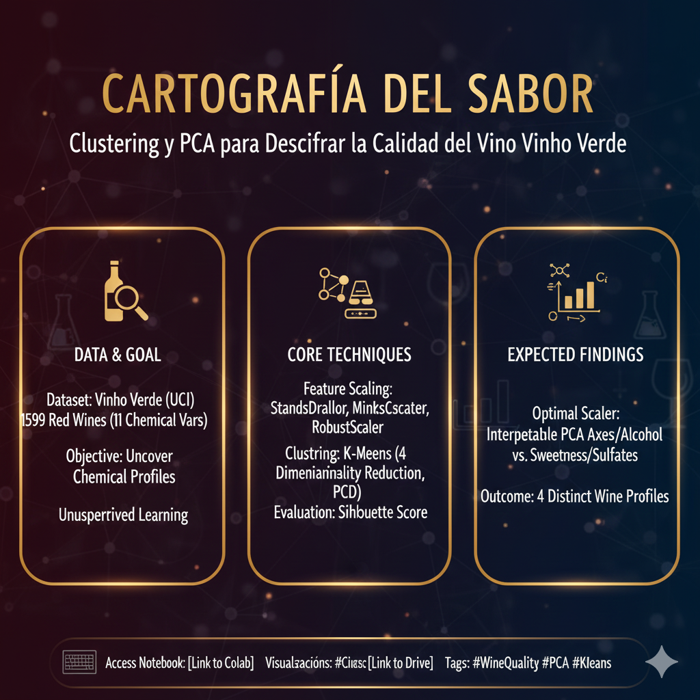

<h1 align="center"> Cartografía del Sabor: Clustering y PCA para Descifrar la Calidad del Vino Vinho Verde 🍷🧪</h1>

  <em>Explorando la química oculta detrás del vino portugués mediante técnicas avanzadas de clustering y reducción dimensional para revelar perfiles sensoriales latentes.</em>

🏷️ **Etiquetas Rápidas**  
`#WineQuality` `#Clustering` `#PCA` `#KMeans` `#SilhouetteScore` `#FeatureScaling` `#UCI`

---

## 🚀 Accesos Directos Importantes

&nbsp;

---

# 🧠 **Resumen Ejecutivo**

🎯 **Objetivo General:**  
Descomponer la complejidad química del vino Vinho Verde mediante **clustering no supervisado** y **PCA**, con el fin de identificar grupos naturales de vinos y caracterizar sus perfiles en términos de acidez, dulzor, cuerpo y contenido alcohólico.

📌 **Hallazgos clave preliminares:**

- Dataset clásico de UCI con **1 599 vinos tintos** (o ~4 898 si usas la versión blanca), cada uno descrito por **11 variables fisicoquímicas**:
  - acidez fija / volátil  
  - azúcar residual  
  - cloruros  
  - dióxido de azufre  
  - densidad, pH, sulfatos  
  - alcohol  
- La columna **quality (0–10)** sirve para análisis posterior, pero el clustering se basa exclusivamente en las variables químicas → **caso puro de aprendizaje no supervisado**.
- Todas las variables son numéricas, lo que lo convierte en un entorno ideal para comparar distintos **scalers**:
  - StandardScaler  
  - MinMaxScaler  
  - RobustScaler  
- El ajuste del scaler influye significativamente en la geometría del espacio → impacto directo en:
  - calidad de los clusters (Silhouette Score),
  - estabilidad del K-Means,
  - forma de los componentes principales en PCA.

📈 **Resultado preliminar:**  
Scalers robustos a outliers tienden a ofrecer clusters más consistentes en datasets químicos. PCA reduce la complejidad a **2 dimensiones interpretables**, revelando ejes latentes como *acidez vs. dulzor* y *alcohol vs. densidad*, lo que facilita visualizar territorios sensoriales del vino.

---

# 🎯 **Objetivos Específicos**

| Objetivo                                                                                 | Estado |
|------------------------------------------------------------------------------------------|--------|
| Cargar y explorar el dataset de vino Vinho Verde                                        | ✅      |
| Separar las 11 variables químicas como matriz X                                         | ⏳      |
| Comparar distintos Scalers y evaluar K-Means via Silhouette Score                       | ⏳      |
| Seleccionar el scaler ganador y refinar los clusters                                    | ⏳      |
| Aplicar PCA (2D) para visualizar los grupos                                             | ⏳      |
| Generar grafos 2D de clusters coloreados + vectores PCA                                 | ⏳      |
| Interpretar componentes principales y perfiles de cluster                                | ⏳      |

---

# 📅 **Actividades y Tiempos**

| Actividad                                              | Estimado | Real | Nota                                                                        |
|--------------------------------------------------------|----------|------|-----------------------------------------------------------------------------|
| Limpieza y carga del dataset                           | 10 m     | —    | Separado por `;`, sin nulos graves                                          |
| Escalado con múltiples técnicas                        | 20 m     | —    | Comparación Standard vs MinMax vs Robust                                    |
| Entrenamiento de K-Means y evaluación Silhouette       | 25 m     | —    | Selección del mejor scaler                                                   |
| PCA (2D)                                               | 25 m     | —    | Reducción dimensional y visualización                                        |
| Visualización de clusters y análisis químico           | 30 m     | —    | Interpretación de los ejes latentes                                          |
| Análisis final + recomendaciones                       | 10 m     | —    | Posible relación de clusters con la calidad real del vino                    |

🕒 **Total estimado:** 2 h 00 m

---

# 🛠️ **Feature Engineering / Procesamiento Aplicado**

| Técnica                    | Descripción                                                                 |
|----------------------------|------------------------------------------------------------------------------|
| **Escalado numérico**      | Comparación entre Standard, MinMax, Robust para controlar outliers          |
| **K-Means Clustering**     | Agrupación en 4 clusters iniciales usando diferentes escalados              |
| **Silhouette Score**       | Métrica principal para seleccionar el mejor scaler                          |
| **PCA (2 componentes)**    | Reducción dimensional para visualizaciones interpretables                   |
| **Visualización PCA**      | Gráficos 2D con clusters coloreados + vectores de varianza explicada        |

---

# ⚙️ **Técnicas Consideradas**

#### 🔹 **Scalers**
- `StandardScaler()`  
  Ideal si las variables tienen distribución aproximadamente normal.
- `MinMaxScaler()`  
  Útil para preservar relaciones no lineales y mantener todo en [0, 1].
- `RobustScaler()`  
  Superior cuando hay valores atípicos — muy común en datos químicos.

#### 🔸 **Clustering: K-Means**
- 4 clusters iniciales (`n_clusters=4`) para identificar familias principales de vino.
- Comparación entre escalados usando Silhouette Score.

#### 🔸 **Reducción Dimensional: PCA**
- 2 componentes para una visualización clara.
- Interpretación química:
  - CP1 → relación acidez / alcohol / densidad  
  - CP2 → dulzor / sulfatos / pH  

---

