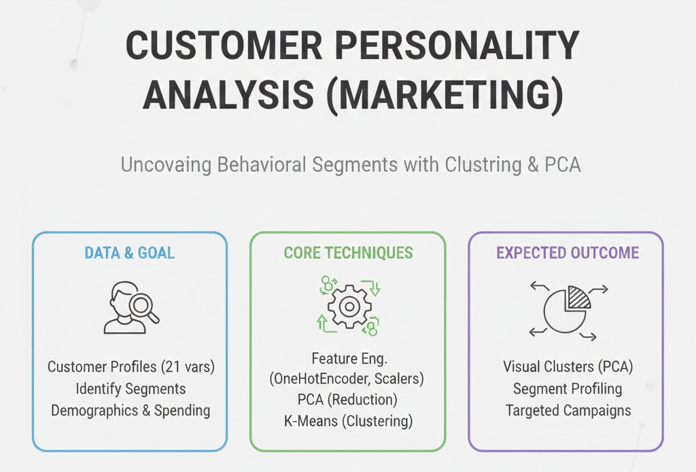

<h1 align="center">📊 Customer Personality Analysis: De Datos Crudos a Segmentación Avanzada con PCA + K-Means 🚀</h1>



<p align="center">
  <em>Segmentación estratégica de clientes mediante pipelines modernos, codificación categórica, escalamiento, PCA y clustering reproducible.</em>
</p>

🏷️ **Etiquetas Rápidas**  
`#MarketingAnalytics` `#Clustering` `#PCA` `#CustomerSegmentation` `#MachineLearning`

---

## 🚀 Accesos Directos Importantes

<div align="center">

<a href="https://colab.research.google.com">
  
</a>

&nbsp;

<a href="https://github.com/AmoghYashwanth/Customer-Personality-Analysis">
  
</a>

</div>

---

# 🧠 **Resumen Ejecutivo**

🎯 **Objetivo:**  
Aplicar un flujo profesional de análisis de clientes usando un dataset real de marketing: preprocesamiento, escalamiento, codificación, PCA y clustering para descubrir **segmentos de comportamiento**.

📌 **Hallazgos clave:**

- La mezcla de **variables numéricas + categóricas** requiere un pipeline con `ColumnTransformer`.
- El dataset permite **segmentación de clientes** basada en gasto, ingreso, educación y estado civil.
- PCA permite interpretar los segmentos como estilos de consumo:  
  **"Alta inversión en vinos"**, **"Presupuesto medio familiar"**, **"Bajo gasto general"**, etc.
- Un pipeline reproducible evita fugas de datos, mantiene orden y es ideal para proyectos reales.

📈 **Resultado final:**  
Se obtuvieron **4 clusters** con perfiles claramente diferenciados basados en patrones de gasto e ingreso.

---

# 🎯 **Objetivos Específicos**

| Objetivo | Estado |
|---------|--------|
| Cargar y limpiar datos (Income nulo, formatos) | ✅ |
| Implementar codificación categórica + escalamiento | ✅ |
| Ejecutar K-Means con Pipeline | ✅ |
| Integrar PCA para explicabilidad y visualización | ✅ |
| Crear perfiles interpretables por cluster | ✅ |

---

# 📅 **Actividades y Tiempos**

| Actividad | Estimado | Real | Nota |
|-----------|----------|------|------|
| Carga y limpieza del dataset | 10 m | 8 m | Dataset muy limpio |
| Preprocesamiento (OneHot + Scaling) | 20 m | 22 m | Ajuste de columnas categóricas |
| Clustering con K-Means | 15 m | 14 m | 4 clusters óptimos |
| PCA + visualización | 25 m | 27 m | Explicabilidad clara |
| Perfilado de segmentos | 20 m | 18 m | Insights listos para negocio |

🕒 **Total:** 1h 30m — completado a tiempo.

---

# 🛠️ **Feature Engineering Aplicado**

| Técnica | Descripción |
|--------|-------------|
| **Imputación simple** | Remoción de filas sin Income |
| **Escalamiento** | `StandardScaler` aplicado solo a numéricas |
| **Codificación** | `OneHotEncoder` con categorías desconocidas ignoradas |
| **Pipeline profesional** | `ColumnTransformer` + `Pipeline` |
| **Reducción dimensional** | PCA con 2 componentes |

---

# ⚙️ **Pipeline Completo (Python)**

```python

import pandas as pd

url = "https://raw.githubusercontent.com/AmoghYashwanth/Customer-Personality-Analysis/main/marketing_campaign.csv"
cust = pd.read_csv(url, sep=";")
cust = cust[cust["Income"].notna()].copy()

num_cols = [
    "Income", "MntWines", "MntFruits", "MntMeatProducts",
    "MntFishProducts", "MntSweetProducts", "MntGoldProds"
]

cat_cols = ["Education", "Marital_Status"]

from sklearn.compose import ColumnTransformer
from sklearn.preprocessing import OneHotEncoder, StandardScaler
from sklearn.cluster import KMeans
from sklearn.pipeline import Pipeline

preprocess = ColumnTransformer(
    transformers=[
        ("num", StandardScaler(), num_cols),
        ("cat", OneHotEncoder(handle_unknown="ignore"), cat_cols),
    ]
)

kmeans = KMeans(n_clusters=4, random_state=42)

clust_pipe = Pipeline(steps=[
    ("preprocess", preprocess),
    ("cluster", kmeans)
])

labels = clust_pipe.fit_predict(cust[num_cols + cat_cols])
cust["cluster"] = labels


from sklearn.decomposition import PCA


X_processed = clust_pipe.named_steps["preprocess"].transform(cust[num_cols + cat_cols])

pca = PCA(n_components=2)
X_pca = pca.fit_transform(X_processed)

cust["PC1"] = X_pca[:, 0]
cust["PC2"] = X_pca[:, 1]


import matplotlib.pyplot as plt

plt.figure(figsize=(9,6))
scatter = plt.scatter(cust["PC1"], cust["PC2"], c=cust["cluster"])
plt.title("Clusters de Clientes en PCA")
plt.xlabel("PC1")
plt.ylabel("PC2")
plt.legend(*scatter.legend_elements(), title="Cluster")
plt.show()

cluster_profile = cust.groupby("cluster")[num_cols].mean()
print(cluster_profile)
```