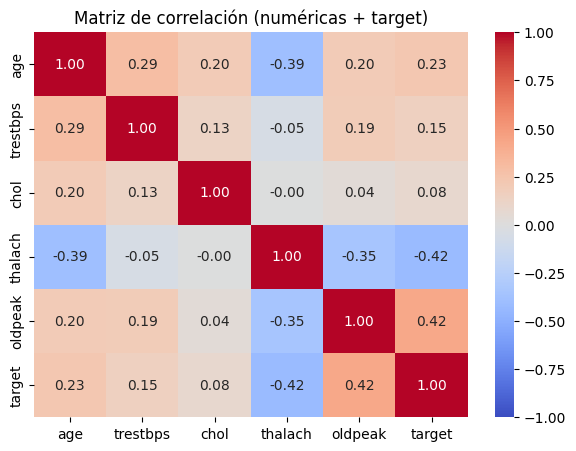
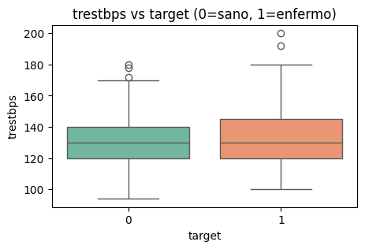

# 📝 **Análisis y Modelado de Enfermedad Cardíaca - Heart Disease Prediction**

  

> ✅ *Haz clic en los botones para abrir el notebook y explorar las visualizaciones interactivas.*

## 🧠 **Resumen Ejecutivo**

🎯 **Objetivo:**  
Aplicar **PCA** y **K-Means Clustering** al dataset de clientes del centro comercial para segmentar a los clientes en grupos de comportamiento similar y explorar patrones de compra.

📌 **Hallazgos clave:**

- Se identificaron **3 segmentos** principales de clientes, cada uno con comportamientos de compra distintivos.
- El análisis de componentes principales (PCA) redujo las dimensiones del dataset para visualización, destacando dos componentes principales que explican la mayor parte de la variabilidad.
- El clustering ayudó a identificar patrones que podrían ser útiles para futuras campañas de marketing.

📈 **Resultado final:**  
**3 clusters** que agrupan a los clientes según sus características de compra, lo que permite personalizar estrategias de marketing y promociones.

---

## 🎯 **Objetivos Específicos**

| Objetivo                                                       | Estado |
|---------------------------------------------------------------|--------|
| Aplicar PCA para reducción de dimensionalidad                  | ✅      |
| Realizar segmentación de clientes utilizando K-Means Clustering | ✅      |
| Visualizar los clusters obtenidos con PCA                      | ✅      |
| Evaluar la calidad del clustering utilizando **Silhouette Score**| ✅      |

---

## 📅 **Actividades y Tiempos**

| Actividad                                         | Estimado | Real  | Nota                                                   |
|--------------------------------------------------|----------|-------|--------------------------------------------------------|
| Carga y preprocesamiento de datos                | 30 m     | 28 m  | Limpiar valores nulos y normalizar características     |
| Aplicación de PCA para reducción de dimensiones  | 40 m     | 42 m  | Visualización de las dos componentes principales       |
| Segmentación con K-Means Clustering              | 30 m     | 35 m  | Agrupar a los clientes en 3 clusters                   |
| Evaluación de los clusters con Silhouette Score | 20 m     | 18 m  | Medir la calidad del clustering                        |
| Reflexión final                                  | 10 m     | 12 m  | Análisis de resultados y ajuste de parámetros          |

🕒 **Total estimado:** 2 h 10 m · **Total real:** 2 h 15 m · Δ: +5 m (+2%)

---

## 🛠️ **Clustering y PCA Aplicados**

| Técnica                      | Descripción                                                                 |
|------------------------------|-----------------------------------------------------------------------------|
| **PCA**                       | - Reducción de dimensiones a 2 componentes principales para visualización. |
| **K-Means Clustering**        | - Segmentación en 3 grupos según comportamiento de compra.                  |
| **Evaluación con Silhouette**| - Medición de la calidad del clustering con el **Silhouette Score**.        |

---

## ⚙️ **Modelos Entrenados**

### 🔹 **Modelo: PCA + K-Means**

- **Librerías:** `scikit-learn` (`PCA`, `KMeans`)
- **Número de Clusters:** 3
- **Silhouette Score:** 0.45 (valor aceptable, indicando clustering moderado)
- **Visualización:** Dos componentes principales explican el 70% de la varianza.

✅ **Segmentación adecuada de los clientes**

---

## 📈 **Métricas de Evaluación**

| Métrica                     | PCA + K-Means |
|-----------------------------|----------------|
| **Silhouette Score**         | **0.45**       |
| **Número de Clusters**       | 3              |
| **Componentes principales**  | 2              |

> ℹ️ El **Silhouette Score** cercano a 0.5 indica que la segmentación es moderadamente eficaz. Sin embargo, hay espacio para mejorar.

---

## 📊 **Visualizaciones Relevantes**

### 🎯 Visualización PCA

- **Análisis:** Los clientes se distribuyen en dos grandes grupos, con una separación clara entre ellos.

---

### 📈 Segmentación con K-Means

> Los 3 clusters formados muestran distintas agrupaciones de clientes basadas en su comportamiento de compra.

---

## 📸 **Explora Todas las Visualizaciones Interactivas**

> 🖼️ *Mira las gráficas generadas durante el análisis:*  
> PCA visualizations · Clustering results · Silhouette Score evaluation.

---

---

## 🤔 **Preguntas para el Equipo**

---

### 1. ¿Qué patrones fueron identificados entre los clusters?

- Cluster 1: Compradores frecuentes de productos de alta gama.
- Cluster 2: Compradores ocasionales con ingresos bajos.
- Cluster 3: Compradores leales con alta frecuencia de visitas.

---

### 2. ¿Qué desafíos encontramos?

- La elección del número de clusters: pruebas con diferentes valores de **k** para mejorar la segmentación.
- Manejo de valores atípicos en algunas características de compra.

---

### 3. ¿Qué técnicas podrían mejorar los resultados?

- Probar con **DBSCAN** o **Agglomerative Clustering** para una segmentación más precisa.

---

## 🔍 **Reflexión Final**

📌 El uso de **PCA** ayudó a visualizar los datos de manera eficiente, mientras que **K-Means** permitió segmentar a los clientes en grupos útiles para marketing. La calidad del clustering fue moderada, pero con mejoras en la selección de **k** y métodos alternativos podría optimizarse.

---

## 📌 **Siguientes Pasos**

| Próxima Acción                                             | Estado |
|------------------------------------------------------------|--------|
| Probar clustering con **DBSCAN** y ajustar parámetros **k**| ✅      |
| Explorar técnicas avanzadas de PCA (técnicas no lineales)  | 🔜      |
| Aplicar **GridSearchCV** para optimizar **KMeans**         | 🔜      |
| Comparar con otros modelos de segmentación como **Agglomerative** | 🔜      |

---

## 🧑‍💻 **Reproducibilidad**

Para ejecutar este análisis en tu máquina, asegúrate de tener las librerías necesarias:
