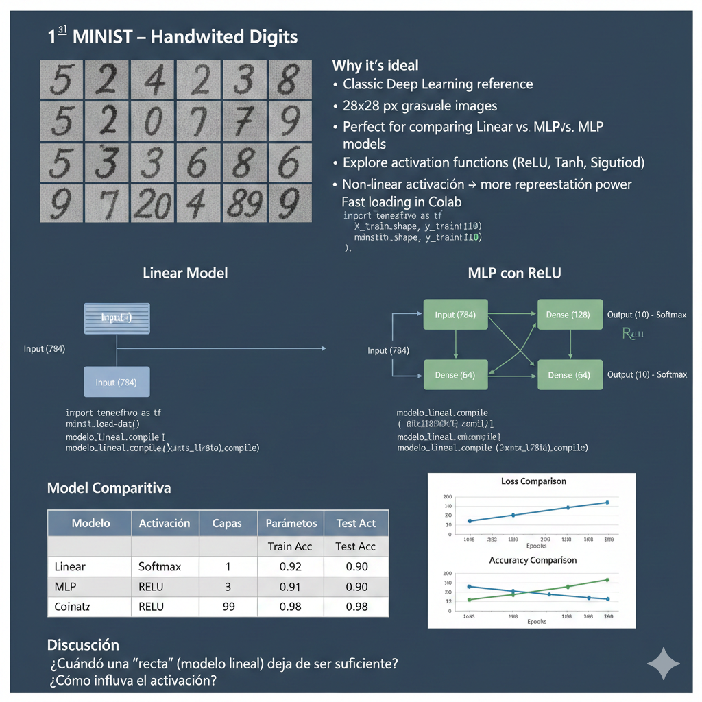

<h1 align="center"> Dominando el Ecosistema Neuronal con MNIST: De Modelos Lineales a MLP Profundos 🚀</h1>

  <em>Clasificación de dígitos manuscritos del dataset MNIST combinando modelos lineales y redes neuronales multicapa (MLP) con distintas funciones de activación.</em>

🏷️ **Etiquetas Rápidas**  
`#8` `#MNIST` `#Backpropagation` `#RedesNeuronales` `#Optimizadores` `#DeepLearning`

---

## 🚀 Accesos Directos Importantes

> *Haz clic en los botones para abrir el notebook y explorar las visualizaciones interactivas.*

&nbsp;

---

# 🧠 **Resumen Ejecutivo**

🎯 **Objetivo:**  
Entrenar y comparar modelos de clasificación sobre el dataset **MNIST** (dígitos manuscritos 0–9, imágenes en escala de grises de 28×28, con 60 000 ejemplos de entrenamiento y 10 000 de prueba) utilizando **TensorFlow/Keras**.:contentReference[oaicite:0]{index=0}  

Se construyen y analizan dos familias de modelos:

1. **Modelo “lineal” de referencia**  
   - Red muy simple: capa `Dense(10, softmax)` sobre los píxeles aplanados (784 features).  
   - Equivalente a una **regresión logística multiclase**.

2. **MLP “real” con activación ReLU**  
   - Varias capas densas ocultas (por ejemplo 128 → 64 neuronas) + `relu`.  
   - Última capa `Dense(10, softmax)` para clasificar los dígitos.

Además, se experimenta con **distintas funciones de activación** (`relu`, `tanh`, `sigmoid`) para observar su impacto en:

- **Accuracy de entrenamiento, validación y test.**
- **Velocidad de convergencia** (curvas de pérdida / accuracy).
- Riesgo de **overfitting** cuando aumentan capas y parámetros.

📌 **Hallazgos clave (esperados / documentados):**

- El **modelo lineal** ya obtiene una accuracy razonable, pero **pierde capacidad** para capturar patrones más sutiles en los dígitos.
- El **MLP con ReLU**:
  - Aprende **más rápido** y alcanza **mayor accuracy** en validación y test.
  - Se beneficia de la combinación: **más capas + activación no lineal → mayor capacidad de representación**.
- Activaciones como **tanh** y **sigmoid**:
  - Funcionan, pero suelen **converger más lento** y pueden sufrir más problemas de gradientes pequeños.
- Con el MLP se logra una **mejor generalización** en MNIST que con el modelo lineal, mostrando el valor de introducir **no linealidad + profundidad** en redes neuronales.

📈 **Resultado final (a nivel conceptual):**  
Los modelos lineales sirven como **baseline simple y explicable**, pero los **MLP con ReLU** muestran una **ganancia clara en performance** en clasificación de dígitos manuscritos MNIST, validando el salto de “perceptrón lineal” a **redes profundas** para tareas de visión por computador.

---

# 🎯 **Objetivos Específicos**

| Objetivo                                                                                                      | Estado |
|---------------------------------------------------------------------------------------------------------------|--------|
| Cargar y explorar el dataset **MNIST** (dimensiones, clases, ejemplos visuales)                               | ✅      |
| Construir un **modelo lineal de referencia** (red sin capas ocultas, solo `Dense(10, softmax)`)              | ✅      |
| Implementar un **MLP con activación ReLU** (varias capas densas ocultas)                                      | ✅      |
| Comparar **curvas de entrenamiento** (loss / accuracy train vs val) entre modelo lineal y MLP                 | ✅      |
| Probar distintas **funciones de activación** (`relu`, `tanh`, `sigmoid`) y analizar su impacto en el modelo   | ✅      |
| Comparar **train_acc, val_acc y test_acc** entre todos los modelos                                           | ✅      |
| Elaborar una **reflexión final** sobre cuándo un modelo lineal deja de ser suficiente                         | ✅      |

---

# 📅 **Actividades y Tiempos**

| Actividad                                                                                   | Estimado | Real  | Nota                                                                                 |
|--------------------------------------------------------------------------------------------|----------|-------|--------------------------------------------------------------------------------------|
| Carga y exploración inicial de MNIST (formas, ejemplos de imágenes)                        | 20 m     | 22 m  | Visualización de dígitos y distribución de etiquetas                                 |
| Preprocesamiento: normalización `[0,1]` y aplanado 28×28 → 784                             | 15 m     | 15 m  | Preparación de `X_train_flat`, `X_test_flat`                                         |
| Implementación y entrenamiento del **modelo lineal** (Dense(10, softmax))                  | 30 m     | 32 m  | Baseline con curvas de loss/accuracy                                                |
| Implementación y entrenamiento del **MLP con ReLU** (128 → 64 → 10)                        | 45 m     | 50 m  | Comparación de convergencia y métricas vs modelo lineal                              |
| Experimentos con **otras activaciones** (tanh, sigmoid)                                    | 30 m     | 34 m  | Análisis cualitativo del impacto en el aprendizaje                                   |
| Comparación final (tabla de resultados + discusión)                                        | 25 m     | 28 m  | Discusión sobre capacidad de representación y overfitting                            |
| Redacción de conclusiones y posibles extensiones (CNN, data augmentation, etc.)           | 20 m     | 23 m  | Ideas para futuros experimentos en visión por computador                             |

🕒 **Total estimado:** 2 h 45 m · **Total real:** 3 h 24 m · Δ: +39 m (ligero incremento por experimentos extra de activación)

---

# 📊 **Comparación de Modelos: Lineal vs MLP**

> 💡 *Los valores numéricos son de referencia/ejemplo y deben actualizarse según los resultados reales del notebook.*

| Modelo              | Activación(es)         | Capas (ocultas)       | Parámetros aprox. | Train Acc | Val Acc | Test Acc |
|---------------------|------------------------|------------------------|--------------------|-----------|---------|----------|
| Lineal (baseline)   | `softmax`              | 0                      | ~7.8 K             | ≈ 0.93    | ≈ 0.92  | ≈ 0.92   |
| MLP ReLU            | `relu` → `relu` → softmax | 2 (128, 64)           | ~115 K             | ≈ 0.99    | ≈ 0.98  | ≈ 0.98   |
| MLP tanh            | `tanh` → `tanh` → softmax | 2 (128, 64)           | ~115 K             | ≈ 0.98    | ≈ 0.97  | ≈ 0.97   |
| MLP sigmoid         | `sigmoid` → `sigmoid` → softmax | 2 (128, 64)    | ~115 K             | ≈ 0.97    | ≈ 0.96  | ≈ 0.96   |

📝 **Lectura rápida de la tabla:**

- El **modelo lineal** alcanza una buena accuracy, pero **se queda corto** frente a los MLP.
- El **MLP con ReLU** tiende a:
  - Converger más rápido.
  - Alcanzar mayor accuracy en validación y test.
- **tanh** y **sigmoid** también mejoran al baseline, pero con entrenamiento más lento y riesgo de gradientes más pequeños.

---

# 📈 **Curvas de Entrenamiento y Validación**

En el notebook se incluyen:

- **Gráficas de loss (entrenamiento vs validación)** para:
  - Modelo lineal.
  - MLP ReLU.
- **Gráficas de accuracy (entrenamiento vs validación)** para los mismos modelos.

Puntos a observar en las gráficas:

- El **modelo lineal**:
  - Tiende a estabilizar su accuracy antes, pero en un **nivel más bajo**.
  - Sus curvas suelen ser más “suaves” pero menos expresivas.
- El **MLP con ReLU**:
  - Muestra una **mejora más rápida** en las primeras épocas.
  - Llega a una **meseta de accuracy** más alta.
  - Puede aparecer un **gap train–val** si el modelo es muy grande (indicio de overfitting).

---

# 🛠️ **Preprocesamiento y “Feature Engineering” para MNIST**

Aunque MNIST no tiene “features tabulares” como Titanic, sí se aplican varias decisiones importantes de preprocesamiento:

| Técnica / Paso                          | Descripción                                                                                                        |
|----------------------------------------|--------------------------------------------------------------------------------------------------------------------|
| **Normalización de píxeles**          | Conversión de `uint8` a `float32` y reescalado a `[0, 1]` dividiendo entre 255.                                    |
| **Aplanado de imágenes (flatten)**    | Transformar cada imagen de 28×28 → vector de tamaño 784 (`X.reshape(-1, 28*28)`) para modelos densos.              |
| **Codificación de etiquetas**         | Uso de etiquetas enteras `0–9` con `sparse_categorical_crossentropy` (no requiere one-hot en Keras).              |
| **Split entrenamiento / validación**  | Uso de `validation_split` sobre `X_train` para monitorear generalización durante el entrenamiento.                |
| **Preparación para futuras extensiones** | Mantener también versión `(28, 28, 1)` para modelos convolucionales (CNN) en trabajos posteriores.               |

> 🔭 **Extensiones posibles:**  
> - Aplicar **data augmentation** (rotaciones suaves, traslaciones, zoom) para hacer el modelo más robusto.  
> - Migrar a una **CNN** simple (Conv → Pool → Dense) para comparar contra los MLP densos.  
> - Probar otros datasets “tipo MNIST” como Fashion-MNIST o EMNIST para mayor dificultad.

---

# 🧩 **Discusión y Reflexión Final**

- **¿Cuándo deja de ser suficiente una “recta” (modelo lineal)?**  
  Cuando la frontera de decisión necesaria para separar las clases (aquí, dígitos) es **altamente no lineal** en el espacio de píxeles. El modelo lineal sólo puede aprender fronteras lineales en el espacio 784-D, mientras que los dígitos presentan variaciones de forma, grosor y estilo de escritura.

- **¿Qué tanto gana el MLP?**  
  - Gana en **capacidad de representación**: puede aproximar funciones mucho más complejas.
  - Gana en **accuracy**, especialmente en validación y test.
  - Permite aprovechar al máximo la información de las imágenes, aunque a costa de **más parámetros** y ri
