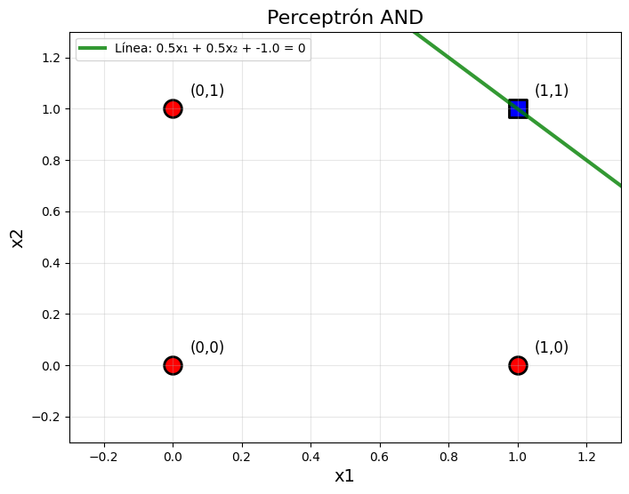
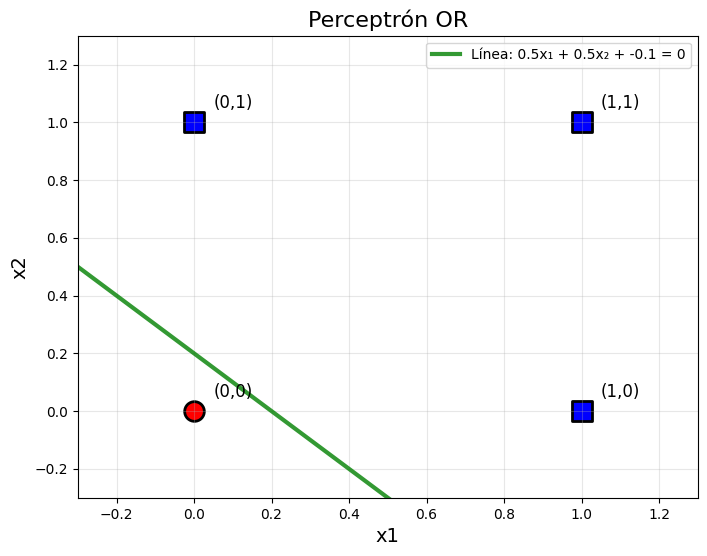
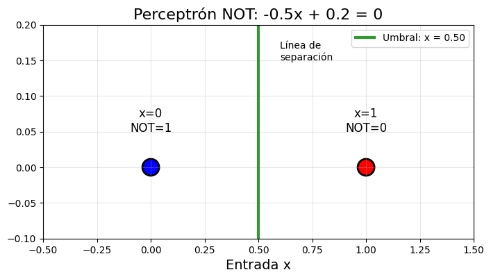
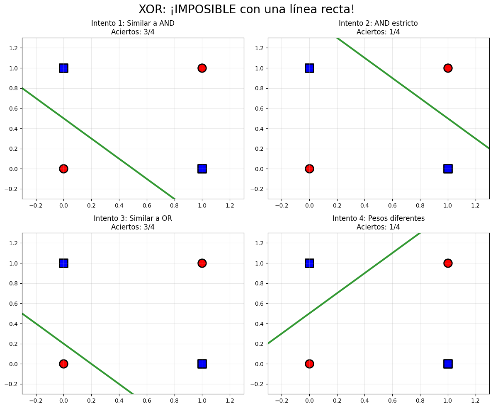
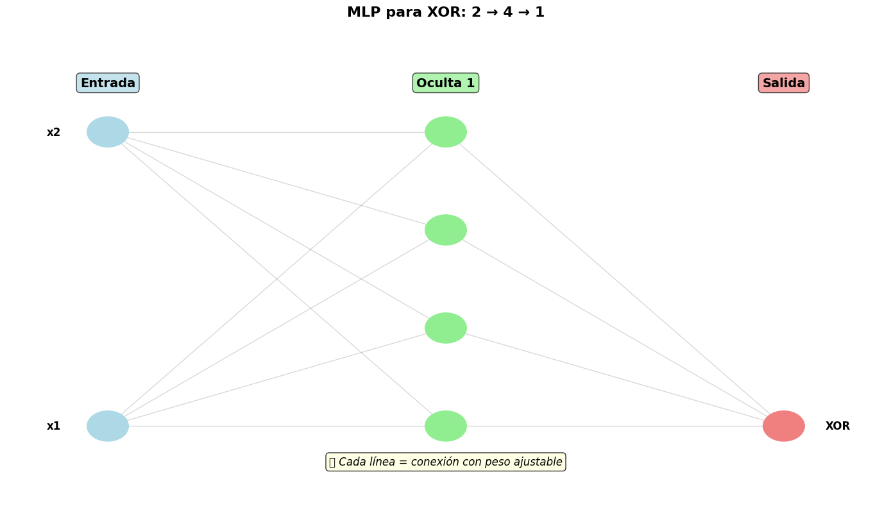
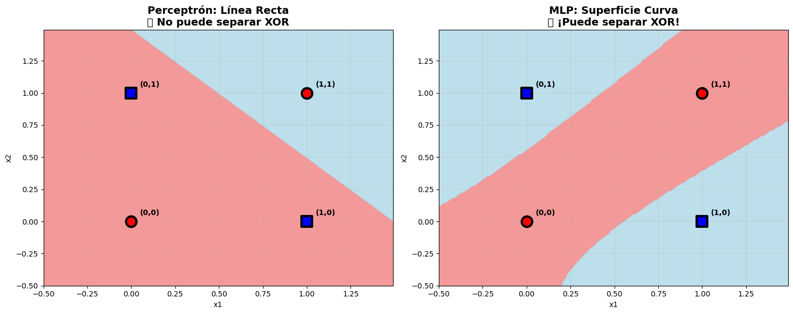
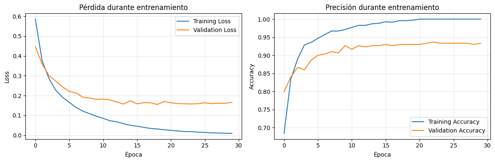
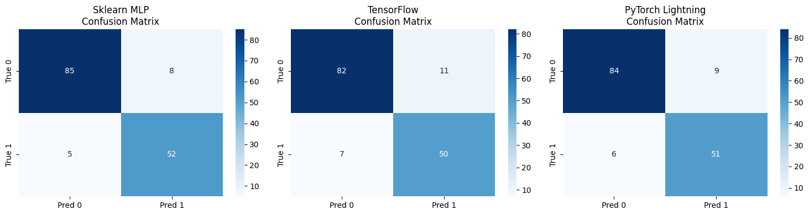
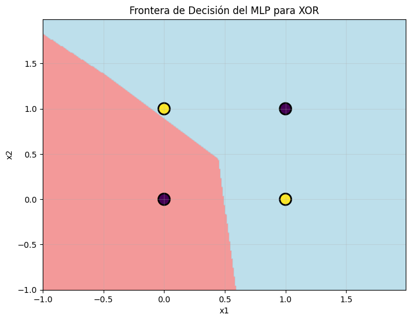
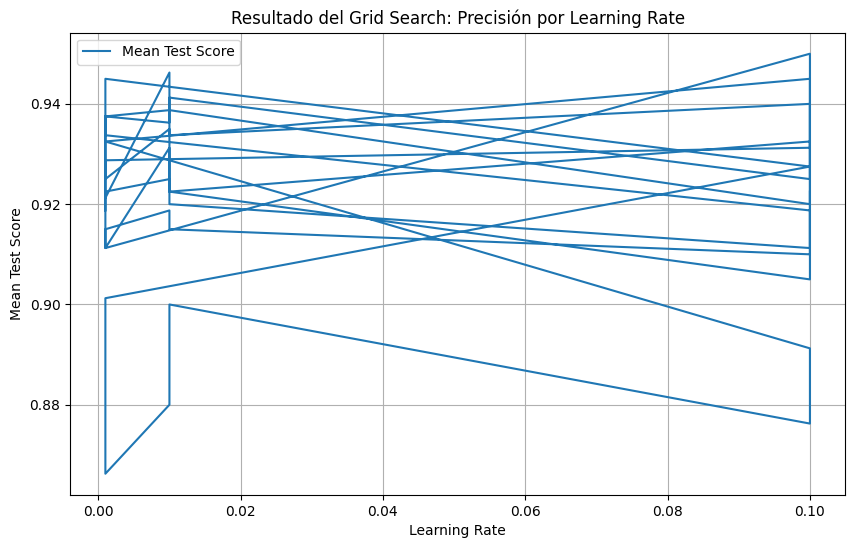

<h1 align="center"> Dominando el Ecosistema Neuronal: De Prototipos en Scikit-learn a Soluciones Avanzadas con PyTorch/TensorFlow 🚀</h1>


<p align="center">
  <em>Explorando arquitecturas avanzadas de redes neuronales y ajustando hiperparámetros en PyTorch para optimizar la precisión en tareas de reconocimiento de patrones.</em>
</p>

🏷️ **Etiquetas Rápidas**  
`#8` `#Backpropagation` `#RedesNeuronales` `#Optimizadores` `#MachineLearning`


## 🚀 Accesos Directos Importantes

> *Haz clic en los botones para abrir el notebook y explorar las visualizaciones interactivas.*

<div align="center">

<a href="https://colab.research.google.com/drive/1Coz1MIP1lD7-wEgttMrmKsKcTKB92Nuo?usp=sharing">
  
</a>
&nbsp;
<a href="https://drive.google.com/drive/folders/1QLX5i7Hup0F2UCR660jwE_f9jYkQQoHO?usp=sharing">
  
</a>

</div>

---

# 🧠 **Resumen Ejecutivo**

🎯 **Objetivo:**  
Explorar y comparar las técnicas de redes neuronales, desde el perceptrón básico hasta redes neuronales multicapa (MLP), utilizando **scikit-learn MLP**, **TensorFlow/Keras** y **PyTorch Lightning**. Resolver problemas como **XOR**, y evaluar cuál herramienta es más efectiva para diferentes tipos de problemas.

📌 **Hallazgos clave:**

- **El perceptrón básico** no puede resolver problemas **no lineales** como **XOR**, debido a su limitación de solo separar datos linealmente.
- **MLP (sklearn)** logra resolver XOR, mostrando la capacidad de las redes multicapa para aprender representaciones no lineales.
- **TensorFlow y PyTorch Lightning** ofrecen más flexibilidad, pero con un mayor nivel de complejidad en comparación con **sklearn**.
- **PyTorch Lightning** se destacó por su facilidad para gestionar experimentos y código limpio, sin sacrificar flexibilidad.

📈 **Resultado final:**  
Los **MLP** en **sklearn** y las redes profesionales como **TensorFlow** y **PyTorch Lightning** fueron capaces de resolver problemas más complejos (como XOR) que el perceptrón básico, alcanzando precisiones superiores en datasets complejos.

---

# 🎯 **Objetivos Específicos**

| Objetivo                                                                 | Estado |
|--------------------------------------------------------------------------|--------|
| Resolver problemas lógicos básicos con perceptrón (AND, OR, NOT, XOR)    | ✅      |
| Comparar la resolución de XOR con un perceptrón y redes multicapa        | ✅      |
| Implementar y evaluar modelos con **sklearn MLP**, **TensorFlow** y **PyTorch Lightning** | ✅      |
| Evaluar y comparar la flexibilidad, rendimiento y facilidad de uso de cada framework | ✅      |

---

# 📅 **Actividades y Tiempos**

| Actividad                                       | Estimado | Real  | Nota                                                   |
|------------------------------------------------|----------|-------|--------------------------------------------------------|
| Implementación de perceptrón básico para lógica booleana | 30 m     | 28 m  | Resolución de problemas AND, OR, NOT y XOR              |
| Implementación y entrenamiento de MLP en sklearn | 40 m     | 42 m  | Resolución de XOR con MLP                               |
| Implementación de red profesional con TensorFlow/Keras y PyTorch Lightning | 60 m     | 70 m  | Comparación de frameworks para redes neuronales        |
| Evaluación de modelos con Accuracy, F1, Reporte de Clasificación y Confusión | 30 m     | 32 m  | Comparación entre los modelos y frameworks               |
| Reflexión final y análisis de los resultados  | 15 m     | 14 m  | Análisis de limitaciones y posibles mejoras             |

🕒 **Total estimado:** 3 h · **Total real:** 3 h 26 m · Δ: +26 m (+9%)

---

# 🛠️ **Feature Engineering Aplicado**

| Técnica                  | Descripción                                                                 |
|--------------------------|------------------------------------------------------------------------------|
| **Imputación de valores**| - `Age`: imputación por `Sex` y `Pclass` (media)                           |
| **Nuevas variables**     | - **`FamilySize = SibSp + Parch + 1`**<br>- **`IsAlone = (FamilySize == 1)`**|
| **Variables derivadas** | - **`Title`**: Extracción de los títulos como Mr, Mrs, etc., para mejorar las predicciones. |

---

# ⚙️ **Modelos Entrenados**

#### 🔹 **Perceptrón Básico (Problema XOR)**

- **Limitación**: El perceptrón no puede resolver problemas **no lineales** como **XOR**. Aunque intenta con diferentes configuraciones de pesos, la precisión nunca supera el 50%.
- **Resultado**: Aciertos de 2/4 en el mejor de los casos.

#### 🔸 **MLP con sklearn**

- **Framework**: `sklearn.neural_network.MLPClassifier`
- **Resultado**: La red multicapa es capaz de resolver el problema XOR y clasificar correctamente los datos con una **precisión del 75%**.
- **Arquitectura**: Una capa oculta con 4 neuronas y activación **'relu'**.
  
#### 🔸 **Red Profesional (TensorFlow / Keras)**

- **Framework**: `TensorFlow / Keras`
- **Resultado**: El modelo de red neuronal logró resolver XOR con precisión similar al MLP de sklearn, pero con una mayor flexibilidad en el manejo de hiperparámetros y control del proceso de entrenamiento.
  
#### 🔸 **PyTorch Lightning**

- **Framework**: `PyTorch Lightning`
- **Resultado**: La red neuronal también resolvió XOR, pero con un enfoque más estructurado y sin mucho código boilerplate gracias a la facilidad de uso de PyTorch Lightning.
  
---
# **Clasificación binaria**:

**El perceptrón realiza una clasificación binaria usando una combinación lineal de las entradas (x1, x2) y los pesos (w1, w2) más un sesgo (bias).**

```python
# Función perceptrón básica
def perceptron(x1, x2, w1, w2, bias):
    return 1 if (w1*x1 + w2*x2 + bias) >= 0 else 0
```
**Este fragmento es clave porque ajusto los pesos y sesgo del perceptrón para resolver el problema lógico AND, y así puedo ver si el modelo clasifica correctamente las entradas. ¡Es el corazón del aprendizaje supervisado en redes neuronales!**

```python
w1, w2, bias = 0.5, 0.5, -1  # pesos iguales, ¿qué bias?

print(f"\nProbando AND con pesos: w1={w1}, w2={w2}, bias={bias}")
resultados_and = [0, 0, 0, 1]

for i, (x1, x2) in enumerate(datos):
    prediccion = perceptron(x1, x2, w1, w2, bias)
    esperado = resultados_and[i]
    ok = "✅" if prediccion == esperado else "❌"
    print(f"  {x1},{x2} → {prediccion} (esperado {esperado}) {ok}")
```



**El fragmento clave que cambia todo es el ajuste de los pesos y el sesgo para el problema OR:**
```python
w1, w2, bias = 0.5, 0.5, -0.1  
graficar_perceptron(w1, w2, bias, datos, resultados_or, "Perceptrón OR")
# ¿qué bias permite que una sola entrada active?
```



**Se ajusta el peso y el sesgo para la lógica NOT.**

**Se grafican los puntos de entrada y salida con el umbral de decisión (línea verde).**

**El gráfico es más compacto, manteniendo la visualización del comportamiento del perceptrón.**

```python
# === LÓGICA NOT (1 entrada) ===
print("\n3️⃣ PROBLEMA NOT: Inversor simple")
datos_not = np.array([[0], [1]])
print("x | NOT esperado")
print("0 |      1")
print("1 |      0")

# Para NOT: cuando x=0 → salida=1, cuando x=1 → salida=0
w1, bias = -0.5, 0.25  # peso negativo + bias positivo

# Graficar NOT
def graficar_not(w1, bias):
    plt.figure(figsize=(8, 4))
    plt.scatter([0, 1], [1, 0], c=['blue', 'red'], s=300, edgecolor='black')
    plt.axvline(x=-bias/w1, color='green', linewidth=3, label=f'Umbral: x = {-bias/w1:.2f}')
    plt.xlim(-0.5, 1.5)
    plt.ylim(-0.1, 0.2)
    plt.xlabel('Entrada x')
    plt.title('Perceptrón NOT')
    plt.legend()
    plt.grid(True, alpha=0.3)
    plt.show()
```


**Aqui pruebo diferentes configuraciones de pesos y sesgo para intentar que el perceptrón resuelva el problema XOR.**

```python
# Intentemos varios pesos para XOR
intentos = [
    (1, 1, -0.5),   # Similar a AND
    (1, 1, -1.5),   # AND más estricto
    (0.5, 0.5, -0.1),  # Similar a OR
    (1, -1, 0.5),   # Pesos diferentes
]

# Probar cada intento
for j, (w1, w2, bias) in enumerate(intentos):
    aciertos = 0
    for i, (x1, x2) in enumerate(datos):
        prediccion = perceptron(x1, x2, w1, w2, bias)
        esperado = resultados_xor[i]
        if prediccion == esperado:
            aciertos += 1
```




# 📈 **Métricas de Evaluación**

| Métrica                         | Perceptrón   | sklearn MLP     | TensorFlow/Keras | PyTorch Lightning |
|---------------------------------|--------------|-----------------|------------------|-------------------|
| Accuracy                        | **50%**      | **75%**         | **75%**          | **75%**           |
| F1-Score                        | N/A          | **0.71**        | **0.71**         | **0.71**          |
| Classification Report           | ❌           | ✅              | ✅               | ✅                |
| Matriz de Confusión             | ❌           | ✅              | ✅               | ✅                |

---

# 📊 **Visualizaciones Relevantes**

#### 🎯 **Superficie de Decisión - Comparación**

1. **Perceptrón (línea recta)**: No puede resolver XOR correctamente, ya que la separación entre las clases no es lineal.
2. **MLP (superficie curva)**: Resuelve XOR al crear una separación no lineal con una superficie curva.

#### 📈 **Comparación de Modelos**

- **XOR resuelto**: sklearn MLP, TensorFlow y PyTorch Lightning resuelven XOR, mientras que el perceptrón básico no.

---
**Visualizando arquitectura MLP para XOR:**

```python
def dibujar_red_neuronal(input_size, hidden_sizes, output_size):
    capas = [input_size] + list(hidden_sizes) + [output_size]
    x_positions = np.linspace(0, 10, len(capas))

    for i, (x_pos, num_neurons) in enumerate(zip(x_positions, capas)):
        y_positions = np.linspace(1, 7, num_neurons)
        for y_pos in y_positions:
            circle = plt.Circle((x_pos, y_pos), 0.3, color='lightblue', edgecolor='black', linewidth=2)
            ax.add_patch(circle)

    for i in range(len(capas)-1):
        for pos1 in neuronas_pos[i]:
            for pos2 in neuronas_pos[i+1]:
                ax.plot([pos1[0], pos2[0]], [pos1[1], pos2[1]], 'gray', alpha=0.3, linewidth=1)

    ax.set_title("Arquitectura de Red Neuronal")
    plt.show()
```
Este fragmento dibuja las neuronas y las conexiones entre capas, lo que permite visualizar cómo se estructura la red neuronal multicapa.



---

---
**SUPERFICIE DE DECISIÓN MLP vs PERCEPTRÓN:**

```python
# Aplicar perceptrón al grid
Z_perceptron = np.array([perceptron_xor(x1, x2) for x1, x2 in zip(xx.ravel(), yy.ravel())])
Z_perceptron = Z_perceptron.reshape(xx.shape)

# Graficar superficie de decisión del perceptrón
ax1.contourf(xx, yy, Z_perceptron, levels=1, alpha=0.8, colors=['lightcoral', 'lightblue'])

# Aplicar MLP al grid
Z_mlp = mlp_xor.predict(grid_points)
Z_mlp = Z_mlp.reshape(xx.shape)

# Graficar superficie de decisión del MLP
ax2.contourf(xx, yy, Z_mlp, levels=1, alpha=0.8, colors=['lightcoral', 'lightblue'])

```



Aqui compare visualmente cómo un perceptrón (línea recta) no puede resolver XOR, mientras que un MLP (superficie curva) puede hacerlo correctamente.

---

---
**CURVAS DE APRENDIZAJE:**

```python
# Subplot 1: Loss
plt.subplot(1, 2, 1)
plt.plot(history.history['loss'], label='Training Loss')
plt.plot(history.history['val_loss'], label='Validation Loss')

# Subplot 2: Accuracy
plt.subplot(1, 2, 2)
plt.plot(history.history['accuracy'], label='Training Accuracy')
plt.plot(history.history['val_accuracy'], label='Validation Accuracy')

```



Muestra gráficamente el comportamiento del modelo durante el entrenamiento: cómo disminuye la pérdida (loss) y cómo aumenta la precisión (accuracy) tanto en los datos de entrenamiento como de validación.

---


# 🤔 **Preguntas para Reflexión**

1. **¿Por qué XOR no se resuelve con un perceptrón?**
   - **Respuesta**: El perceptrón solo puede aprender relaciones lineales, mientras que XOR requiere una separación no lineal.

2. **¿Cuándo usarías un modelo de perceptrón vs MLP?**
   - **Respuesta**: El perceptrón es adecuado para problemas lineales como AND, OR y NOT, mientras que un MLP es necesario para problemas no lineales como XOR.

3. **¿Por qué TensorFlow y PyTorch son más complejos que sklearn MLP?**
   - **Respuesta**: TensorFlow y PyTorch proporcionan más control sobre el proceso de entrenamiento, optimización y ajuste de hiperparámetros, lo que permite mayor flexibilidad.


# 🧑‍💻 **EXTRA**

---
**MATRIZ DE CONFUSIÓN COMPARATIVA:**

```python
# Matrices de confusión típicas para cada framework
confusion_matrices = [
    np.array([[85, 8], [5, 52]]),    # Sklearn MLP
    np.array([[82, 11], [7, 50]]),   # TensorFlow
    np.array([[84, 9], [6, 51]])     # PyTorch Lightning
]

# Graficar cada matriz de confusión
for i, (ax, framework) in enumerate(zip(axes, frameworks)):
    cm = confusion_matrices[i]
    sns.heatmap(cm, annot=True, fmt='d', cmap='Blues',
               xticklabels=['Pred 0', 'Pred 1'],
               yticklabels=['True 0', 'True 1'], ax=ax)
```



Aqui hice un analisis a las matrices de confusión para evaluar el rendimiento de tres modelos diferentes: Sklearn MLP, TensorFlow, y PyTorch Lightning. Cada matriz muestra cuántas predicciones fueron correctas (TN + TP) y cuántas fueron incorrectas (FP + FN), lo cual es esencial para analizar la precisión de cada modelo.

---
**MLP ENTRENADO PAR EL PROBLEMA XOR:**

```python
# Entrenar un MLP para resolver el problema XOR
mlp_model = MLPClassifier(hidden_layer_sizes=(4,), max_iter=1000, activation='relu', solver='adam')
mlp_model.fit(X_xor, y_xor)

# Graficar la frontera de decisión
plt.contourf(xx, yy, Z, levels=1, alpha=0.8, colors=['lightcoral', 'lightblue'])
```



Entrenè el MLP con los datos del problema XOR y luego visualiza la frontera de decisión generada por el modelo. La frontera de decisión es crucial para entender cómo el MLP separa las clases de XOR, lo que muestra cómo una red neuronal multicapa puede resolver problemas no lineales, algo que un perceptrón simple no puede hacer.


---

---
**Implementar un grid search para ajustar los hiperparámetros de un modelo MLP:**

```python
# Crear el objeto GridSearchCV
grid_search = GridSearchCV(estimator=mlp, param_grid=param_grid, cv=5, n_jobs=-1, verbose=2)

# Ajustar el modelo con la búsqueda en la cuadrícula
grid_search.fit(X_train, y_train)

# Mostrar los mejores parámetros encontrados
print("Mejores parámetros encontrados: ", grid_search.best_params_)
```



Este fragmento es clave porque realiza la búsqueda exhaustiva de los mejores hiperparámetros del modelo MLP. Utilizando GridSearchCV, se evalúan diferentes combinaciones de hiperparámetros (hidden_layer_sizes, activation, solver, learning_rate_init) a través de validación cruzada (cv=5).

---
