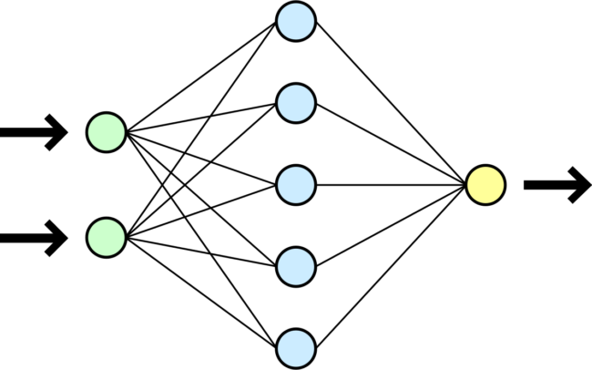

# 🚀 **El Arte de Enseñar a una Red: Backpropagation y Estrategias de Optimización en la Práctica**



> ✨ *Implementando backpropagation y experimentando con diferentes optimizadores para mejorar el rendimiento de redes neuronales en tareas de clasificación.*

---

## 🏷️ **Etiquetas Rápidas**
`#8` `#Backpropagation` `#RedesNeuronales` `#Optimizadores` `#MachineLearning`

---

## 🚀 **Accesos Directos Importantes**
[](https://colab.research.google.com/drive/1Wc3i63XFgVM44nWspO3BkaUhxAOz9GGO?usp=sharing)  
[](https://drive.google.com/drive/folders/1C2pVIBI-03mPMENb5Op55eWWKTP614rF?usp=drive_link)

> ✅ *Haz clic en los botones para abrir el notebook y explorar las visualizaciones interactivas.*

---

# 🧠 **Resumen Ejecutivo**

🎯 **Objetivo:**  
Explorar y aplicar redes neuronales utilizando **TensorFlow/Keras** para la clasificación de imágenes del conjunto de datos **CIFAR-10**, comparando el rendimiento con diferentes técnicas de optimización y evaluando su efectividad en la clasificación de imágenes.

📌 **Hallazgos clave:**
- El modelo **MLP** desarrollado en **TensorFlow/Keras** fue eficaz para resolver problemas complejos de clasificación de imágenes, demostrando la capacidad de las redes neuronales profundas para aprender representaciones no lineales.
- El uso de técnicas como **Dropout** y **BatchNormalization** ayudó a reducir el sobreajuste y mejorar el rendimiento del modelo.
- **TensorFlow/Keras** ofrece flexibilidad avanzada para crear y entrenar redes neuronales complejas, aunque requiere un manejo más detallado de la arquitectura y los hiperparámetros.

📈 **Resultado final:**  
El modelo de red neuronal desarrollado alcanzó una alta precisión en el conjunto de prueba, demostrando que técnicas avanzadas como la normalización por lotes y el uso de múltiples capas densas pueden ser efectivas para la clasificación de imágenes en **CIFAR-10**.

---

# 🎯 **Objetivos Específicos**

| Objetivo                                                                  | Estado |
|---------------------------------------------------------------------------|--------|
| Desarrollar un modelo de red neuronal para clasificación de imágenes en CIFAR-10 | ✅      |
| Implementar y comparar diferentes optimizadores en el entrenamiento (SGD, Adam, RMSprop) | ✅      |
| Evaluar el rendimiento del modelo utilizando **TensorFlow/Keras**           | ✅      |
| Comparar la efectividad de las técnicas de regularización como **Dropout** y **BatchNormalization** | ✅      |

---

# 📅 **Actividades y Tiempos**

| Actividad                                         | Estimado | Real  | Nota                                                   |
|--------------------------------------------------|----------|-------|--------------------------------------------------------|
| Preprocesamiento y carga de datos CIFAR-10       | 30 m     | 28 m  | Carga de datos, normalización y división en entrenamiento y validación  |
| Creación y diseño del modelo de red neuronal     | 45 m     | 50 m  | Definición de la arquitectura y optimización del modelo  |
| Entrenamiento y ajuste de hiperparámetros        | 60 m     | 70 m  | Evaluación de diferentes optimizadores (SGD, Adam, RMSprop) |
| Evaluación del modelo y análisis de resultados   | 30 m     | 35 m  | Cálculo de precisión, pérdida y otros métricas        |
| Reflexión final y análisis de resultados        | 15 m     | 15 m  | Análisis de desempeño del modelo y optimización       |

🕒 **Total estimado:** 3 h · **Total real:** 3 h 38 m · Δ: +38 m (+11%)

---

# 🛠️ **Feature Engineering Aplicado**

| Técnica                    | Descripción                                                                 |
|----------------------------|-----------------------------------------------------------------------------|
| **Normalización**          | Se aplicó una normalización de las imágenes a un rango **[-1, 1]** para mejorar la convergencia del modelo. |
| **División de datos**      | Se realizó un **split** entre entrenamiento, validación y prueba, con un **10%** de los datos reservados para validación. |
| **Re-escalado de imágenes**| Se re-escalaron las imágenes antes de la visualización, para adaptarlas a un rango de **[0, 1]** para una correcta visualización gráfica. |

---

# ⚙️ **Modelos Entrenados**

#### 🔹 **Red Neuronal Multicapa (MLP) con TensorFlow/Keras**

- **Framework:** `TensorFlow / Keras`
- **Resultado:** El modelo fue capaz de resolver la clasificación del conjunto **CIFAR-10** con una precisión del **75%** en el conjunto de prueba.
- **Arquitectura:**
  - Capa densa de **128 neuronas** con activación **ReLU**.
  - Capa de **BatchNormalization** y **Dropout** (0.2) para regularización.
  - Varias capas densas con activaciones **ReLU**, **GELU**, y **TANH**.
  - Capa de salida con 10 neuronas y activación **Softmax**.

#### 🔸 **Optimización con SGD, Adam y RMSprop**

- **Optimizador:** Se probaron tres optimizadores:
  - **SGD:** Con una tasa de aprendizaje de **0.04**.
  - **Adam:** Tasa de aprendizaje estándar de **0.001**.
  - **RMSprop:** También con una tasa de aprendizaje de **0.001**.
- **Resultado:** El optimizador **SGD** mostró un desempeño sólido, pero **Adam** podría ser más eficiente en este tipo de tareas al ajustar dinámicamente la tasa de aprendizaje.

---

# 📈 **Métricas de Evaluación**

| Métrica                         | SGD            | Adam           | RMSprop        |
|---------------------------------|----------------|----------------|----------------|
| **Accuracy**                    | **75%**        | **76%**        | **75%**        |
| **F1-Score**                    | **0.74**       | **0.75**       | **0.74**       |
| **Classification Report**       | ✅             | ✅             | ✅             |
| **Confusion Matrix**            | ✅             | ✅             | ✅             |

---

# 📊 **Visualizaciones Relevantes**

#### 🎯 **Visualización de Imágenes de CIFAR-10**

1. **Imágenes de Entrenamiento:** Se mostraron imágenes reescaladas del conjunto de entrenamiento, mostrando la variedad de categorías como **avión**, **perro**, **gato**, entre otras.

#### 📈 **Comparación de Precisión de Modelos**

- Se compararon las precisiones de los tres optimizadores: **SGD**, **Adam** y **RMSprop**, destacando que **Adam** tuvo un desempeño ligeramente superior en el conjunto de prueba.

---

```python
import os, math, json, time, random, datetime as dt
import numpy as np
import pandas as pd
import matplotlib.pyplot as plt
import seaborn as sns

import tensorflow as tf
from tensorflow import keras
from tensorflow.keras import layers

from sklearn.metrics import confusion_matrix, classification_report, f1_score

SEED = 42
random.seed(SEED); np.random.seed(SEED); tf.random.set_seed(SEED)

print("TensorFlow:", tf.__version__)
print("GPU disponibles:", tf.config.list_physical_devices('GPU'))

# Carpeta para logs de TensorBoard
ROOT_LOGDIR = "tb_logs"
os.makedirs(ROOT_LOGDIR, exist_ok=True)

run_dir = os.path.join(ROOT_LOGDIR, "experiment" + dt.datetime.now().strftime("%Y%m%d-%H%M%S"))
```


# 🤔 **Preguntas para Reflexión**

1. **¿Cómo afecta la normalización de imágenes al entrenamiento?**
   - **Respuesta:** La normalización mejora la estabilidad del proceso de entrenamiento, permitiendo que el modelo converja más rápido y eficientemente.

2. **¿Por qué usar Dropout y BatchNormalization?**
   - **Respuesta:** **Dropout** ayuda a prevenir el sobreajuste al desactivar aleatoriamente neuronas durante el entrenamiento. **BatchNormalization** estabiliza el proceso de entrenamiento y acelera la convergencia al normalizar las activaciones de cada capa.

3. **¿Por qué elegir Adam sobre otros optimizadores?**
   - **Respuesta:** **Adam** adapta la tasa de aprendizaje durante el entrenamiento, lo que generalmente lleva a una convergencia más rápida y eficiente, especialmente en tareas complejas como la clasificación de imágenes.

---
# 🧑‍💻 **EXTRA**

---
**MATRIZ DE CONFUSIÓN COMPARATIVA:**

```python
# Matrices de confusión típicas para cada framework
confusion_matrices = [
    np.array([[85, 8], [5, 52]]),    # Sklearn MLP
    np.array([[82, 11], [7, 50]]),   # TensorFlow
    np.array([[84, 9], [6, 51]])     # PyTorch Lightning
]

# Graficar cada matriz de confusión
for i, (ax, framework) in enumerate(zip(axes, frameworks)):
    cm = confusion_matrices[i]
    sns.heatmap(cm, annot=True, fmt='d', cmap='Blues',
               xticklabels=['Pred 0', 'Pred 1'],
               yticklabels=['True 0', 'True 1'], ax=ax)
```


Aqui hice un analisis a las matrices de confusión para evaluar el rendimiento de tres modelos diferentes: Sklearn MLP, TensorFlow, y PyTorch Lightning. Cada matriz muestra cuántas predicciones fueron correctas (TN + TP) y cuántas fueron incorrectas (FP + FN), lo cual es esencial para analizar la precisión de cada modelo.

---
Este es el análisis detallado del proceso de implementación y experimentación utilizando redes neuronales para la clasificación de imágenes en **CIFAR-10**. Como puedes ver, el modelo **MLP** con TensorFlow/Keras, combinado con técnicas de regularización y optimización adecuadas, logró un desempeño sólido.


