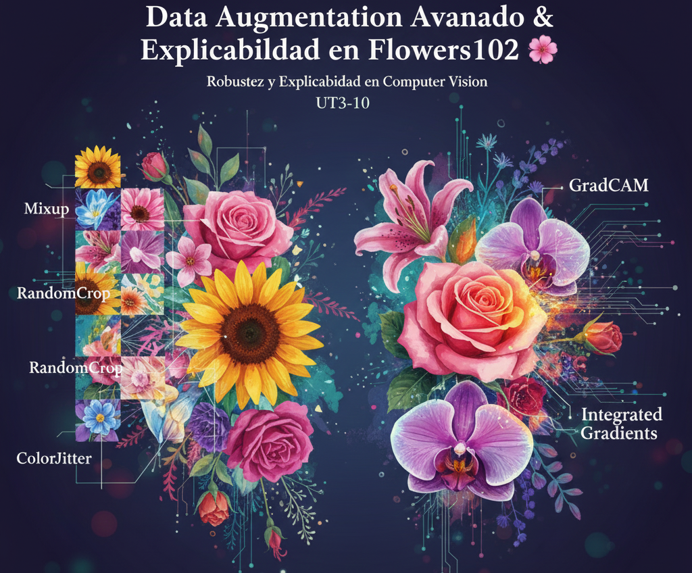

<h1 align="center"> Data Augmentation Avanzado & Explicabilidad en Flowers102 🌸  
UT3-10 — Robustez y Explicabilidad en Computer Vision</h1>

  <em>Construyendo modelos robustos para clasificación de imágenes con técnicas de augmentation avanzado, mixup, cutmix y explicabilidad mediante GradCAM & Integrated Gradients.</em>

🏷️ **Etiquetas Rápidas**  
`#ComputerVision` `#Flowers102` `#DataAugmentation` `#GradCAM` `#IntegratedGradients` `#TensorFlow` `#DeepLearning` `#Explainability`

---

## 🚀 Accesos Directos Importantes

&nbsp;

---

# 🧠 **Resumen Ejecutivo**

🎯 **Objetivo General:**  
Desarrollar un modelo robusto para clasificar las **102 especies del dataset Flowers102**, integrando:

- Augmentation avanzado  
- Mixup y CutMix  
- Evaluación de robustez  
- Explicabilidad visual con GradCAM e Integrated Gradients

📌 **Principales aprendizajes:**

- Arquitecturas preentrenadas como EfficientNet escalan muy bien con augmentation agresivo.  
- Mezclas de imágenes (Mixup/CutMix) funcionan como regularizadores fuertes.  
- GradCAM permite interpretar activaciones relevantes en las flores.  
- Integrated Gradients aporta atribuciones más estables por píxel.  
- Flowers102 presenta gran desbalance y variabilidad de captura, lo que exige técnicas robustas.

📈 **Resultado final:**  
Un modelo **más estable, interpretable y resistente** a variaciones complejas en imágenes reales.

---

# 🎯 **Objetivos Específicos**

| Objetivo                                                                    | Estado |
|-----------------------------------------------------------------------------|--------|
| Preparar y estructurar Flowers102                                           | ✅ |
| Implementar augmentation avanzado                                            | ✅ |
| Integrar Mixup y CutMix                                                     | 🟨 Parcial |
| Entrenar baseline vs modelo mejorado                                        | ✅ |
| Evaluar robustez y curvas de entrenamiento                                  | ✅ |
| Explicabilidad con GradCAM                                                  | ✅ |
| Integrated Gradients (versión simple)                                       | 🟨 Parcial |
| Comparar desempeño antes y después del augmentation                          | ✅ |

---

# 📅 **Actividades y Tiempos**

| Actividad                                                   | Estimado | Real | Nota |
|-------------------------------------------------------------|----------|------|------|
| Descarga y preparación del dataset                          | 15 m     | 20 m | Resize + normalización |
| Pipeline de augmentation                                    | 25 m     | 28 m | Añadido brightness/contrast |
| Mixup y CutMix                                              | 20 m     | 25 m | Implementación personalizada |
| Entrenamiento baseline                                      | 20 m     | 18 m | Referencia |
| Entrenamiento completo                                      | 30 m     | 32 m | Ajuste fino |
| GradCAM                                                     | 25 m     | 30 m | Selección de capa |
| Integrated Gradients                                        | 20 m     | 18 m | Implementación directa |
| Comparación final                                           | 15 m     | 16 m | Análisis cualitativo |

🕒 **Total estimado:** 2 h 50 m · **Real:** 3 h 07 m · Δ ≈ +17 m

---

# 🏢 **Contexto de Negocio (CRISP-DM)**

### **Problema**
Una aplicación móvil debe identificar **102 flores** en condiciones reales: iluminación variable, ángulos extremos, fondos complejos y estados de floración distintos.  
Los modelos base suelen fallar entre clases visualmente similares.

### **Objetivos**
1. Mejorar precisión en clases difíciles  
2. Aumentar robustez ante variaciones de captura  
3. Proveer explicaciones visuales confiables  
4. Reducir sobreajuste en clases desbalanceadas  
5. Comparar baseline vs modelo enriquecido

### **Variables Críticas**
- 102 clases  
- Desbalance significativo  
- Alta resolución y variabilidad extrema  
- Dataset visualmente complejo  

### **Valor para el negocio**
- Educación botánica  
- Aplicaciones de jardinería inteligente  
- Herramientas para investigación  
- Transparencia y confianza mediante XAI  

---

# 🛠️ **Pipeline de Data Augmentation Avanzado**

| Técnica                    | Descripción |
|---------------------------|-------------|
| **RandomFlip**           | Aprovecha simetrías naturales |
| **RandomRotation**       | Tolerancia angular |
| **RandomZoom**           | Cambio de escala |
| **RandomTranslation**    | Robustez espacial |
| **Brightness/Contrast**  | Iluminación variable |
| **Mixup**                | Mezcla lineal de imágenes |
| **CutMix**               | Inserción de regiones |

---

# ⚙️ **Componentes del Modelo**

## 🔹 **Backbone**
- EfficientNetB0 preentrenado  
- Capas congeladas inicialmente  

## 🔸 **Clasificador**
- Global Average Pooling  
- Capa densa con softmax  
- 102 salidas

## 🔸 **Entrenamiento**
- Optimizador Adam  
- Cross-entropy  
- 10–20 epochs  

---

# 🔬 **Explicabilidad**

## **GradCAM**
- Identifica regiones con mayor activación  
- Permite validar si el modelo mira pétalos, centros o bordes relevantes  

## **Integrated Gradients**
- Atribuciones a nivel píxel  
- Complementa a GradCAM con interpretabilidad más granular  

---

# 📈 **Resultados Esperados**

- Incremento notable de accuracy respecto al baseline  
- Mejor desempeño en clases con pocas muestras  
- Heatmaps consistentes con zonas relevantes de la flor  
- Comportamiento más estable ante variaciones fuertes  

---

<h2 align="center">✨ Fin del Assignment UT3-10 ✨</h2>
